# Criar um cartão de pontuação móvel

As informações a seguir instruem os curadores de dados do Adobe Analytics sobre como configurar e apresentar cartões de pontuação móveis para usuários executivos. Para começar, você pode exibir o vídeo do construtor de scorecard dos painéis do Adobe Analytics:

>[!VIDEO](https://video.tv.adobe.com/v/34544)

Um cartão de pontuação do Adobe Analytics exibe as principais visualizações de dados para usuários executivos em um layout lado a lado, como mostrado abaixo:

Como curador desse scorecard, você pode usar o construtor de scorecards para configurar quais blocos aparecem no scorecard para o consumidor executivo. Você também configura como as exibições detalhadas ou os detalhamentos podem ser ajustados quando os blocos forem tocados. A interface do construtor de scorecards é mostrada abaixo:

Para criar o scorecard, é necessário fazer o seguinte:

1. Acesse o modelo de [!UICONTROL Scorecard para dispositivos móveis em branco].
1. Configure o cartão de pontuação com os dados e salve-o.

## Acesse o modelo de [!UICONTROL Scorecard para dispositivos móveis em branco] {#template}

Você pode acessar o modelo [!UICONTROL Cartão de pontuação para dispositivos móveis em branco] criando um novo projeto ou no menu Ferramentas.

### Criar um novo projeto {#create}

1. Abra o Adobe Analytics e clique na guia **[!UICONTROL Espaço de trabalho]**.
1. Clique em **[!UICONTROL Criar projeto]** e selecione o **[!UICONTROL Scorecard para dispositivos móveis em branco]** modelo de projeto.
1. Clique em **[!UICONTROL Criar]**.

### Menu Ferramentas

1. No menu **[!UICONTROL Ferramentas]**, selecione **[!UICONTROL Painéis do Analytics (Aplicativo para dispositivos móveis)]**.
1. Na tela seguinte, clique em **[!UICONTROL Criar novo cartão de pontuação]**.

## Configure o cartão de pontuação com os dados e salve-o {#configure}

Para implementar o modelo de scorecard:

1. Em **[!UICONTROL Propriedades]** (no painel direito), especifique um **[!UICONTROL Conjunto de relatórios do projeto]** cujos dados você deseja usar.

   

1. Para adicionar um novo bloco ao scorecard, arraste uma métrica do painel esquerdo e solte-a no **[!UICONTROL Arrastar e soltar métricas aqui]** zona. Também é possível inserir uma métrica entre dois blocos usando um fluxo de trabalho semelhante.

   

1. Em cada bloco, é possível acessar uma exibição detalhada que mostra informações adicionais sobre a métrica, como itens principais para uma lista de dimensões relacionadas.

## Adicionar dimensões ou métricas {#dimsmetrics}

Para adicionar uma dimensão relacionada a uma métrica, arraste uma dimensão do painel esquerdo e solte-a em um bloco.

Por exemplo, é possível adicionar dimensões apropriadas (como **[!DNL Marketing Channel]**, neste exemplo) à métrica **[!UICONTROL Visitantes únicos]**, arrastando-as e soltando-as no bloco. Os detalhamentos de dimensão são exibidos na seção [!UICONTROL Detalhes] das **[!UICONTROL Propriedades]** específicas do slide de detalhes. É possível adicionar várias dimensões a cada bloco.

## Aplicar segmentos {#segments}

Para aplicar segmentos a blocos individuais, arraste um segmento do painel esquerdo e solte-o diretamente na parte superior do bloco.

Se quiser aplicar o segmento a todos os blocos no scorecard, solte o bloco na parte superior do scorecard. Ou você também pode aplicar segmentos selecionando segmentos no menu de filtro abaixo dos intervalos de datas. Você [configurar e aplicar filtros para seus scorecards](https://experienceleague.adobe.com/docs/analytics-learn/tutorials/analysis-workspace/using-panels/using-drop-down-filters.html?lang=pt-BR) da mesma forma que faria no Adobe Analytics Workspace.

## Adicionar intervalos de datas {#dates}

Adicione e remova combinações de intervalo de datas que podem ser selecionadas no cartão de pontuação selecionando o menu suspenso Intervalo de datas.

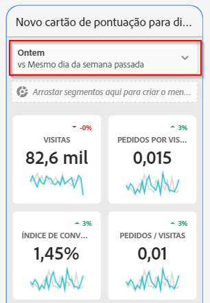

Cada novo cartão de pontuação começa com seis combinações de intervalo de datas, com foco nos dados de hoje e ontem. Você pode remover intervalos de datas desnecessários clicando no x ou editar cada combinação de intervalo de datas clicando no lápis.

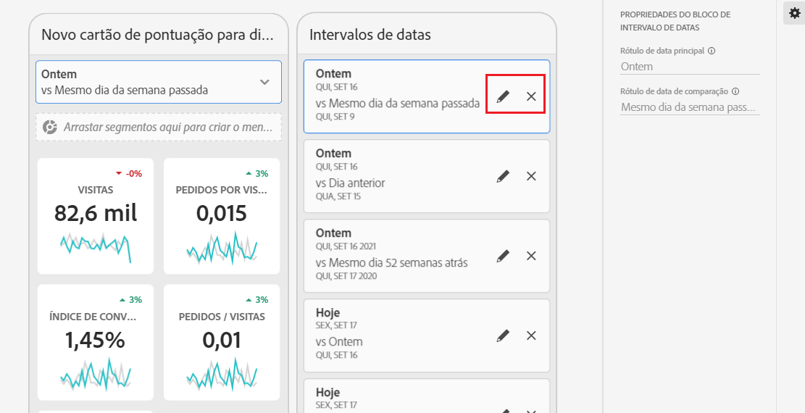

Para criar ou alterar uma data principal, use o menu suspenso para selecionar intervalos de datas disponíveis ou arraste e solte um componente de data do painel direito na área designada.

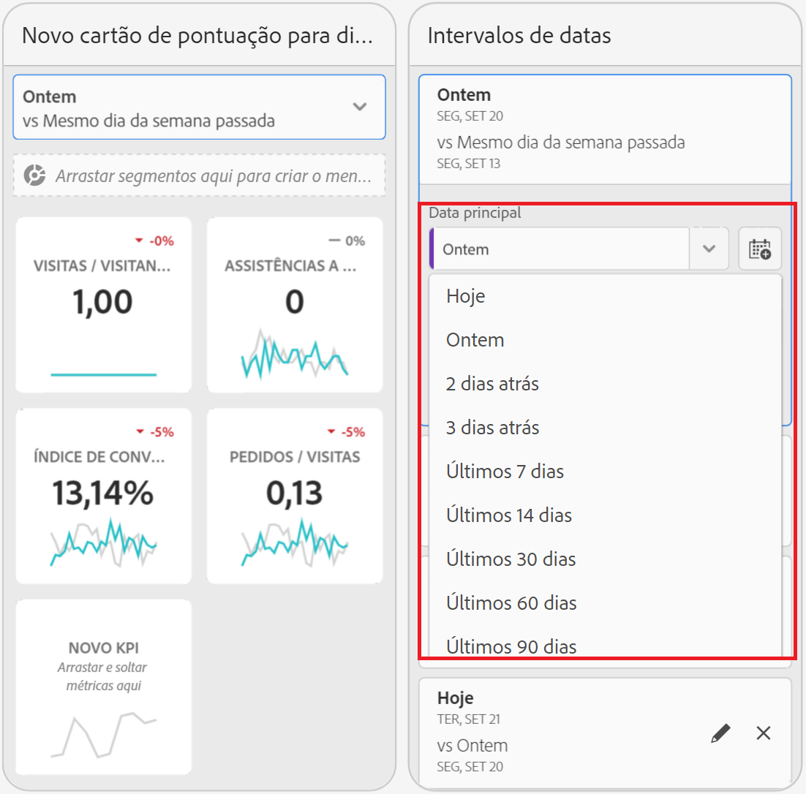

Para criar uma data de comparação, você pode selecionar entre predefinições convenientes para comparações de tempo comuns no menu suspenso. Você também pode arrastar e soltar um componente de data no painel direito.

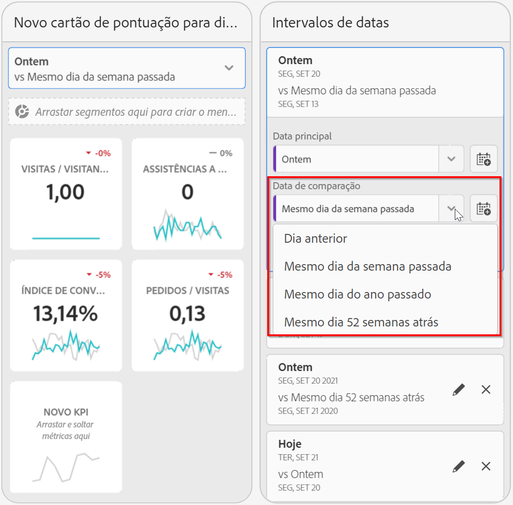

Se o intervalo de datas desejado ainda não tiver sido criado, será possível criar um novo clicando no ícone do calendário.

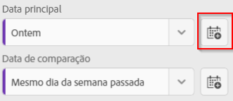

Você será direcionado ao construtor de intervalo de datas, em que é possível criar e salvar um novo componente de intervalo de datas.

### Mostrar/ocultar intervalos de datas de comparação {#show-comparison-dates}

Para mostrar ou ocultar intervalos de datas de comparação, alterne a configuração **Incluir datas de comparação**.

A configuração é *on* por padrão. Desmarque a opção se não quiser exibir datas de comparação.

## Aplicar visualizações {#viz}

Exibir um vídeo sobre visualizações para cartões de pontuação móveis:

>[!VIDEO](https://video.tv.adobe.com/v/337570/?quality=12&learn=on)

Os painéis do Analytics oferecem quatro visualizações que proporcionam um excelente insight sobre itens de dimensão e métricas. Mude para um visualização diferente alterando o [!UICONTROL tipo de gráfico] das [!UICONTROL Propriedades] de um bloco. Basta selecionar o bloco correto e alterar o tipo de gráfico.

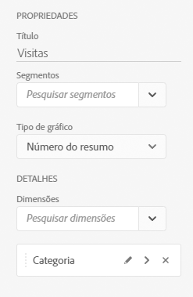

Ou clique no ícone [!UICONTROL Visualizações] no painel à esquerda e arraste e solte a visualização correta sobre o bloco:

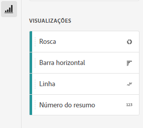

### [!UICONTROL Número do resumo]

Use a visualização Número do resumo para realçar um grande número que é importante em um projeto.

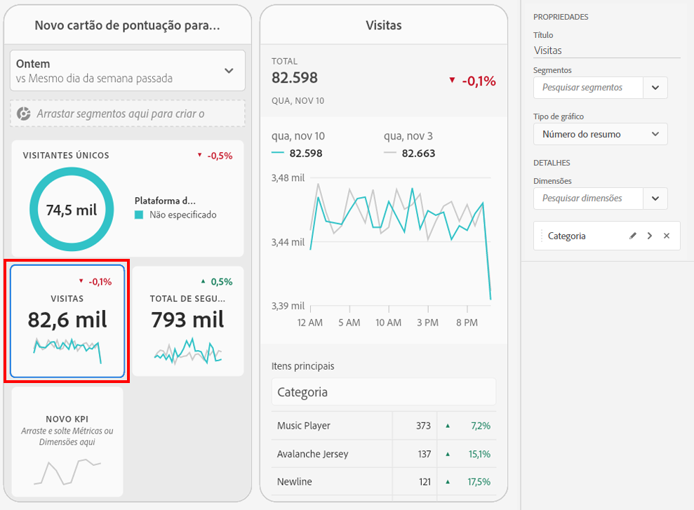

### [!UICONTROL Rosca]

Semelhante ao gráfico de pizza, essa visualização mostra os dados como partes ou segmentos de um todo. Use um gráfico de rosca ao comparar porcentagens de um total. Por exemplo, digamos que você queira ver qual plataforma de publicidade contribuiu para o número total de visitantes únicos:

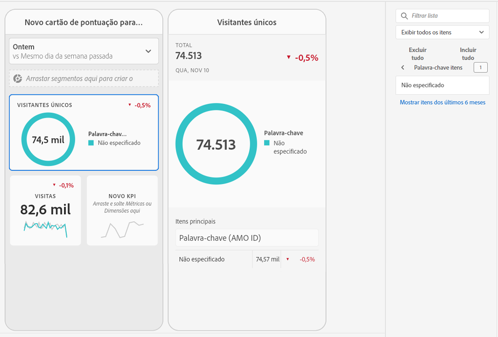

### [!UICONTROL Linha]

A visualização de linha representa as métricas que usam uma linha para mostrar como os valores são alterados em um período. Um gráfico de linha mostra dimensões ao longo do tempo, mas funciona com qualquer visualização. Você está visualizando a dimensão categoria do produto neste exemplo.

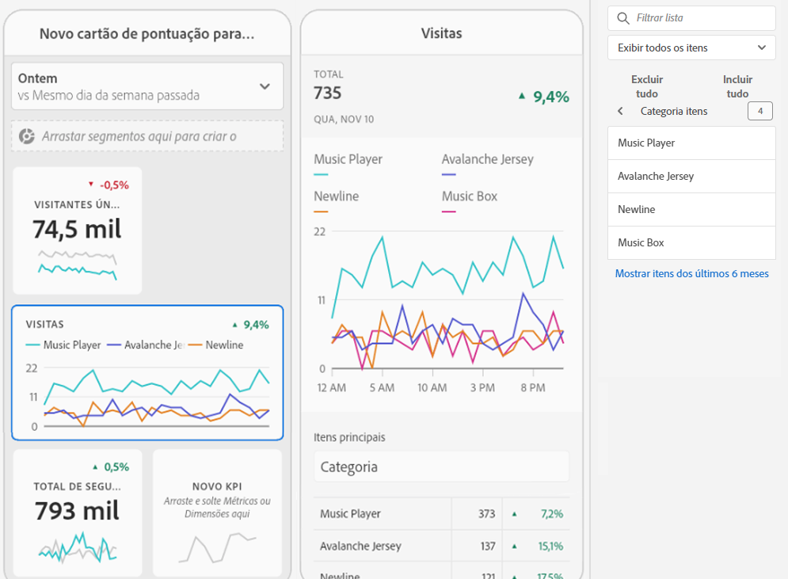

### [!UICONTROL Barra horizontal]

Esta visualização mostra barras horizontais que representam vários valores de uma ou mais métricas. Por exemplo, para ver facilmente seus principais produtos, use a [!UICONTROL Barra horizontal] como sua visualização preferida.

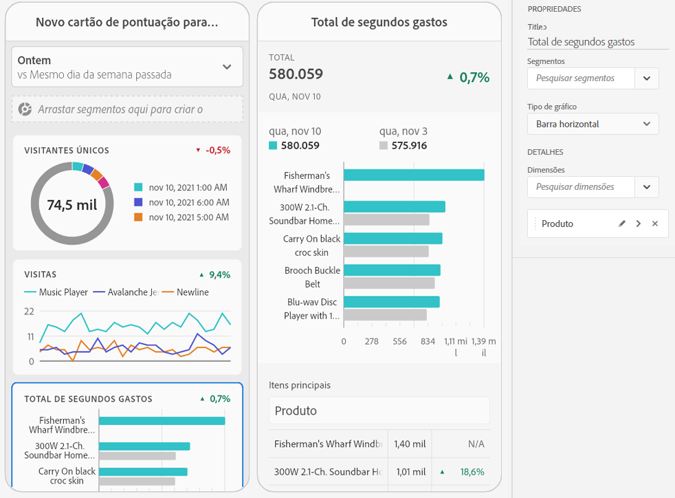

### Remover os itens de dimensão [!UICONTROL Não especificados]

Se desejar remover itens de dimensão [!UICONTROL Não especificados] dos dados, faça o seguinte:

1. Selecione o bloco correto.
1. No painel direito, em **[!UICONTROL Drill-ins]**, selecione a seta para a direita ao lado do item de dimensão do qual você deseja remover itens **[!UICONTROL Não especificados]**.

   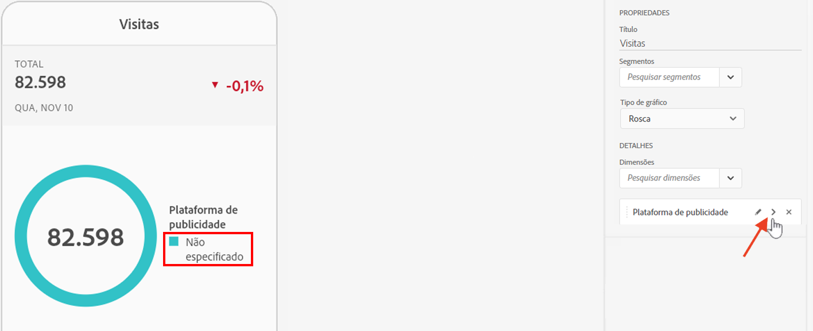

1. Clique no ícone ao lado de **[!UICONTROL Não especificado]** para remover dados não especificados de seus relatórios. (Também é possível remover qualquer outro item de dimensão).

## Exibir e configurar propriedades de blocos {#tiles}

Ao clicar em um bloco no construtor de scorecards, o painel direito exibe as propriedades e características associadas a esse bloco e seu slide de detalhes. Nesse painel, você pode fornecer um novo **Título** para o bloco e, como alternativa, configurá-lo aplicando segmentos.

## Exibir slides de detalhes {#view-detail-slides}

Ao clicar nos blocos, uma janela pop-up dinâmica mostrará como o slide de detalhes aparecerá para o usuário executivo no aplicativo. Você pode adicionar dimensões para detalhar seus dados de acordo com suas necessidades específicas. Se nenhuma dimensão for aplicada, a dimensão de detalhamento será definida como **hora** ou **dias**, dependendo do intervalo de datas padrão.

Os detalhamentos refinam sua análise ao detalhar métricas por itens de dimensão, como o seguinte:

* Métrica de Visitantes únicos detalhada por Plataforma de publicidade (AMO ID)
* Visitas detalhadas por Categoria de produto (Varejo)
* Receita total detalhada por Nome do produto

Cada dimensão adicionada ao slide de detalhes será exibida em uma lista suspensa na exibição desse slide no aplicativo. O usuário executivo pode então escolher entre as opções indicadas na lista suspensa.

## Personalizar slides de detalhes {#customize-detail-slide}

Os slides de detalhes personalizados permitem ter ainda mais controle sobre quais informações você compartilha com seu público.

>[!VIDEO](https://video.tv.adobe.com/v/3410002)

Você pode modificar o layout de cada slide de detalhes e adicionar texto para explicar melhor o que o usuário final pode ver nos dados. Também é possível alterar o tipo de gráfico usando o menu suspenso.

### Alterar o layout do slide

Altere o layout do slide para se concentrar nas informações mais importantes. Por exemplo, é possível alterar o layout para mostrar apenas um gráfico ou apenas uma tabela. Para alterar o layout do slide, selecione um dos formatos pré-projetados.

Você também pode alterar o layout do slide arrastando e soltando componentes de visualização do painel esquerdo na tela. Cada slide de detalhe pode acomodar apenas duas visualizações por vez.

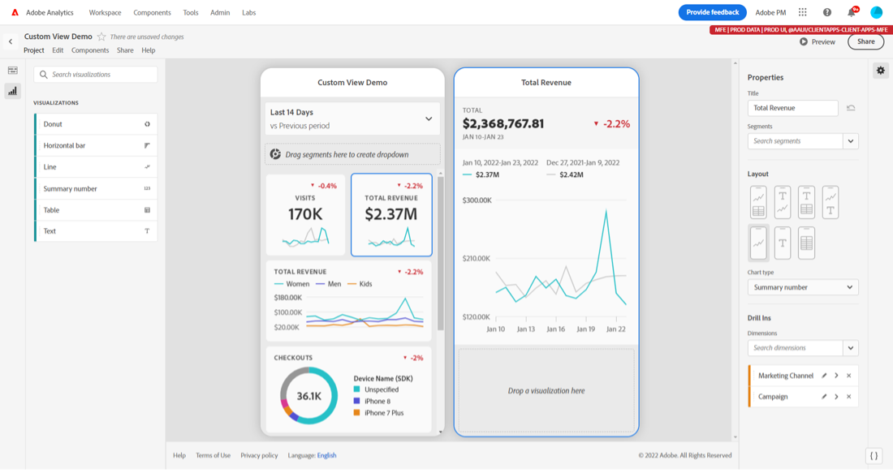

### Adicionar texto descritivo a um slide

É possível adicionar texto para fornecer informações significativas sobre o que está contido nos gráficos ou nuances dos dados.

Para adicionar texto a um slide de detalhes, selecione um layout que apresente o símbolo `T` ou arraste e solte o componente de visualização de texto do painel esquerdo. O editor de texto será aberto automaticamente ao adicionar uma nova visualização de texto ou escolher um layout de slide com texto. O editor de texto fornece todas as opções padrão para a formatação do texto. É possível aplicar estilos de texto como parágrafo, cabeçalho e subtítulo, além de aplicar negrito e itálico à fonte. Você pode justificar o texto, adicionar listas com marcadores, números e adicionar links. Quando terminar a edição, selecione o botão Minimizar no canto superior direito do editor de texto para fechá-lo. Para editar um texto já adicionado, selecione o ícone de lápis para abrir o editor de texto novamente.

## Remover componentes {#remove}

Da mesma forma, para remover um componente aplicado a todo o scorecard, clique em qualquer lugar do scorecard fora dos blocos e remova-o clicando no botão **x** que é exibido quando você passa o mouse sobre o componente, como mostrado abaixo para a **Novas visitas** segmento:

## Criar histórias de dados {#create-data-story}

Uma história de dados é uma coleção de pontos de dados de suporte, contexto comercial e métricas relacionadas com base em um tema ou métrica central.

Por exemplo, se focar no tráfego na Web, sua métrica mais importante pode ser visitas, mas você também pode se interessar em novos visitantes ou visitantes únicos, e querer ver os dados detalhados por página da Web ou de que tipo de dispositivo o tráfego vem. As histórias de dados em projetos de cartões de pontuação móveis permitem colocar suas métricas mais importantes em primeiro plano ao mesmo tempo em que conta toda a história por trás das métricas com vários slides de detalhes.

Assista ao vídeo para saber mais sobre como criar histórias de dados em projetos de cartões de pontuação móveis no Analysis Workspace.

>[!VIDEO](https://video.tv.adobe.com/v/3416392/?quality=12&learn=on)

**Para criar uma história de dados**

Crie sua história de dados adicionando vários slides de detalhes a um bloco.

1. Comece com um projeto de cartão de pontuação móvel.
1. Selecione um bloco do qual deseja criar uma história.

   

   {width=".50%"}

1. Adicione slides para criar sua história de dados. Seu primeiro slide é gerado por padrão.

   Para adicionar novos slides, passe o mouse sobre ou clique em um slide e selecione uma das opções disponíveis:

   * Toque no sinal de [!UICONTROL +] para criar um novo slide.

   * Toque no ícone de duplicação para duplicar o slide já existente.

1. Se você criar um slide em branco, arraste e solte componentes do painel esquerdo ou escolha um layout para preencher automaticamente o slide com os dados do bloco.

   

Para excluir um slide, toque no ícone de lixeira.

### Personalizar uma história de dados {#customize-data-story}

As histórias de dados permitem personalizar tudo. Assim você pode compartilhar as informações que deseja e excluir tudo que não precisa. Você pode personalizar blocos e slides individuais para adicionar filtros, mostrar detalhamentos, alterar o layout e as visualizações.

**Para personalizar blocos**

1. Toque em um bloco. O bloco selecionado será contornado em azul e o painel direito mostrará as propriedades do bloco.
1. Altere o título, o tipo de gráfico e outras opções do bloco.
1. Arraste um componente para o bloco.

   

   Ao arrastar e soltar um componente, como uma visualização em um bloco, o componente é aplicado a todos os slides da história de dados.

1. Para aplicar uma alteração somente ao título, mantenha pressionada a tecla Shift para aplicar a alteração.

   

>[!NOTE]
>Os slides herdam componentes do bloco, mas os blocos não herdam componentes dos slides.

**Como personalizar slides individuais**

Você pode alterar a visualização de slides individuais em uma história de dados. Por exemplo, é possível alterar um gráfico de barras horizontais para um gráfico de rosquinha em um slide específico. Também é possível alterar o layout. Consulte [Personalizar slides de detalhes](#customize-detail-slide).

### Visualizar uma história de dados {#preview-data-story}

Depois de criar uma história de dados, use o botão **Visualizar** para visualizar e interagir com uma história de dados como se você fosse um usuário do aplicativo. Para obter informações sobre como visualizar sua história de dados, consulte [Visualizar um cartão de pontuação](#preview)

### Navegar entre blocos e slides {#navigate-tiles-slides}

A barra de navegação exibe ícones que representam o que está em cada slide. A barra de navegação facilita a navegação para um slide específico se você tiver vários.

Para se mover entre o bloco e os slides, toque na barra de navegação.

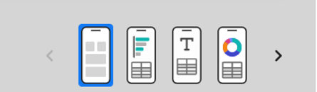{width="25%"}

Você também pode navegar para frente e para trás usando as setas no teclado ou selecionando um componente e mantendo-o à esquerda ou direita da tela para rolar.

## Visualizar cartão de pontuação {#preview}

Você pode visualizar como o cartão de pontuação será exibido e funcionará assim que for publicado no aplicativo de painéis do Analytics.

1. Clique em **[!UICONTROL Visualizar]** no canto superior direito da tela.

   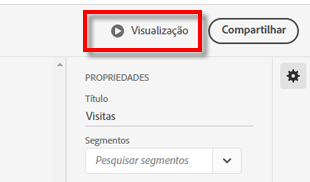

1. Para visualizar a aparência do cartão de pontuação em diferentes dispositivos, selecione um dispositivo no menu suspenso [!UICONTROL Visualização do dispositivo].

   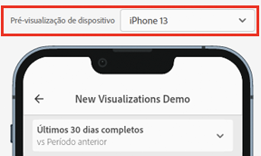

1. Para interagir com a visualização, é possível:

   * Clicar com o botão esquerdo do mouse para simular o toque na tela do telefone.

   * Usar a função de rolagem do computador para simular a rolagem da tela do telefone com o dedo.

   * Clicar e segurar para simular pressionar e segurar o dedo na tela do telefone. Isso é útil para interagir com as visualizações na visualização detalhada.

## Nomear um cartão de pontuação {#name}

Para nomear o scorecard, clique no namespace no canto superior esquerdo da tela e digite o novo nome.

## Compartilhar um cartão de pontuação {#share}

Para compartilhar o scorecard com um usuário executivo:

1. Clique no menu **[!UICONTROL Compartilhar]** e selecione **[!UICONTROL Compartilhar scorecard]**.

1. No formulário **[!UICONTROL Compartilhar scorecard para dispositivos móveis]**, preencha os campos da seguinte forma:

   * Fornecer o nome do cartão de pontuação
   * Fornecer uma descrição do cartão de pontuação
   * Adicionar tags relevantes
   * Especificar os recipients do cartão de pontuação

1. Clique em **[!UICONTROL Compartilhar]**.

Depois de compartilhar um cartão de pontuação, os recipients podem acessá-lo nos painéis do Analytics. Se você fizer alterações subsequentes no scorecard no construtor do scorecard, elas serão atualizadas automaticamente no scorecard compartilhado. Os usuários executivos verão as alterações depois de atualizar o scorecard no aplicativo.

Se você atualizar o cartão de pontuação adicionando novos componentes, será possível compartilhar o cartão de pontuação novamente (e marcar a opção **[!UICONTROL Compartilhar componentes integrados]**) para garantir que seus usuários executivos tenham acesso a essas mudanças.

### Compartilhar scorecards usando um link compartilhável

Usar um link compartilhável facilita o compartilhamento de um scorecard em um email, documento ou aplicativo de mensagem de texto. O link compartilhável permite que os recipients abram o scorecard no desktop ou no aplicativo móvel dos painéis. Os deep links compartilháveis tornam ainda mais fácil compartilhar projetos e impulsionar o engajamento com seus participantes.

Para compartilhar um scorecard usando um link compartilhável

1. Clique no menu **[!UICONTROL Compartilhar]** e selecione **[!UICONTROL Compartilhar scorecard]**.

   

1. Copie o link e cole-o em um email, documento ou aplicativo de IM.

   Quando um recipient usa um aplicativo de desktop ou navegador para abrir o link, o projeto do scorecard móvel é aberto no Workspace.

   Quando um recipient abrir o link em um dispositivo móvel, o scorecard será aberto diretamente no aplicativo de painéis do Analytics.

   Se um recipient não tiver baixado o aplicativo móvel, ele será direcionado para a lista de aplicativos na App Store ou na Google Play Store, onde poderá baixá-lo.

