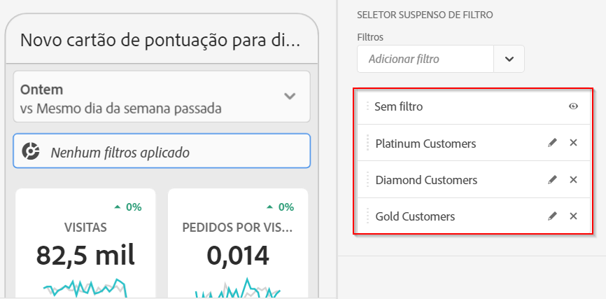
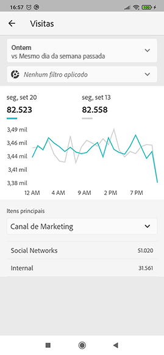

# Criar um scorecard

As informações a seguir instruem os curadores de dados do Adobe Analytics sobre como configurar e apresentar painéis para usuários executivos. Para começar, você pode exibir o vídeo Construtor de scorecard dos painéis do Adobe Analytics :

>[!VIDEO](https://video.tv.adobe.com/v/34544)

Um scorecard do Adobe Analytics exibe as principais visualizações de dados para usuários executivos em um layout lado a lado, como mostrado abaixo:

Como curador desse scorecard, você pode usar o Construtor de scorecards para configurar quais blocos aparecem no scorecard para o consumidor executivo. Você também configura como as exibições detalhadas ou os detalhamentos podem ser ajustados quando os blocos forem tocados. A interface do Construtor de scorecards é mostrada abaixo:

Para criar o Scorecard, é necessário fazer o seguinte:

1. Acesse o modelo de [!UICONTROL Scorecard para dispositivos móveis em branco].
2. Configure o scorecard com dados e salve.

## Acesse o modelo de [!UICONTROL Scorecard para dispositivos móveis em branco]

Você pode acessar o modelo [!UICONTROL Scorecard para dispositivos móveis em branco] criando um novo projeto ou no menu Ferramentas .

### Criar um novo projeto

1. Abra o Adobe Analytics e clique na guia **[!UICONTROL Workspace]**.
1. Clique em **[!UICONTROL Criar projeto]** e selecione o modelo de projeto **[!UICONTROL Scorecard para dispositivos móveis em branco]**.
1. Clique em **[!UICONTROL Criar]**.

### Menu Ferramentas

1. No menu **[!UICONTROL Ferramentas]**, selecione **[!UICONTROL Painéis do Analytics (Aplicativo móvel)]**.
1. Na tela subsequente, clique em **[!UICONTROL Create new scorecard]**.

## Configure o scorecard com dados e salve

Para implementar o modelo de Scorecard:

1. Em **[!UICONTROL Propriedades]** (no painel direito), especifique um **[!UICONTROL Conjunto de relatórios do projeto]** cujos dados você deseja usar.

   

1. Para adicionar um novo bloco ao Scorecard, arraste uma métrica do painel esquerdo e solte-a na zona **[!UICONTROL Arrastar e soltar métricas aqui]**. Também é possível inserir uma métrica entre dois blocos usando um fluxo de trabalho semelhante.

   

1. Em cada bloco, é possível acessar uma exibição detalhada que mostra informações adicionais sobre a métrica, como itens principais para uma lista de dimensões relacionadas.

## Adicionar dimensões ou métricas

Para adicionar uma dimensão relacionada a uma métrica, arraste uma dimensão do painel esquerdo e solte-a em um bloco.

Por exemplo, é possível adicionar dimensões apropriadas (como **[!DNL Marketing Channel]**, neste exemplo) à métrica **[!UICONTROL Visitantes únicos]**, arrastando-as e soltando-as no bloco. Os detalhamentos de Dimension são exibidos na seção [!UICONTROL Drill Ins] (detalhamento) do bloco específico **[!UICONTROL Properties]**. É possível adicionar várias dimensões a cada bloco.

## Aplicar segmentos

Para aplicar segmentos a blocos individuais, arraste um segmento do painel esquerdo e solte-o diretamente na parte superior do bloco.

Se você deseja aplicar o segmento a todos os blocos no Scorecard, solte o bloco em cima do scorecard. Ou você também pode aplicar segmentos selecionando segmentos no menu de filtro abaixo dos intervalos de datas. Você [configura e aplica filtros para seus Scorecards](https://experienceleague.adobe.com/docs/analytics-learn/tutorials/analysis-workspace/using-panels/using-drop-down-filters.html?lang=pt-BR) da mesma forma que faria no Adobe Analytics Workspace.

## Adicionar intervalos de datas

Adicione e remova combinações de intervalo de datas que podem ser selecionadas no cartão de pontuação selecionando o menu suspenso Intervalo de datas.

Cada novo cartão de pontuação começa com seis combinações de intervalo de datas, com foco nos dados de hoje e ontem. Você pode remover intervalos de datas desnecessários clicando no x ou editar cada combinação de intervalo de datas clicando no lápis.

Para criar ou alterar uma data principal, use o menu suspenso para selecionar intervalos de datas disponíveis ou arraste e solte um componente de data do painel direito na área designada.

Para criar uma data de comparação, você pode selecionar entre predefinições convenientes para comparações de tempo comuns no menu suspenso. Você também pode arrastar e soltar um componente de data no painel direito.

Se o intervalo de datas desejado ainda não tiver sido criado, será possível criar um novo clicando no ícone do calendário.

Você será direcionado ao construtor de intervalo de datas, em que é possível criar e salvar um novo componente de intervalo de datas.

## Aplicar visualizações

Os painéis do Analytics oferecem quatro visualizações que proporcionam um excelente insight sobre itens de dimensão e métricas. Altere para uma visualização diferente alterando o [!UICONTROL tipo de gráfico] de [!UICONTROL Propriedades] de um bloco. Basta selecionar o bloco direito e alterar o tipo de gráfico.

Ou clique no ícone [!UICONTROL Visualizações] no painel à esquerda e arraste e solte a visualização à direita no bloco :

**[!UICONTROL Número do resumo]**

Use a visualização Número do resumo para realçar um grande número que é importante em um projeto.

** Rosvisualização**

Semelhante ao gráfico de pizza, essa visualização mostra os dados como partes ou segmentos de um todo. Use um gráfico de rosca ao comparar porcentagens de um total. Por exemplo, digamos que você queira ver qual plataforma de anúncio contribuiu para o número total de visitantes únicos:

**Visualização de linha**

A visualização de linha representa as métricas que usam uma linha para mostrar como os valores são alterados em um período. Um gráfico de linha mostra dimensões ao longo do tempo, mas funciona com qualquer visualização. Você está visualizando a dimensão categoria do produto neste exemplo.

**[!UICONTROL Visualização ] de Barras Horizontais**

Esta visualização mostra barras horizontais que representam vários valores de uma ou mais métricas. Por exemplo, para ver facilmente os principais produtos, use a [!UICONTROL Barra horizontal] para visualizar de preferência.

**Remover itens de dimensão   não especificados**

Se quiser remover [!UICONTROL Unspecified] itens de dimensão de seus dados, faça o seguinte:

1. Selecione o mosaico correto.
1. No painel direito, em **[!UICONTROL Drill ins]**, selecione a seta para a direita ao lado do item de dimensão cujos itens **[!UICONTROL Não especificado]** você deseja remover.

   

1. Clique no ícone ao lado de **[!UICONTROL Unspecified]** para remover dados não especificados de seus relatórios. (Também é possível remover qualquer outro item de dimensão.)

## Exibir e configurar propriedades de blocos

Ao clicar em um bloco no Construtor de scorecards, o painel direito exibe as propriedades e características associadas a esse bloco. Nesse painel, você pode fornecer um novo **[!UICONTROL Título]** para o bloco e, como alternativa, configurá-lo especificando os componentes, em vez de arrastá-los e soltá-los no painel esquerdo.

Quando você clica em blocos, um pop-up dinâmico exibe como a exibição Drill ins (Detalhamento) é exibida para o usuário executivo no aplicativo. Se nenhuma dimensão tiver sido aplicada ao bloco, a dimensão de detalhamento será a **hora** ou os **dias**, dependendo do intervalo de datas padrão.

Detalhamentos refinam sua análise ao detalhar literalmente métricas e dimensões por outras métricas e dimensões, como neste exemplo de varejo:

* Métrica de Visitantes únicos detalhada por Plataforma de anúncio (AMO ID)
* Visitas detalhadas por Categoria do produto (varejo)
* Receita total dividida por Nome do produto

Cada dimensão adicionada ao bloco será mostrada em uma lista suspensa na exibição detalhada do aplicativo. O usuário executivo pode então escolher entre as opções indicadas na lista suspensa.

## Remover componentes

Da mesma forma, para remover um componente aplicado a todo o cartão de pontuação, clique em qualquer lugar do cartão de pontuação fora dos blocos e remova-o clicando no **x** exibido ao passar o mouse sobre o componente, como mostrado abaixo para o segmento **Primeiras visitas**:

## Nomear um scorecard

Para nomear o Scorecard, clique no namespace no canto superior esquerdo da tela e digite o novo nome.

## Compartilhar um scorecard

Para compartilhar o Scorecard com um usuário executivo:

1. Clique no menu **[!UICONTROL Compartilhar]** e selecione **[!UICONTROL Compartilhar scorecard]**.

1. No formulário **[!UICONTROL Compartilhar scorecard para dispositivos móveis]**, preencha os campos da seguinte forma:

   * Fornecimento do nome do scorecard
   * Fornecer uma descrição do scorecard
   * Adicionar tags relevantes
   * Especificação dos recipients para o scorecard

1. Clique em **[!UICONTROL Compartilhar]**.

Depois de compartilhar um scorecard, os destinatários podem acessá-lo nos painéis do Analytics. Se você fizer alterações subsequentes no scorecard no Construtor de scorecards, elas serão atualizadas automaticamente no scorecard compartilhado. Os usuários executivos verão as alterações depois de atualizar o Scorecard no aplicativo.

Se você atualizar o scorecard adicionando novos componentes, convém compartilhar o scorecard novamente (e marque a opção **[!UICONTROL Share embedded components]** ) para garantir que os usuários executivos tenham acesso a essas alterações.