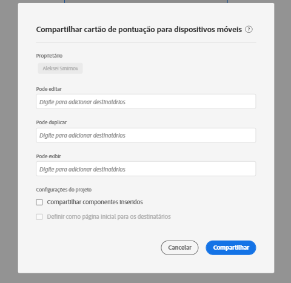

# Criar um scorecard

Um scorecard do Adobe Analytics exibe as principais visualizações de dados para usuários executivos em um layout lado a lado, como mostrado abaixo:

Como curador desse scorecard, você pode usar o Construtor de scorecards para configurar quais blocos aparecem no scorecard para o consumidor executivo. Você também configura como as exibições detalhadas ou os detalhamentos podem ser ajustados quando os blocos forem tocados. A interface do Construtor de scorecards é mostrada abaixo:

Para criar o Scorecard, é necessário fazer o seguinte:

1. Acesse o modelo de [!UICONTROL Scorecard para dispositivos móveis em branco].
2. Configure o Scorecard com os dados e salve.

## Acesse o modelo de [!UICONTROL Scorecard para dispositivos móveis em branco]

Você pode acessar o modelo de [!UICONTROL Scorecard para dispositivos móveis em branco] de uma das seguintes maneiras:

**Criar um novo projeto**

1. Abra o Adobe Analytics e clique na guia **[!UICONTROL Workspace]**.
1. Clique em **[!UICONTROL Criar projeto]** e selecione o modelo de projeto **[!UICONTROL Scorecard para dispositivos móveis em branco]**.
1. Clique em **[!UICONTROL Criar]**.

Ou

1. No menu **[!UICONTROL Ferramentas]** selecione **[!UICONTROL Painéis do Analytics (Aplicativo móvel)]**.
1. Na tela seguinte, clique no botão **[!UICONTROL Criar novo scorecard]**.

## Configure o scorecard com dados e salve

Para implementar o modelo de Scorecard:

1. Em **[!UICONTROL Propriedades]** (no painel direito), especifique um **[!UICONTROL Conjunto de relatórios do projeto]** cujos dados você deseja usar.

   

1. Para adicionar um novo bloco ao Scorecard, arraste uma métrica do painel esquerdo e solte-a na zona **[!UICONTROL Arrastar e soltar métricas aqui]**. Também é possível inserir uma métrica entre dois blocos usando um fluxo de trabalho semelhante.

   

   *Em cada bloco, é possível acessar uma exibição detalhada que mostra informações adicionais sobre a métrica, como itens principais para uma lista de dimensões relacionadas.*

1. Para adicionar uma dimensão relacionada a uma métrica, arraste uma dimensão do painel esquerdo e solte-a em um bloco. Por exemplo, você pode adicionar dimensões apropriadas (como **[!DNL DMA Region]**, neste exemplo) às métricas **[!UICONTROL Visitantes únicos]** arrastando e soltando no bloco; as dimensões que você adicionar aparecerão na seção de detalhamento das **[!UICONTROL Propriedades]** específicas do bloco. É possível adicionar várias dimensões a cada bloco.

   

   Quando você clica em um bloco no Construtor de scorecards, o painel direito exibe as propriedades e características associadas a esse bloco. Nesse painel, você pode fornecer um novo **[!UICONTROL Título]** para o bloco e, como alternativa, configurá-lo especificando os componentes, em vez de arrastá-los e soltá-los no painel esquerdo.

   

   Além disso, se você clicar nos blocos, um pop-up dinâmico mostrará como a exibição Detalhamento aparecerá para o usuário executivo no aplicativo. Se nenhuma dimensão tiver sido aplicada ao bloco, a dimensão de detalhamento será a **hora** ou os **dias**, dependendo do intervalo de datas padrão.

   

   Cada dimensão adicionada ao bloco será mostrada em uma lista suspensa na exibição detalhada do aplicativo. O usuário executivo pode então escolher entre as opções indicadas na lista suspensa.

1. Para aplicar segmentos a blocos individuais, arraste um segmento do painel esquerdo e solte-o diretamente na parte superior do bloco. Se você deseja aplicar o segmento a todos os blocos no Scorecard, solte o bloco em cima do scorecard. Ou você também pode aplicar segmentos selecionando segmentos no menu de filtro abaixo dos intervalos de datas. Você [configura e aplica filtros para seus Scorecards](https://experienceleague.adobe.com/docs/analytics-learn/tutorials/analysis-workspace/using-panels/using-drop-down-filters.html?lang=pt-BR) da mesma forma que faria no Adobe Analytics Workspace.

   

1. Da mesma forma, para remover um componente aplicado a todo o cartão de pontuação, clique em qualquer lugar do cartão de pontuação fora dos blocos e remova-o clicando no **x** exibido ao passar o mouse sobre o componente, como mostrado abaixo para o segmento **Primeiras visitas**:

   

1. Adicione e remova combinações de intervalo de datas que podem ser selecionadas no cartão de pontuação selecionando o menu suspenso Intervalo de datas.

   

   Cada novo cartão de pontuação começa com seis combinações de intervalo de datas, com foco nos dados de hoje e ontem. Você pode remover intervalos de datas desnecessários clicando no x ou editar cada combinação de intervalo de datas clicando no lápis.

   

   Para criar ou alterar uma data principal, use o menu suspenso para selecionar intervalos de datas disponíveis ou arraste e solte um componente de data do painel direito na área designada.

   

   Para criar uma data de comparação, você pode selecionar entre predefinições convenientes para comparações de tempo comuns no menu suspenso. Você também pode arrastar e soltar um componente de data no painel direito.

   

   Se o intervalo de datas desejado ainda não tiver sido criado, será possível criar um novo clicando no ícone do calendário.

   

1. Você será direcionado ao construtor de intervalo de datas, em que é possível criar e salvar um novo componente de intervalo de datas. Para nomear o Scorecard, clique no namespace no canto superior esquerdo da tela e digite o novo nome.

   

## Compartilhar o scorecard

Para compartilhar o Scorecard com um usuário executivo:

1. Clique no menu **[!UICONTROL Compartilhar]** e selecione **[!UICONTROL Compartilhar scorecard]**.

1. No formulário **[!UICONTROL Compartilhar scorecard para dispositivos móveis]**, preencha os campos da seguinte forma:

   * Fornecer o nome do Scorecard
   * Fornecer uma descrição do Scorecard
   * Adicionar tags relevantes
   * Especificar os destinatários do Scorecard

1. Clique em **[!UICONTROL Compartilhar]**.

Depois de compartilhar um scorecard, os destinatários podem acessá-lo nos painéis do Analytics. Se você fizer alterações subsequentes no scorecard no Construtor de scorecards, elas serão atualizadas automaticamente no scorecard compartilhado. Os usuários executivos verão as alterações depois de atualizar o Scorecard no aplicativo.

Se você atualizar o Scorecard adicionando novos componentes, convém compartilhar o scorecard novamente (e marcar a opção **[!UICONTROL Compartilhar componentes inseridos]**) para garantir que os usuários executivos tenham acesso a essas alterações.