# BETA: Guia do curador para o aplicativo móvel do Analytics

## Introdução

O aplicativo móvel do Adobe Analytics fornece insights a qualquer hora e em qualquer lugar do Adobe Analytics.   O aplicativo permite que os usuários tenham acesso móvel a scorecards intuitivos, que você pode criar e compartilhar na interface do usuário do Adobe Analytics para desktop. Os scorecards são uma coleção de métricas principais e outros componentes apresentados em um layout lado a lado que você pode tocar para detalhar mais detalhadamente e relatórios de tendências. Você pode adaptar os Scorecards de acordo com os dados mais importantes para você. O aplicativo móvel é compatível com sistemas operacionais iOS e Android.

## Sobre este guia

Este guia tem como objetivo ajudar os curadores dos dados do Adobe Analytics a configurar os Scorecards para seus usuários executivos no aplicativo móvel do Analytics. Os curadores podem ser administradores organizacionais ou pessoas em outras funções responsáveis pela configuração dos Scorecards do aplicativo, que permitem que os usuários executivos visualizem uma ampla renderização de dados importantes de resumo com rapidez e facilidade em seus próprios dispositivos móveis. Embora os usuários executivos sejam os usuários finais do aplicativo móvel do Analytics, este guia ajudará os curadores de dados a configurar o aplicativo eficientemente para esses usuários.

## Glossário de termos

A tabela a seguir descreve os termos para entender o público-alvo, as funções e a operação do aplicativo móvel do Analytics.

| Termo | Definição |
|--- |--- |
| Consumidor | Personalidade executiva visualizando métricas e insights principais do Analytics em um dispositivo móvel |
| Curador | Personalidade da biblioteca de dados que encontra e distribui insights do Analytics e configura os Scorecards a serem exibidos pelo consumidor |
| Preparação | O ato de criar ou editar um scorecard móvel contendo métricas, dimensões e outros componentes relevantes para o consumidor |
| Scorecar | Uma exibição de aplicativo móvel contendo um ou mais blocos |
| Lado a lado | Uma renderização para uma métrica em uma Exibição de Scorecard |
| Detalhamento | Uma exibição secundária acessível tocando em um bloco no Scorecard. Essa exibição é expandida na métrica exibida no bloco e, opcionalmente, informa sobre dimensões de detalhamento adicionais. |
| Intervalo de datas | O intervalo de datas principal para relatórios do aplicativo móvel |
| Intervalo de datas de comparação | O intervalo de datas que é comparado ao intervalo de datas principal |

 
## Criar um Scorecard para usuários executivos

Um Mobile Scorecard exibe as principais visualizações de dados para usuários executivos em um layout lado a lado, como mostrado abaixo:

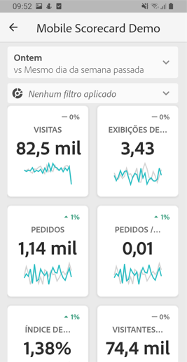

Como curador deste Scorecard, você pode usar o Construtor de Scorecard para configurar quais blocos aparecem no Scorecard para seu consumidor. Você também configura como as exibições detalhadas, ou os Detalhamentos, podem ser ajustados quando os blocos forem tocados. A interface do Construtor de scorecard é mostrada abaixo:

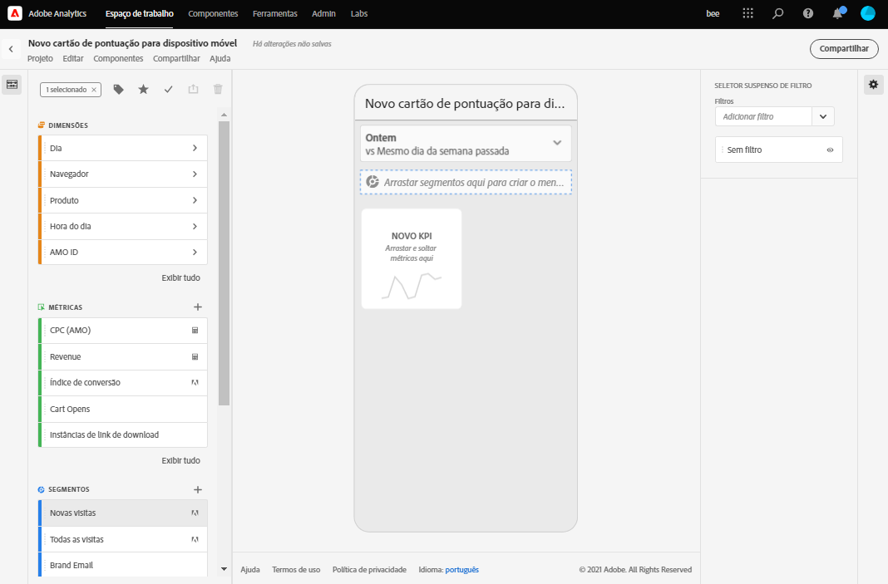

Para criar o Scorecard, é necessário fazer o seguinte:

1. Acesse o modelo em branco do Mobile Scorecard.
2. Configure o Scorecard com dados e salve-o.

### Acessar o modelo em branco do Mobile Scorecard

Você pode acessar o modelo em branco do Mobile Scorecard de uma das seguintes maneiras:

**Criar um novo projeto**

1. Abra o Adobe Analytics e clique na guia **Espaço de trabalho** .
2. Clique no botão **Criar novo projeto** e selecione o modelo de projeto **em branco do Mobile Scorecard** .
3. Click the **Create** button.

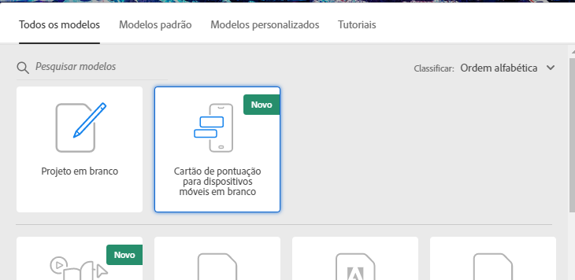

*Observação: Se você não vir o modelo em branco do Mobile Scorecard, como mostrado abaixo, sua empresa ainda não foi ativada para o Beta. Entre em contato com seu gerente de atendimento ao cliente.*

**Adicionar um projeto**

Na tela **Projetos** , na guia **Componentes** , clique no botão **Adicionar** e selecione **Mobile Scorecard**.

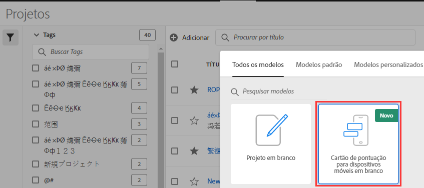

**Usar ferramentas do Analytics**

No Analytics, clique no menu **Ferramentas** e selecione Aplicativo **** móvel. Na tela subsequente, clique no botão **Criar Scorecard** .

### Configurar o Scorecard com dados e salvá-los

Para implementar o modelo do Scorecard:

1. Em **Propriedades** (no painel direito), especifique um Conjunto **de relatórios de** projeto do qual deseja usar os dados.

   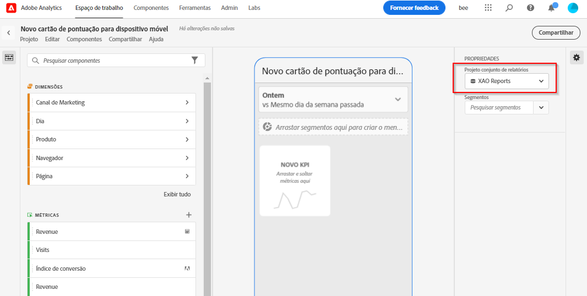

2. Para adicionar um novo bloco ao Scorecard, arraste uma métrica do painel esquerdo e solte-a na Zona **Arrastar e soltar métricas aqui** . Também é possível inserir uma métrica entre dois blocos usando um fluxo de trabalho semelhante.

   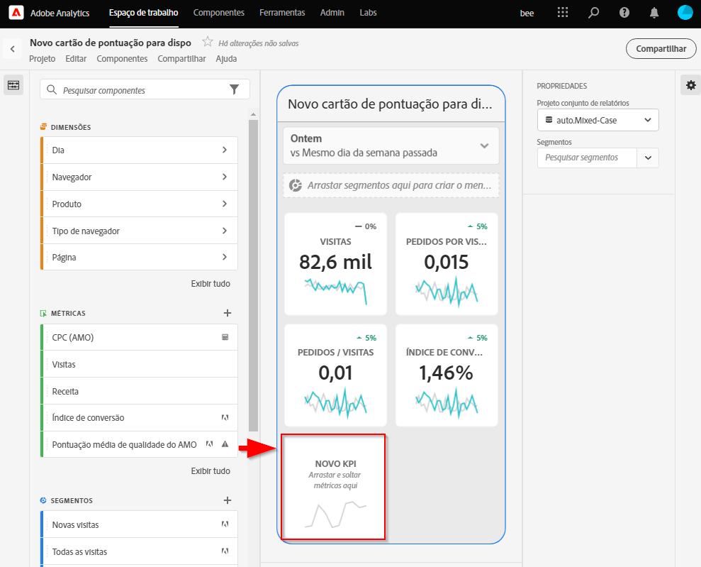

   *Em cada bloco, você pode acessar uma exibição detalhada que exibe informações adicionais sobre a métrica, como itens principais para uma lista de dimensões relacionadas.*

3. Para adicionar uma dimensão relacionada a uma métrica, arraste uma dimensão do painel esquerdo e solte-a em um bloco. Por exemplo, é possível adicionar dimensões apropriadas (como Região **** DMA, neste exemplo) à métrica Visitantes **** únicos arrastando-a e soltando-a no bloco; as dimensões adicionadas aparecerão na seção de detalhamento das **Propriedades** específicas do bloco. É possível adicionar várias dimensões a cada bloco.

   

   *Observação: Também é possível adicionar uma dimensão a todos os blocos soltando-os na tela do Scorecard.*

   Quando você clica em um bloco no Construtor de scorecard, o painel direito exibe as propriedades e características associadas ao bloco. Neste painel, você pode fornecer um novo **Título** para o bloco e, como alternativa, configurar o bloco ao especificar componentes em vez de arrastá-los e soltá-los do painel esquerdo.

   Além disso, se você clicar em blocos, um pop-up dinâmico exibirá como a exibição Detalhamento será exibida para o usuário executivo no aplicativo. Se nenhuma dimensão tiver sido aplicada ao bloco, a dimensão de detalhamento será **hora** ou **dias**, dependendo do intervalo de datas padrão.

   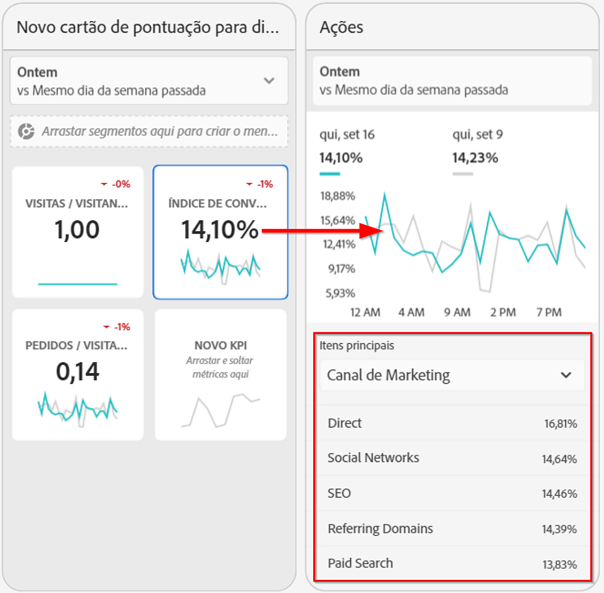

   *Observe como cada dimensão adicionada ao bloco será exibida em uma lista suspensa na exibição detalhada do aplicativo. O usuário executivo pode então escolher entre as opções listadas na lista suspensa.*

4. Para aplicar segmentos a blocos individuais, arraste um segmento do painel esquerdo e solte-o diretamente na parte superior do bloco. Se desejar aplicar o segmento a todos os blocos do Scorecard, solte o bloco na parte superior do scorecard.

5. Da mesma forma, para remover um componente que é aplicado a todo o Scorecard, clique em qualquer lugar no Scorecard fora dos blocos e remova-o clicando no **x** exibido ao passar o mouse sobre o componente, conforme mostrado abaixo para o segmento Clientes **** móveis:

   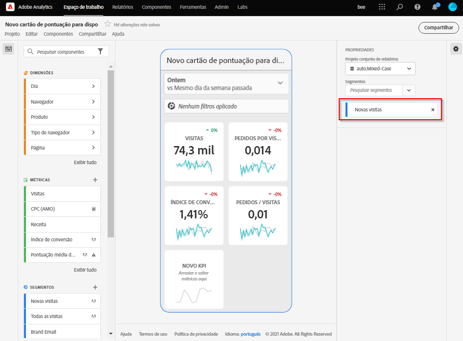

6. Em **Propriedades** do Scorecard, também é possível especificar o seguinte:

   * Um Intervalo **De Datas** Padrão. Os intervalos especificados aqui serão os mesmos aplicados ao primeiro acesso do usuário executivo ao Scorecard em seu aplicativo.

   * Um intervalo de datas de **comparação**

   * Quaisquer **segmentos** a serem aplicados a todo o Scorecard

7. Para nomear o Scorecard, clique no namespace no canto superior esquerdo da tela e digite o novo nome.

   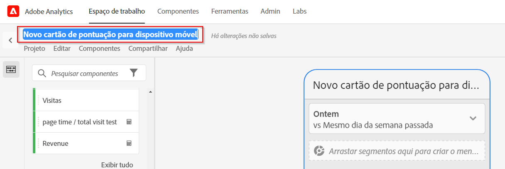

## Compartilhar o Scorecard

Para compartilhar o Scorecard com um usuário executivo:

1. Clique no menu **Compartilhar** e selecione **Compartilhar Scorecard**.

2. No formulário **Compartilhar** , preencha os campos ao:

   * Fornecer o nome do Scorecard
   * Fornecer uma descrição do Scorecard
   * Adição de tags relevantes
   * Especificação dos destinatários do Scorecard
   * Selecione a opção para **Compartilhar componentes incorporados com destinatários** para garantir que o usuário executivo tenha acesso a todos os componentes no Scorecard.

3. Clique em **Compartilhar**.

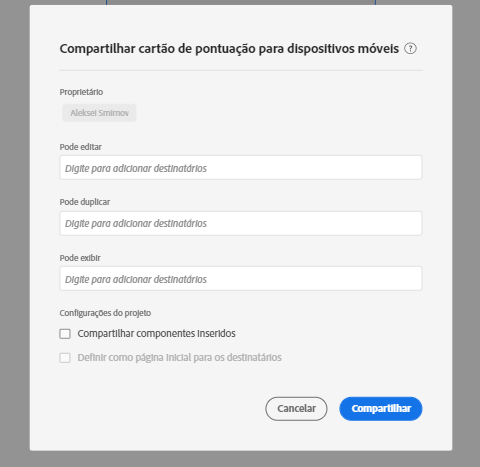

Depois de compartilhar um Scorecard, os destinatários poderão acessá-lo em seus aplicativos do Analytics Mobile. Se você fizer alterações subsequentes no Scorecard no Construtor de Scorecard, elas serão automaticamente atualizadas no Scorecard compartilhado. Os usuários executivos verão as alterações depois de atualizar o Scorecard em seu aplicativo.

*Observação: Se você atualizar o Scorecard adicionando novos componentes, poderá compartilhar o scorecard novamente (e marcar a opção Compartilhar componentes incorporados **automaticamente com destinatários**) para garantir que os usuários executivos tenham acesso a essas alterações.*

## Configurar usuários executivos com o aplicativo

Em alguns casos, os usuários executivos podem precisar de alguma assistência adicional para acessar e usar o aplicativo. Esta seção fornece informações para ajudá-lo a fornecer essa assistência.

### Ajuda os usuários executivos a obterem acesso

Para ajudar usuários executivos a acessar seus Scorecards no aplicativo, verifique se:

* Os requisitos mínimos de SO móvel em seus dispositivos são iOS versão 10 ou superior, ou Android versão 4.4 (KitKat) ou superior
* Eles têm um logon válido no Adobe Analytics
* Você criou corretamente os Scorecards móveis para eles e compartilha esses Scorecards com eles.
* Eles têm acesso à Analysis Workspace e ao conjunto de relatórios no qual o Scorecard se baseia
* Eles têm acesso aos Componentes incluídos no Scorecard. Observação: Você pode selecionar uma opção ao compartilhar seus Scorecards com os destinatários **para Compartilhar** automaticamente componentes incorporados.

### Ajuda os usuários executivos a usar o aplicativo

Durante a fase beta e antes do aplicativo ser exibido ao público, você pode controlar quem tem acesso ao aplicativo.

1. Ajuda os usuários executivos a baixar e instalar o aplicativo. Para fazer isso, forneça as seguintes etapas para estender o acesso aos usuários executivos, dependendo se eles usam um dispositivo iOS ou Android.

   **Para usuários executivos no iOS:**

      1. Clique no seguinte link público (ele também está disponível no Analytics em **Ferramentas** &gt; Aplicativo **** móvel):

         [Link](https://testflight.apple.com/join/WtXMQxlI)do iOS: `https://testflight.apple.com/join/WtXMQxlI`

         Depois de clicar no link, a seguinte tela de Testflight é exibida:

         

      2. Toque no link **Exibir na App Store** na tela para baixar o aplicativo Testflight.

      3. Após instalar o aplicativo Testflight, localize e instale o aplicativo móvel do Adobe Analytics no Testflight, como mostrado abaixo:

         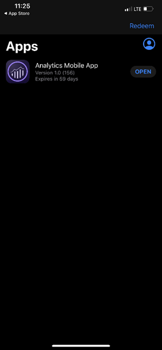
   **Para usuários executivos no Android:**

      1. Toque no link Reproduzir na loja a seguir no dispositivo do usuário (ele também está disponível no Analytics em **Ferramentas** &gt; Aplicativo ****móvel):
         [Android](https://play.google.com/apps/testing/com.adobe.analyticsmobileapp): `https://play.google.com/apps/testing/com.adobe.analyticsmobileapp`

         Depois de tocar no link, toque no link Testar na seguinte tela:

         

      2. Toque no **download do link no Google Play** na seguinte tela:
         

      3. Baixe e instale o aplicativo.
   Depois de baixados e instalados, os usuários executivos podem fazer logon no aplicativo usando suas credenciais existentes do Adobe Analytics; oferecemos suporte para Adobe e Enterprise/Federated IDs.
      

2. Ajude-os a acessar seu Scorecard. Depois que os usuários executivos fazem logon no aplicativo, a tela **Escolher uma empresa** é exibida. Esta tela lista as empresas de logon às quais o usuário executivo pertence. Para ajudá-los a chegar ao Scorecard:

   * Toque no nome da empresa de logon ou da Experience Cloud Org que se aplica ao Scorecard que você compartilhou. A lista Scorecard mostra todos os Scorecards que foram compartilhados com o executivo na empresa de logon.
   * Ajude-os a classificar essa lista pela **última vez modificada**, se aplicável.
   * Toque no nome do Scorecard para exibi-lo.
   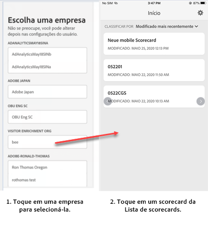

   Observação: Se o usuário executivo fizer logon e vir uma mensagem dizendo que nada foi compartilhado:

   * O usuário executivo pode ter selecionado a instância incorreta do Analytics
   * O Scorecard pode não ter sido compartilhado com o usuário executivo

      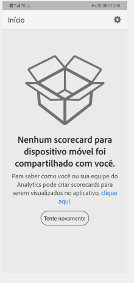
   Verifique se o usuário executivo pode fazer logon na instância correta do Analytics e se o Scorecard foi compartilhado.

3. Explique ao usuário executivo como os blocos aparecem nos Scorecards que você compartilha.

   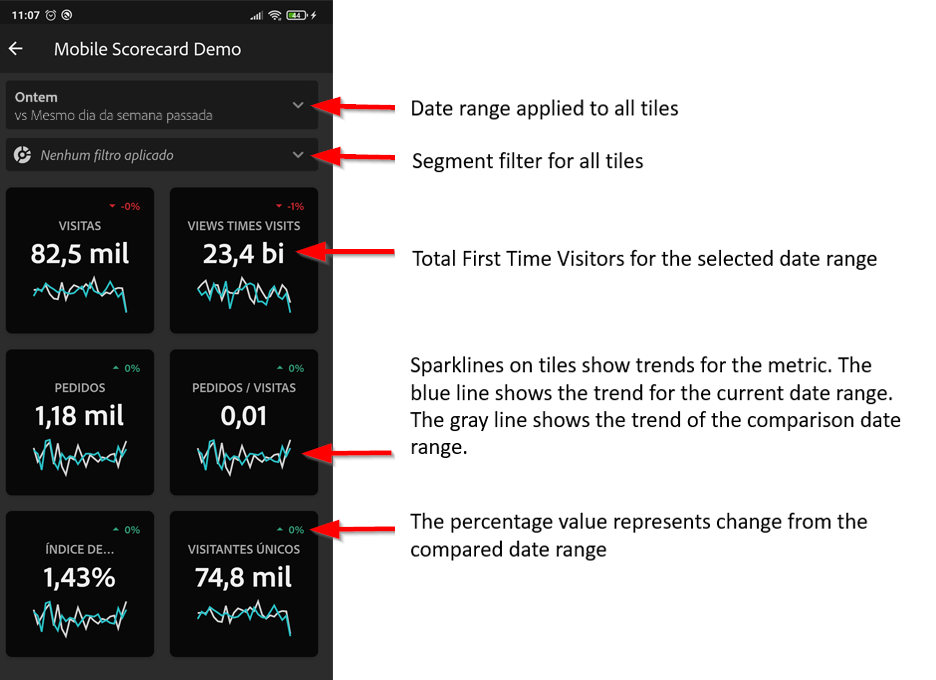

   Informações adicionais sobre blocos:

   * A granularidade dos minigráficos depende do comprimento do intervalo de datas:
      * Um dia mostra uma tendência por hora
      * Mais de um dia e menos de um ano mostram uma tendência diária
      * Um ano ou mais mostra uma tendência semanal
   * A fórmula de alteração do valor percentual é o total da métrica (intervalo de datas atual) - total da métrica (intervalo de datas de comparação) / total da métrica (intervalo de datas de comparação).
   * Você pode puxar a tela para baixo para atualizar o Scorecard.

4. Toque em um bloco para mostrar como um detalhamento do bloco funciona.

   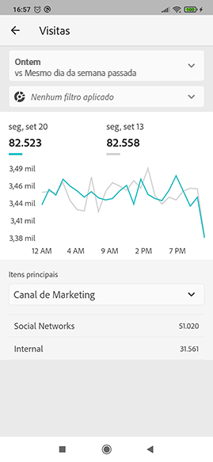

5. Para alterar os intervalos de datas do Scorecard:

   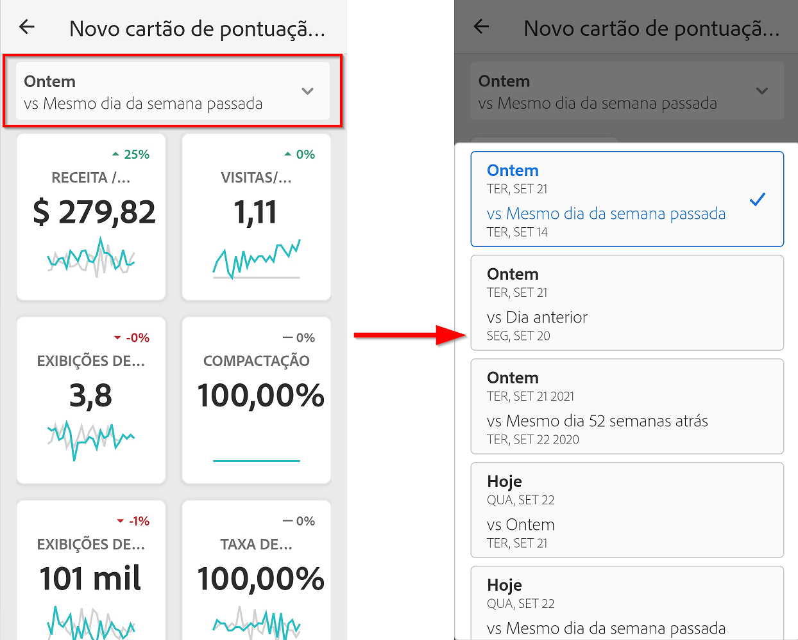

   *Observação: Você também pode alterar os intervalos de datas na exibição de Detalhamento mostrada acima da mesma maneira.*

   Dependendo do intervalo que você tocar (**Dia**, **Semana**, **Mês** ou **Ano**), você verá duas opções para intervalos de datas - seja o período atual ou aquele imediatamente anterior. Toque em uma dessas duas opções para selecionar o primeiro intervalo. Na lista **COMPARAR PARA** , toque em uma das opções apresentadas para comparar os dados desse período com o primeiro intervalo de datas selecionado. Toque em **Concluído** no canto superior direito da tela. Os campos Intervalos **de** datas e os blocos do Scorecard são atualizados com os novos dados de comparação dos novos intervalos selecionados.

6. Para deixar feedback sobre este aplicativo:

   1. Toque no ícone do usuário no canto superior direito da tela do aplicativo.
   2. Na tela **Minha conta** , toque na opção **Feedback** .
   3. Toque em para exibir as opções para deixar feedback.
   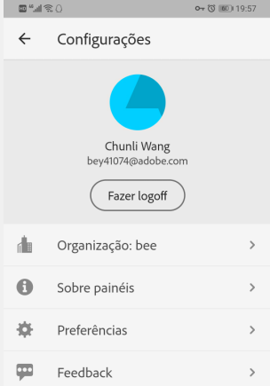
   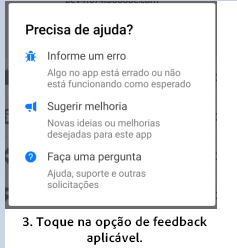

**Para relatar um bug**:

Toque na opção e escolha uma subcategoria do erro. No formulário para reportar um bug, forneça seu endereço de email no campo superior e a descrição do bug no campo abaixo dele. Uma captura de tela das informações de sua conta é anexada automaticamente à mensagem, mas você pode excluí-la, se desejar, tocando no **X** na imagem do anexo. Você também tem opções para gravar uma tela, adicionar mais capturas de tela ou anexar arquivos. Para enviar o relatório, toque no ícone de plano de papel na parte superior direita do formulário.

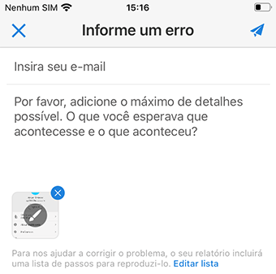

**Para sugerir uma melhoria**:

Toque na opção e escolha uma subcategoria para a sugestão. No formulário de sugestão, forneça seu endereço de email no campo superior e a descrição do bug no campo abaixo dele. Uma captura de tela das informações de sua conta é anexada automaticamente à mensagem, mas você pode excluí-la, se desejar, tocando no **X** na imagem do anexo. Você também tem opções para gravar uma tela, adicionar mais capturas de tela ou anexar arquivos. Para enviar a sugestão, toque no ícone de plano de papel na parte superior direita do formulário.

**Para fazer uma pergunta**:

Toque na opção e forneça seu endereço de email no campo superior e sua pergunta no campo abaixo. Uma captura de tela é anexada automaticamente à mensagem, mas você pode excluí-la, se desejar, tocando no **X** na imagem do anexo. Você também tem opções para gravar uma tela, adicionar mais capturas de tela ou anexar arquivos. Para enviar a pergunta, toque no ícone de plano de papel na parte superior direita do formulário.
