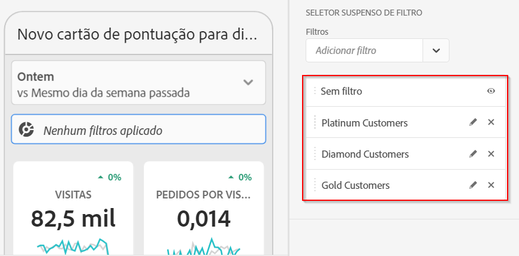
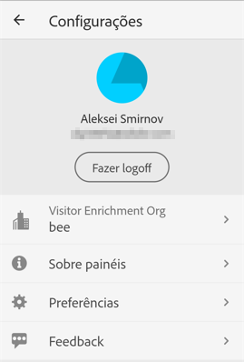
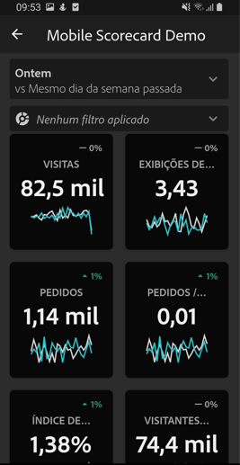

# Guia do curador para painéis do Adobe Analytics

As informações a seguir instruem os curadores de dados do Adobe Analytics sobre como configurar e apresentar painéis para usuários executivos. Para assistir a um vídeo que demonstra essas informações, consulte o vídeo do Adobe Analytics painel Scorecard Builder:

>[!VIDEO](https://video.tv.adobe.com/v/34544)

## Introdução

Os painéis do Adobe Analytics fornecem insights a qualquer hora e em qualquer lugar do Adobe Analytics. O aplicativo permite aos usuários acesso móvel a scorecards intuitivos criados e compartilhados a partir da interface do usuário de desktop do Adobe Analytics. Os scorecards são uma coleção das métricas principais e de outros componentes apresentados em um layout lado a lado, que você pode usar para obter detalhamentos mais minuciosos e relatórios de tendências. Você pode adaptar os Scorecards de acordo com os dados mais importantes para você. Os painéis do Analytics são aceitos em sistemas operacionais iOS e Android.

## Mais informações sobre este guia

Este guia tem como objetivo ajudar os curadores de dados do Adobe Analytics a configurar os scorecards para os usuários executivos nos painéis. Os curadores podem ser administradores organizacionais ou pessoas em outras funções responsáveis pela configuração dos Scorecards para aplicativos, que permitem aos usuários executivos visualizar uma ampla renderização de dados sumários importantes de maneira rápida e fácil em seus próprios dispositivos móveis. Embora os usuários executivos sejam os usuários finais dos painéis do Analytics, este guia ajudará os curadores de dados a configurar o aplicativo de maneira eficaz para esses usuários.

## Glossário de termos

A tabela a seguir descreve os termos para entender o público-alvo, as funções e a operação dos painéis do Analytics.

| Termo | Definição |
|--- |--- |
| Consumidor | Usuário executivo que visualiza as métricas principais e informações do Analytics em um dispositivo móvel |
| Curador | Usuário com conhecimento de dados que encontra e distribui informações do Analytics e configura os Scorecards para serem visualizados pelo consumidor |
| Preparação | O ato de criar ou editar um Scorecard para dispositivos móveis com métricas, dimensões e outros componentes relevantes para o consumidor |
| Scorecard | Uma exibição de painéis que contém um ou mais blocos |
| Bloco | Uma renderização para uma métrica em uma Exibição de scorecard |
| Detalhamento | Uma exibição secundária acessível ao tocar em um bloco no Scorecard. Essa exibição é expandida na métrica mostrada no bloco e, opcionalmente, relata as dimensões adicionais de detalhamento |
| Intervalo de datas | O intervalo de datas principal dos relatórios de painéis |
| Intervalo de datas de comparação | O Intervalo de datas comparado ao intervalo de datas principal |

## Criar um Scorecard para usuários executivos

Um Scorecard exibe as principais visualizações de dados para usuários executivos em um layout lado a lado, como mostrado abaixo:

Como curador deste Scorecard, você pode usar o Construtor de scorecards para configurar quais blocos são exibidos no Scorecard para o consumidor. Você também configura como as exibições detalhadas ou os Detalhamentos podem ser ajustados quando os blocos forem tocados. A interface do Construtor de scorecards é mostrada abaixo:

Para criar o Scorecard, é necessário fazer o seguinte:

1. Access the [!UICONTROL Blank Mobile Scorecard] template.
2. Configure o Scorecard com os dados e salve.

### Access the [!UICONTROL Blank Mobile Scorecard] template

You can access the [!UICONTROL Blank Mobile Scorecard] template in one of the following ways:

**Criar um novo projeto**

1. Abra o Adobe Analytics e clique na guia **[!UICONTROL Workspace]**.
2. Clique no botão **[!UICONTROL Criar novo projeto]** e selecione o modelo de projeto de **[!UICONTROL Scorecard para dispositivos móveis em branco]**.
3. Clique no botão **[!UICONTROL Criar]**.

**Adicionar um projeto**

Na tela **[!UICONTROL Projetos]**, na guia **[!UICONTROL Componentes]**, clique no botão **[!UICONTROL Adicionar]** e selecione **[!UICONTROL Scorecard para dispositivos móveis]**.

**Usar [!DNL Analytics] ferramentas**

In [!DNL Analytics], click the **[!UICONTROL Tools]** menu and select **[!UICONTROL Analytics dashboards (Mobile App)]**. On the subsequent screen, click the **[!UICONTROL Create new scorecard]** button.

### Configure o Scorecard com os dados e salve

Para implementar o modelo de Scorecard:

1. Under **[!UICONTROL Properties]** (in the right-hand rail), specify a **[!UICONTROL Project report suite]** from which you want to use data.

   

2. To add a new tile to your Scorecard, drag a metric from the left panel and drop it into the **[!UICONTROL Drag and Drop Metrics Here]** zone. Também é possível inserir uma métrica entre dois blocos usando um fluxo de trabalho semelhante.

   

   *Em cada bloco, é possível acessar uma exibição detalhada que mostra informações adicionais sobre a métrica, como itens principais para uma lista de dimensões relacionadas.*

3. Para adicionar uma dimensão relacionada a uma métrica, arraste uma dimensão do painel esquerdo e solte-a em um bloco. For example, you can add appropriate dimensions (like **[!DNL DMA Region]**, in this example) to the **[!UICONTROL Unique Visitors]** metric by dragging and dropping it onto the tile; dimensions you add will appear under the breakdown section of the tile-specific **[!UICONTROL Properties]**. É possível adicionar várias dimensões a cada bloco.

   

   Também é possível adicionar uma dimensão a todos os blocos, soltando-a na tela Scorecard.

   Quando você clica em um bloco no Construtor de scorecards, o painel direito exibe as propriedades e características associadas a esse bloco. Nesse painel, você pode fornecer um novo **[!UICONTROL Título]** para o bloco e, como alternativa, configurá-lo especificando os componentes, em vez de arrastá-los e soltá-los no painel esquerdo.

   Além disso, se você clicar nos blocos, um pop-up dinâmico mostrará como a exibição Detalhamento aparecerá para o usuário executivo no aplicativo. Se nenhuma dimensão tiver sido aplicada ao bloco, a dimensão de detalhamento será a **hora** ou os **dias**, dependendo do intervalo de datas padrão.

   

   Cada dimensão adicionada ao bloco será mostrada em uma lista suspensa na exibição detalhada do aplicativo. O usuário executivo pode então escolher entre as opções indicadas na lista suspensa.

4. Para aplicar segmentos a blocos individuais, arraste um segmento do painel esquerdo e solte-o diretamente na parte superior do bloco. Se você deseja aplicar o segmento a todos os blocos no Scorecard, solte o bloco em cima do scorecard. Ou você também pode aplicar segmentos selecionando segmentos no menu de filtro abaixo dos intervalos de datas. Você [configura e aplica filtros para seus Scorecards](https://experienceleague.adobe.com/docs/analytics-learn/tutorials/analysis-workspace/using-panels/using-drop-down-filters.html) da mesma forma que faria no Adobe Analytics Workspace.

   

5. Similarly, to remove a component that is applied to the entire Scorecard, click anywhere on the Scorecard outside of the tiles and then remove it by clicking the **x** that appears when you hover over the component, as shown below for the **[!DNL Mobile Customers]** segment:

   

6. Nas **[!UICONTROL Propriedades]** do Scorecard, você também pode especificar o seguinte opcionalmente:

   * A **[!UICONTROL Default date range]**. Os intervalos especificados aqui serão os mesmos aplicados ao primeiro acesso do usuário executivo ao Scorecard em seu aplicativo.

   * A **[!UICONTROL Comparison date range]**

   * Quaisquer **[!UICONTROL segmentos]** a serem aplicados a todo o Scorecard

7. Para nomear o Scorecard, clique no namespace no canto superior esquerdo da tela e digite o novo nome.

   

## Compartilhar o Scorecard

Para compartilhar o Scorecard com um usuário executivo:

1. Click the **[!UICONTROL Share]** menu and select **[!UICONTROL Share scorecard]**.

2. In the **[!UICONTROL Share mobile scorecard]** form, complete the fields by:

   * Fornecer o nome do Scorecard
   * Fornecer uma descrição do Scorecard
   * Adicionar tags relevantes
   * Especificar os destinatários do Scorecard

3. Clique em **[!UICONTROL Compartilhar]**.

Depois de compartilhar um Scorecard, os destinatários podem acessá-lo nos painéis do Analytics. Se você fizer alterações subsequentes no Scorecard usando o Construtor de scorecards, elas serão atualizadas automaticamente no Scorecard compartilhado. Os usuários executivos verão as alterações depois de atualizar o Scorecard no aplicativo.

Se você atualizar o Scorecard adicionando novos componentes, convém compartilhar o scorecard novamente (e marcar a opção **[!UICONTROL Compartilhar componentes inseridos]**) para garantir que os usuários executivos tenham acesso a essas alterações.

## Configurar usuários executivos com o aplicativo

Em alguns casos, os usuários executivos podem precisar de assistência adicional para acessar e usar o aplicativo. Esta seção fornece informações para ajudá-lo a prestar essa assistência.

### Ajude os usuários executivos a obter acesso

Para ajudar os usuários executivos a acessar os Scorecards no aplicativo, verifique se:

* Os requisitos mínimos do sistema operacional móvel dos dispositivos são iOS versão 10 ou superior ou Android versão 4.4 (KitKat) ou superior
* Eles possuem um logon válido no Adobe Analytics
* Você criou corretamente os Scorecards para dispositivos móveis para eles e compartilhou esses Scorecards com eles
* Eles têm acesso à Analysis Workspace e ao conjunto de relatórios em o Scorecard se baseia
* Eles têm acesso aos Componentes incluídos no Scorecard. Observe que é possível selecionar uma opção ao compartilhar os Scorecards para **[!UICONTROL Compartilhar componentes inseridos]**.

### Ajudar os usuários executivos com o aplicativo

Para ajudar usuários executivos:

1. Ajude-os a baixar e instalar o aplicativo. Para fazer isso, estabeleça as seguintes etapas para estender o acesso aos usuários executivos, dependendo se eles usam um dispositivo iOS ou Android.

   **Para usuários executivos no iOS:**

   * Click the following link (it is also available in Analytics under **[!UICONTROL Tools]** > **[!UICONTROL Analytics dashboards (Mobile App)]**) and follow the prompts to download, install, and open the app:

      [Link para iOS](https://apple.co/2zXq0aN)
   **Para usuários executivos no Android:**

   * Click the following link (it is also available in Analytics under **[!UICONTROL Tools]** > **[!UICONTROL Analytics dashboards (Mobile App)]**) and follow the prompts to download, install, and open the app:

      [Link do Android](https://bit.ly/2LM38Oo)
   Após o download e a instalação, os usuários executivos podem fazer logon no aplicativo usando suas credenciais atuais do Adobe Analytics. Oferecemos suporte para Adobe ID e Enterprise/Federated ID.

   

2. Ajude-os a acessar o Scorecard. Depois que os usuários executivos entram no aplicativo, a tela **[!UICONTROL Escolher uma empresa]** é exibida. Essa tela lista as empresas de logon às quais o usuário executivo pertence. Para ajudá-los a chegar ao Scorecard:

   * Toque no nome da empresa de logon ou na Experience Cloud Org que se aplica ao Scorecard que você compartilhou. A lista do Scorecard mostra todos os Scorecards que foram compartilhados com o executivo na empresa de logon.
   * Ajude-os a classificar essa lista pela **[!UICONTROL Modificação mais recente]**, se aplicável.
   * Toque no nome do Scorecard para visualizá-lo.

   

   Se o usuário executivo fizer logon e vir uma mensagem dizendo que nada foi compartilhado:

   * O usuário executivo pode ter selecionado a instância incorreta do Analytics

   * O Scorecard pode não ter sido compartilhado com o usuário executivo

      

   * Verifique se o usuário executivo pode fazer logon na instância correta do Analytics e se o Scorecard foi compartilhado.

3. Explain to the executive user how tiles appear in the Scorecards you share (the first Scorecard below is set in dark mode; see **[!UICONTROL Preferences]** below if you think your executive user prefers this viewing opt-on):

   

   

   Informações adicionais sobre blocos:

   * A granularidade dos minigráficos depende da duração do intervalo de datas:
      * Um dia mostra uma tendência horária
      * Mais de um dia e menos de um ano mostra uma tendência diária
      * Um ano ou mais mostra uma tendência semanal
   * A fórmula de alteração do valor percentual é o total da métrica (intervalo de datas atual) - total da métrica (intervalo de datas de comparação) / total da métrica (intervalo de datas de comparação).
   * Você pode puxar a tela para baixo para atualizar o Scorecard.

4. Toque em um bloco para mostrar como funciona um detalhamento minucioso do bloco.

   

   * Toque em qualquer ponto em um minigráfico para ver os dados associados a esse ponto na linha.

   * Uma tabela é incluída para exibir dados de dimensões adicionadas ao bloco. Toque na seta para baixo para selecionar dimensões. Se nenhuma dimensão tiver sido adicionada ao bloco, a tabela exibirá os dados do gráfico.

5. Para alterar os intervalos de datas do Scorecard:

   

   * Você também pode alterar os intervalos de datas na exibição de Detalhamento mostrada acima da mesma maneira.

   * Dependendo do intervalo em que você tocar (**Dia**, **Semana**, **Mês** ou **Ano**), você verá duas opções para os intervalos de datas - o período de tempo atual ou o imediatamente anterior. Toque em uma dessas duas opções para selecionar o primeiro intervalo. Na lista **[!UICONTROL COMPARAR COM]**, toque em uma das opções apresentadas para comparar os dados desse período com o primeiro intervalo de datas selecionado. Toque em **[!UICONTROL Concluído]** no canto superior direito da tela. O campo **[!UICONTROL Intervalos de datas]** e os blocos de Scorecard são atualizados com os novos dados de comparação dos novos intervalos selecionados.

6. Para deixar comentários sobre este aplicativo:

   1. Toque no ícone de configurações no canto superior direito da tela do aplicativo.
   2. Na tela **[!UICONTROL Configurações]**, toque na opção **[!UICONTROL Feedback]**.
   3. Toque para ver as opções para deixar comentários.

      

7. Para alterar as preferências, toque na opção **[!UICONTROL Preferências]** mostrada acima. Em preferências, você pode ativar o logon biométrico ou pode definir o aplicativo para o modo escuro, como mostrado abaixo:

   

**Para relatar um erro**:

Toque na opção e escolha uma subcategoria do erro. No formulário para relatar um erro, informe o endereço de email no campo superior e a descrição do erro no campo abaixo. Uma captura de tela das informações da sua conta é anexada automaticamente à mensagem, mas você pode excluí-la se desejar tocando no **X** na imagem do anexo. Você também tem opções para gravar uma tela, adicionar mais capturas de tela ou anexar arquivos. Para enviar o relatório, toque no ícone de plano de papel na parte superior direita do formulário.

**Para sugerir uma melhoria**:

Toque na opção e escolha uma subcategoria para a sugestão. No formulário de sugestão, informe o endereço de email no campo superior e a descrição do erro no campo abaixo. Uma captura de tela das informações da sua conta é anexada automaticamente à mensagem, mas você pode excluí-la se desejar tocando no **X** na imagem do anexo. Você também tem opções para gravar uma tela, adicionar mais capturas de tela ou anexar arquivos. Para enviar a sugestão, toque no ícone de plano de papel na parte superior direita do formulário.

**Para fazer uma pergunta**:

Toque na opção e informe o endereço de email no campo superior e a pergunta no campo abaixo. Uma captura de tela é anexada automaticamente à mensagem, mas você pode excluí-la se desejar tocando no **X** na imagem do anexo. Você também tem opções para gravar uma tela, adicionar mais capturas de tela ou anexar arquivos. Para enviar a pergunta, toque no ícone de plano de papel na parte superior direita do formulário.

>[!IMPORTANT]
>
>A partir de outubro de 2020, o Adobe está lançando gradualmente uma série de melhorias para otimizar o desempenho do aplicativo &quot;painéis Adobe Analytics&quot;. Esses aprimoramentos centralizam-se no armazenamento em cache de dados históricos do Analytics que são usados para preencher scorecards com datas (exceto o dia atual). Esses dados serão armazenados em cache por até 24 horas em uma conta de armazenamento na nuvem pública segura do Microsoft Azure. Entre em contato com seu CSM se desejar opt out esses recursos de melhoria de desempenho.
