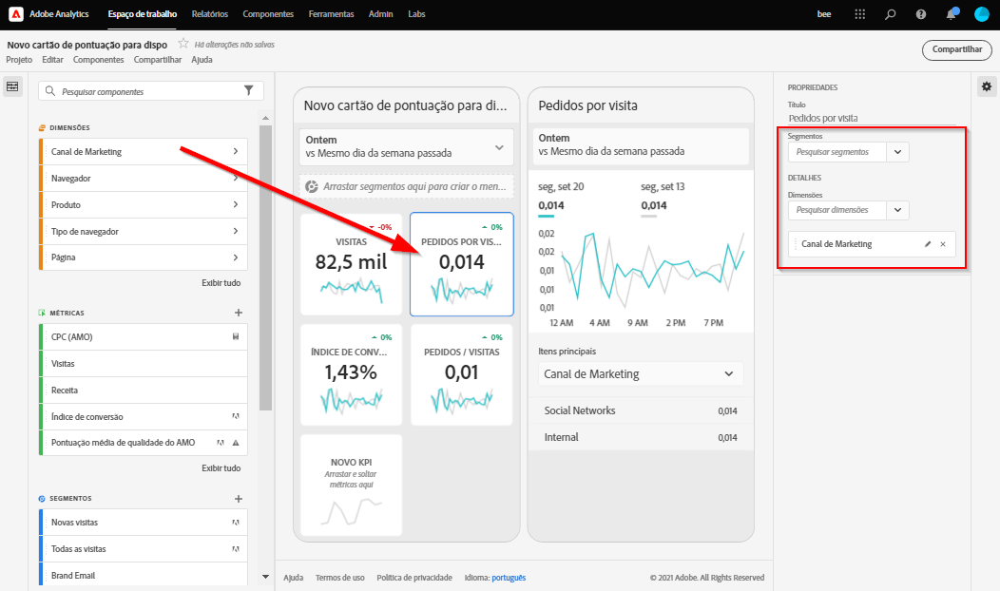

# BETA: guia do curador para o aplicativo móvel do Analytics

## Introdução

O aplicativo móvel do Adobe Analytics fornece informações a qualquer hora e em qualquer lugar no Adobe Analytics.   O aplicativo permite aos usuários acesso móvel a scorecards intuitivos, criados e compartilhados a partir da interface do usuário de desktop do Adobe Analytics. Os scorecards são uma coleção das métricas principais e de outros componentes apresentados em um layout lado a lado, que você pode usar para obter detalhamentos mais minuciosos e relatórios de tendências. Você pode adaptar os Scorecards de acordo com os dados mais importantes para você. O aplicativo móvel é compatível com os sistemas operacionais iOS e Android.

## Sobre este guia

Este guia tem como objetivo ajudar os curadores de dados do Adobe Analytics a configurar os scorecards para os usuários executivos no aplicativo móvel do Analytics. Os curadores podem ser administradores organizacionais ou pessoas em outras funções responsáveis pela configuração dos Scorecards para aplicativos, que permitem aos usuários executivos visualizar uma ampla renderização de dados sumários importantes de maneira rápida e fácil em seus próprios dispositivos móveis. Embora os usuários executivos sejam os usuários finais do aplicativo móvel do Analytics, este guia ajudará os curadores de dados a configurar o aplicativo de maneira eficaz para esses usuários.

## Glossário de termos

A tabela a seguir descreve os termos para entender o público-alvo, as funções e a operação do aplicativo móvel do Analytics.

| Termo | Definição |
|--- |--- |
| Consumidor | Usuário executivo que visualiza as métricas principais e informações do Analytics em um dispositivo móvel |
| Curador | Usuário com conhecimento de dados que encontra e distribui informações do Analytics e configura os Scorecards para serem visualizados pelo consumidor |
| Preparação | O ato de criar ou editar um scorecard para dispositivos móveis com métricas, dimensões e outros componentes relevantes para o consumidor |
| Scorecard | Uma Exibição de aplicativos móveis que contém um ou mais blocos |
| Bloco | Uma renderização para uma métrica em uma Exibição de scorecard |
| Detalhamento | Uma exibição secundária acessível ao tocar em um bloco no Scorecard. Essa exibição é expandida na métrica mostrada no bloco e, opcionalmente, relata as dimensões adicionais de detalhamento. |
| Intervalo de datas | O intervalo de datas principal dos relatórios de aplicativos móveis |
| Intervalo de datas de comparação | O Intervalo de datas comparado ao intervalo de datas principal |

 
## Criar um Scorecard para usuários executivos

Um Scorecard para dispositivos móveis exibe as principais visualizações de dados para usuários executivos em um layout lado a lado, como mostrado abaixo:

Como curador deste Scorecard, você pode usar o Construtor de scorecards para configurar quais blocos são exibidos no Scorecard para o consumidor. Você também configura como as exibições detalhadas ou os Detalhamentos podem ser ajustados quando os blocos forem tocados. A interface do Construtor de scorecards é mostrada abaixo:

Para criar o Scorecard, é necessário fazer o seguinte:

1. Acesse o modelo de Scorecard para dispositivos móveis em branco.
2. Configure o Scorecard com os dados e salve.

### Acesse o modelo de Scorecard para dispositivos móveis em branco

Você pode acessar o modelo de Scorecard para dispositivos móveis em branco de uma das seguintes maneiras:

**Criar um novo projeto**

1. Abra o Adobe Analytics e clique na guia **Workspace**.
2. Clique no botão **Criar novo projeto** e selecione o modelo de projeto de **Scorecard para dispositivos móveis em branco**.
3. Clique no botão **Criar**.

*Observação: se você não vir o modelo de Scorecard para dispositivos móveis em branco, como mostrado abaixo, sua empresa ainda não foi ativada para Beta. Entre em contato com o Gerente de atendimento ao cliente.*

**Adicionar um projeto**

Na tela **Projetos**, na guia **Componentes**, clique no botão **Adicionar** e selecione **Scorecard para dispositivos móveis**.

**Usar ferramentas do Analytics**

No Analytics, clique no menu **Ferramentas** e selecione **Aplicativo móvel**. Na tela subsequente, clique no botão **Criar Scorecard**.

### Configure o Scorecard com os dados e salve

Para implementar o modelo de Scorecard:

1. Em **Propriedades** (no painel direito), especifique um **Conjunto de relatórios de projeto** cujos dados você deseja usar.

   

2. Para adicionar um novo bloco ao Scorecard, arraste uma métrica do painel esquerdo e solte-a na Zona **Arrastar e soltar métricas aqui**. Também é possível inserir uma métrica entre dois blocos usando um fluxo de trabalho semelhante.

   

   *Em cada bloco, é possível acessar uma exibição detalhada que mostra informações adicionais sobre a métrica, como itens principais para uma lista de dimensões relacionadas.*

3. Para adicionar uma dimensão relacionada a uma métrica, arraste uma dimensão do painel esquerdo e solte-a em um bloco. Por exemplo, é possível adicionar as dimensões apropriadas (como **Região de DMA**, neste exemplo) à métrica **Visitantes únicos**, arrastando-as e soltando-as no bloco. As dimensões adicionadas serão exibidas na seção de detalhamento das **Propriedades** específicas do bloco. É possível adicionar várias dimensões a cada bloco.

   

   *Observação: também é possível adicionar uma dimensão a todos os blocos, soltando-a na tela Scorecard.*

   Quando você clica em um bloco no Construtor de scorecards, o painel direito exibe as propriedades e características associadas a esse bloco. Nesse painel, você pode fornecer um novo **Título** para o bloco e, como alternativa, configurá-lo especificando os componentes, em vez de arrastá-los e soltá-los no painel esquerdo.

   Além disso, se você clicar nos blocos, um pop-up dinâmico mostrará como a exibição Detalhamento aparecerá para o usuário executivo no aplicativo. Se nenhuma dimensão tiver sido aplicada ao bloco, a dimensão de detalhamento será a **hora** ou os **dias**, dependendo do intervalo de datas padrão.

   

   *Observe como cada dimensão adicionada ao bloco será mostrada em uma lista suspensa na exibição detalhada do aplicativo. O usuário executivo pode então escolher entre as opções indicadas na lista suspensa.*

4. Para aplicar segmentos a blocos individuais, arraste um segmento do painel esquerdo e solte-o diretamente na parte superior do bloco. Se você deseja aplicar o segmento a todos os blocos no Scorecard, solte o bloco em cima do scorecard.

5. Da mesma forma, para remover um componente aplicado a todo o Scorecard, clique em qualquer lugar do Scorecard fora dos blocos e remova-o clicando no **x** exibido quando você passa o mouse sobre o componente, como mostrado abaixo para o segmento **Clientes de dispositivos móveis**:

   

6. Nas **Propriedades** do Scorecard, você também pode especificar o seguinte opcionalmente:

   * Um **Intervalo de datas padrão**. Os intervalos especificados aqui serão os mesmos aplicados ao primeiro acesso do usuário executivo ao Scorecard em seu aplicativo.

   * Um **Intervalo de datas de comparação**

   * Quaisquer **segmentos** a serem aplicados a todo o Scorecard

7. Para nomear o Scorecard, clique no namespace no canto superior esquerdo da tela e digite o novo nome.

   

## Compartilhar o Scorecard

Para compartilhar o Scorecard com um usuário executivo:

1. Clique no menu **Compartilhar** e selecione **Compartilhar scorecard**.

2. No formulário **Compartilhar**, preencha os campos ao:

   * Fornecer o nome do Scorecard
   * Fornecer uma descrição do Scorecard
   * Adicionar tags relevantes
   * Especificar os destinatários do Scorecard
   * Selecione a opção **Compartilhar os componentes inseridos com os destinatários** para garantir que o usuário executivo tenha acesso a todos os componentes no Scorecard.

3. Clique em **Compartilhar**.

Depois de compartilhar um Scorecard, os destinatários podem acessá-lo no aplicativo móvel do Analytics. Se você fizer alterações subsequentes no Scorecard usando o Construtor de scorecards, elas serão atualizadas automaticamente no Scorecard compartilhado. Os usuários executivos verão as alterações depois de atualizar o Scorecard no aplicativo.

*Observação: se você atualizar o Scorecard adicionando novos componentes, convém compartilhar o scorecard novamente (e marque a opção **Compartilhar automaticamente os componentes inseridos com os destinatários**) para garantir que os usuários executivos tenham acesso a essas alterações.*

## Configure os usuários executivos com o aplicativo

Em alguns casos, os usuários executivos podem precisar de assistência adicional para acessar e usar o aplicativo. Esta seção fornece informações para ajudá-lo a prestar essa assistência.

### Ajude os usuários executivos a obter acesso

Para ajudar os usuários executivos a acessar os Scorecards no aplicativo, verifique se:

* Os requisitos mínimos do sistema operacional móvel dos dispositivos são iOS versão 10 ou superior ou Android versão 4.4 (KitKat) ou superior
* Eles possuem um logon válido no Adobe Analytics
* Você criou corretamente os Scorecards para dispositivos móveis para eles e compartilhou esses Scorecards com eles.
* Eles têm acesso à Analysis Workspace e ao conjunto de relatórios em o Scorecard se baseia
* Eles têm acesso aos Componentes incluídos no Scorecard. Observação: é possível selecionar uma opção ao compartilhar os Scorecards para **Compartilhar automaticamente os componentes inseridos com os destinatários**.

### Ajude os usuários executivos a usar o aplicativo

Durante a fase beta e antes do lançamento do aplicativo ao público, você pode controlar quem tem acesso ao aplicativo.

1. Ajude os usuários executivos a baixar e instalar o aplicativo. Para fazer isso, estabeleça as seguintes etapas para estender o acesso aos usuários executivos, dependendo se eles usam um dispositivo iOS ou Android.

   **Para usuários executivos no iOS:**

   1. Clique no link público a seguir (ele também está disponível no Analytics em **Ferramentas** > **Aplicativo móvel**):

      [Link para iOS](https://testflight.apple.com/join/WtXMQxlI): `https://testflight.apple.com/join/WtXMQxlI`

      Após clicar no link, a seguinte tela Testflight é exibida:

      

   2. Toque no link **Exibir na loja de aplicativos** na tela para baixar o aplicativo Testflight.

   3. Após instalar o aplicativo Testflight, localize e instale o aplicativo móvel do Adobe Analytics no Testflight, como mostrado abaixo:

      
   **Para usuários executivos no Android:**

   1. Toque no seguinte link da Play Store no dispositivo do usuário (também está disponível no Analytics em **Ferramentas** > **Aplicativo móvel**):
      [Android](https://play.google.com/apps/testing/com.adobe.analyticsmobileapp): `https://play.google.com/apps/testing/com.adobe.analyticsmobileapp`

      Depois de tocar no link, toque no link Torne-se um testador na tela a seguir:

      

   2. Toque no link **Baixar no Google Play** na tela a seguir:

      

   3. Baixe e instale o aplicativo. Após o download e a instalação, os usuários executivos podem fazer logon no aplicativo usando suas credenciais atuais do Adobe Analytics. Oferecemos suporte para Adobe ID e Enterprise/Federated ID.
   

2. Ajude-os a acessar o Scorecard. Depois que os usuários executivos entram no aplicativo, a tela **Escolher uma empresa** é exibida. Essa tela lista as empresas de logon às quais o usuário executivo pertence. Para ajudá-los a chegar ao Scorecard:

   * Toque no nome da empresa de logon ou na Experience Cloud Org que se aplica ao Scorecard que você compartilhou. A lista do Scorecard mostra todos os Scorecards que foram compartilhados com o executivo na empresa de logon.
   * Ajude-os a classificar essa lista pela **Modificação mais recente**, se aplicável.
   * Toque no nome do Scorecard para visualizá-lo.
   

   Observação: se o usuário executivo fizer logon e vir uma mensagem dizendo que nada foi compartilhado:

   * O usuário executivo pode ter selecionado a instância incorreta do Analytics
   * O Scorecard pode não ter sido compartilhado com o usuário executivo

      
   Verifique se o usuário executivo pode fazer logon na instância correta do Analytics e se o Scorecard foi compartilhado.

3. Explique ao usuário executivo como os blocos são exibidos nos Scorecards que você compartilha.

   

   Informações adicionais sobre blocos:

   * A granularidade dos minigráficos depende da duração do intervalo de datas:
      * Um dia mostra uma tendência horária
      * Mais de um dia e menos de um ano mostra uma tendência diária
      * Um ano ou mais mostra uma tendência semanal
   * A fórmula de alteração do valor percentual é o total da métrica (intervalo de datas atual) - total da métrica (intervalo de datas de comparação) / total da métrica (intervalo de datas de comparação).
   * Você pode puxar a tela para baixo para atualizar o Scorecard.

4. Toque em um bloco para mostrar como funciona um detalhamento minucioso do bloco.

   

5. Para alterar os intervalos de datas do Scorecard:

   

   *Observação: você também pode alterar os intervalos de datas na exibição de Detalhamento mostrada acima da mesma maneira.*

   Dependendo do intervalo em que você tocar (**Dia**, **Semana**, **Mês** ou **Ano**), você verá duas opções para os intervalos de datas - o período de tempo atual ou o imediatamente anterior. Toque em uma dessas duas opções para selecionar o primeiro intervalo. Na lista **COMPARAR COM**, toque em uma das opções apresentadas para comparar os dados desse período com o primeiro intervalo de datas selecionado. Toque em **Concluído** no canto superior direito da tela. O campo **Intervalos de datas** e os blocos de Scorecard são atualizados com os novos dados de comparação dos novos intervalos selecionados.

6. Para deixar comentários sobre este aplicativo:

   1. Toque no ícone do usuário no canto superior direito da tela do aplicativo.
   2. Na tela **Minha conta**, toque na opção **Comentários**.
   3. Toque para ver as opções para deixar comentários.
   
   

**Para relatar um erro**:

Toque na opção e escolha uma subcategoria do erro. No formulário para relatar um erro, informe o endereço de email no campo superior e a descrição do erro no campo abaixo. Uma captura de tela das informações da sua conta é anexada automaticamente à mensagem, mas você pode excluí-la se desejar tocando no **X** na imagem do anexo. Você também tem opções para gravar uma tela, adicionar mais capturas de tela ou anexar arquivos. Para enviar o relatório, toque no ícone de plano de papel na parte superior direita do formulário.

**Para sugerir uma melhoria**:

Toque na opção e escolha uma subcategoria para a sugestão. No formulário de sugestão, informe o endereço de email no campo superior e a descrição do erro no campo abaixo. Uma captura de tela das informações da sua conta é anexada automaticamente à mensagem, mas você pode excluí-la se desejar tocando no **X** na imagem do anexo. Você também tem opções para gravar uma tela, adicionar mais capturas de tela ou anexar arquivos. Para enviar a sugestão, toque no ícone de plano de papel na parte superior direita do formulário.

**Para fazer uma pergunta**:

Toque na opção e informe o endereço de email no campo superior e a pergunta no campo abaixo. Uma captura de tela é anexada automaticamente à mensagem, mas você pode excluí-la se desejar tocando no **X** na imagem do anexo. Você também tem opções para gravar uma tela, adicionar mais capturas de tela ou anexar arquivos. Para enviar a pergunta, toque no ícone de plano de papel na parte superior direita do formulário.
