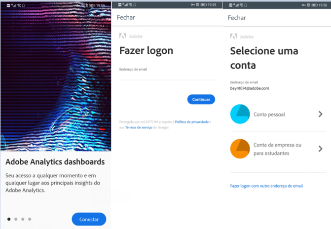

# Aplicativo móvel do Analytics: Guia de início rápido do usuário executivo

## Introdução

O aplicativo móvel do Adobe Analytics fornece insights a qualquer hora e em qualquer lugar do Adobe Analytics.  O aplicativo permite que os usuários acessem dispositivos móveis a scorecards intuitivos. Os scorecards são uma coleção de métricas principais e outros componentes apresentados em um layout lado a lado que você pode tocar para detalhar mais detalhadamente e relatórios de tendências. O aplicativo móvel é compatível com sistemas operacionais iOS e Android.

## Sobre este guia

 Este guia tem como objetivo ajudar usuários executivos a ler e interpretar Scorecards no aplicativo móvel do Analytics. O aplicativo permite que os usuários executivos visualizem uma ampla renderização de dados resumidos importantes de forma rápida e fácil em seus próprios dispositivos móveis.

## Glossário de termos

|Termo|Definição||—|—|Consumidor|Executivo visualizando métricas e insights principais do Analytics em um dispositivo móvel||Curador|Dados alfabetizam a pessoa que encontra e distribui insights do Analytics e configura os Scorecards a serem exibidos pelo consumidor||Preparação|O ato de criar ou editar um scorecard móvel contendo métricas, dimensões e outros componentes relevantes para o consumidor||Scorecard|Uma exibição de aplicativo móvel contendo um ou mais blocos||Lado a lado|Uma renderização para uma métrica em uma exibição de cartão de pontuação||Detalhamento|Uma exibição secundária acessível tocando em um bloco no Scorecard. Essa exibição é expandida na métrica exibida no bloco e, opcionalmente, informa sobre dimensões de detalhamento adicionais.||Intervalo de datas|O intervalo de datas principal para relatórios de aplicativo móvel||Intervalo de Datas de Comparação|O Intervalo de Datas que é comparado com o intervalo de datas principal|

## Configurar o aplicativo em seu dispositivo

Para usar o aplicativo com eficiência, será necessário ter o curador do Scorecard para ajudá-lo a configurá-lo. Esta seção fornece informações para ajudá-lo a se configurar com a ajuda do seu curador.

### Obter acesso

Para acessar os Scorecards no aplicativo, verifique se:

* Você tem um logon válido no Adobe Analytics
* Seu curador criou corretamente os Scorecards móveis e os compartilhou com você

### Baixe e instale o aplicativo

Para baixar e instalar o aplicativo, siga as etapas de acordo com o sistema operacional do dispositivo.

    **Para dispositivos iOS:**
    
    1. Clique no seguinte link público (Ele também está disponível no Analytics em **Ferramentas** &gt; **Aplicativo móvel**):
    
    [link para iOS](https://testflight.apple.com/join/WtXMQxlI): `https://testflight.apple.com/join/WtXMQxlI`
    
    Depois de clicar no link, a seguinte tela de Testflight é exibida:
    
    
    
    2. Toque no link **View in App Store** na tela para baixar o aplicativo Testflight.
    
    3. Após instalar o aplicativo Testflight, localize e instale o aplicativo móvel do Adobe Analytics no Testflight, como mostrado abaixo:
    
    
    
    **Para dispositivos Android:**
    
    1. Toque no seguinte link da Play Store no dispositivo do usuário (ele também está disponível no Analytics em **Ferramentas** &gt; **Aplicativo móvel**):
    
    
    [Android](https://play.google.com/apps/testing/com.adobe.analyticsmobileapp): `https://play.google.com/apps/testing/com.adobe.analyticsmobileapp`
    
    Depois de tocar no link, toque no link Testar na seguinte tela:
    
    
    
    2. Toque no **download no link Google Play** na seguinte tela:
    
    

## Usar o aplicativo

Para usar o aplicativo:

1. Faça logon no aplicativo. A tela de logon será exibida ao iniciar o aplicativo. Siga as instruções usando suas credenciais existentes do Adobe Analytics. Oferecemos suporte para Adobe e Enterprise/Federated IDs.

   

2. Escolha uma empresa. Depois que você fizer logon no aplicativo, a tela **Escolher uma empresa** será exibida. Esta tela lista as empresas de logon às quais você pertence. Toque no nome da empresa associado ao Scorecard compartilhado com você.

3. A lista Scorecard mostra todos os Scorecards que foram compartilhados com você. Toque no Scorecard que deseja exibir.

   

   *Observação: Se você fizer logon e vir uma mensagem informando que nada foi compartilhado, verifique o seguinte com seu curador:*

   * *Você pode fazer logon na instância correta do Analytics*
   * *O Scorecard foi compartilhado com você*
   

4. Examine como os blocos aparecem no Scorecard.

   

   Informações adicionais sobre blocos:

   * A granularidade dos minigráficos depende do comprimento do intervalo de datas:
   * Um dia mostra uma tendência por hora
   * Mais de um dia e menos de um ano mostram uma tendência diária
   * Um ano ou mais mostra uma tendência semanal
   * A fórmula de alteração do valor percentual é o total da métrica (intervalo de datas atual) - total da métrica (intervalo de datas de comparação) / total da métrica (intervalo de datas de comparação).
   * Você pode puxar a tela para baixo para atualizar o Scorecard.

5. Toque em um bloco para mostrar como um detalhamento do bloco funciona.

   

6. Para alterar os intervalos de datas do Scorecard:

   

   *Observação: Você também pode alterar os intervalos de datas na exibição de Detalhamento mostrada acima da mesma maneira.*

   Dependendo do intervalo que você tocar (**Dia**, **Semana**, **Mês** ou **Ano**), você verá duas opções para intervalos de datas - seja o período atual ou aquele imediatamente anterior. Toque em uma dessas duas opções para selecionar o primeiro intervalo. Na lista **COMPARAR PARA** , toque em uma das opções apresentadas para comparar os dados desse período com o primeiro intervalo de datas selecionado. Toque em **Concluído** no canto superior direito da tela. Os campos Intervalos **de** datas e os blocos do Scorecard são atualizados com os novos dados de comparação dos novos intervalos selecionados.

7. Obter atualizações do Scorecard. Se um Scorecard não incluir todas as métricas ou detalhamentos em que você possa estar interessado, entre em contato com a equipe do Analytics para atualizar o Scorecard. Depois de atualizado, puxe o cartão para baixo na tela para atualizá-lo e carregar os dados adicionados recentemente.

8. Deixe feedback. Para deixar feedback:

   1. Toque no ícone do usuário no canto superior direito da tela do aplicativo.
   2. Na tela **Minha conta** , toque na opção **Feedback** .
   3. Toque em para exibir as opções para deixar feedback.
   
   

**Para relatar um bug**:

Toque na opção e escolha uma subcategoria do erro. No formulário para reportar um bug, forneça seu endereço de email no campo superior e a descrição do bug no campo abaixo dele. Uma captura de tela das informações de sua conta é anexada automaticamente à mensagem, mas você pode excluí-la, se desejar, tocando no **X** na imagem do anexo. Você também tem opções para gravar uma tela, adicionar mais capturas de tela ou anexar arquivos. Para enviar o relatório, toque no ícone de plano de papel na parte superior direita do formulário.

**Para sugerir uma melhoria**:

Toque na opção e escolha uma subcategoria para a sugestão. No formulário de sugestão, forneça seu endereço de email no campo superior e a descrição do bug no campo abaixo dele. Uma captura de tela das informações de sua conta é anexada automaticamente à mensagem, mas você pode excluí-la, se desejar, tocando no **X** na imagem do anexo. Você também tem opções para gravar uma tela, adicionar mais capturas de tela ou anexar arquivos. Para enviar a sugestão, toque no ícone de plano de papel na parte superior direita do formulário.

**Para fazer uma pergunta**:

Toque na opção e forneça seu endereço de email no campo superior e sua pergunta no campo abaixo. Uma captura de tela é anexada automaticamente à mensagem, mas você pode excluí-la, se desejar, tocando no **X** na imagem do anexo. Você também tem opções para gravar uma tela, adicionar mais capturas de tela ou anexar arquivos. Para enviar a pergunta, toque no ícone de plano de papel na parte superior direita do formulário.
