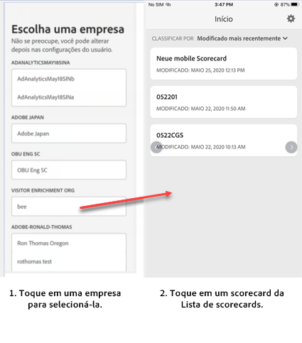
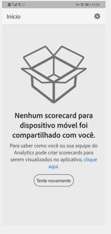
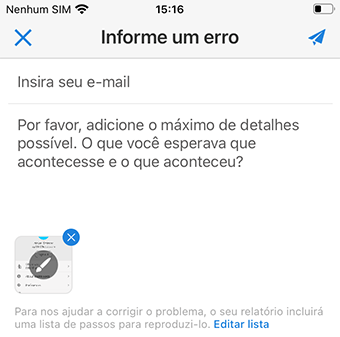

# Configurar usuários executivos com o aplicativo

Em alguns casos, os usuários executivos podem precisar de assistência adicional para acessar e usar o aplicativo. Esta seção fornece informações para ajudá-lo a prestar essa assistência.

## Garantir que os usuários do aplicativo tenham acesso ao Adobe Analytics

1. Configure novos usuários no [Experience Cloud Admin Console](/help/admin/admin-console/permissions/product-profile.md).

1. Para compartilhar scorecards, você deve conceder permissões aos usuários do aplicativo para acessar componentes do scorecard, como o Analysis Workspace, os conjuntos de relatórios nos quais os scorecards são baseados, bem como segmentos, métricas e dimensões.

## Pré-requisitos do sistema dos usuários do aplicativo

Para garantir que os usuários executivos tenham acesso aos seus scorecards no aplicativo, verifique se:

* Os requisitos mínimos do sistema operacional móvel dos dispositivos são iOS versão 10 ou superior ou Android versão 4.4 (KitKat) ou superior
* Eles possuem um logon válido no Adobe Analytics.
* Você criou corretamente os scorecards para dispositivos móveis para eles e compartilhou esses scorecards com eles.
* Eles têm acesso aos Componentes incluídos no scorecard. Observe que é possível selecionar uma opção ao compartilhar os scorecards para **[!UICONTROL Compartilhar componentes inseridos]**.

## Aplicativos de download e instalação dos executivos de ajuda

**Para usuários executivos no iOS:**

Clique no link a seguir (ele também está disponível no Analytics em **[!UICONTROL Ferramentas]** > **[!UICONTROL Painéis do Analytics (Aplicativo móvel)]**) e siga as instruções para baixar, instalar e abrir o aplicativo:

`[iOS link](https://apple.co/2zXq0aN)`

**Para usuários executivos no Android:**

Clique no link a seguir (ele também está disponível no Analytics em **[!UICONTROL Ferramentas]** > **[!UICONTROL Painéis do Analytics (Aplicativo móvel)]**) e siga as instruções para baixar, instalar e abrir o aplicativo:

`[Android link](https://bit.ly/2LM38Oo)`

Após o download e a instalação, os usuários executivos podem fazer logon no aplicativo usando suas credenciais atuais do Adobe Analytics. Oferecemos suporte para Adobe ID e Enterprise/Federated ID.

## Ajude os executivos a acessar o Scorecard

1. Faça com que os usuários executivos façam logon no aplicativo.

   A tela **[!UICONTROL Escolher uma empresa]** é exibida. Essa tela lista as empresas de logon às quais o usuário executivo pertence.

1. Faça com que toque no nome da empresa de logon ou da Experience Cloud Org que se aplica ao scorecard compartilhado.

   A lista Scorecard mostra todos os scorecards que foram compartilhados com o executivo na empresa de logon.

1. Solicite que eles classifiquem essa lista por **[!UICONTROL Modificado mais recentemente]**, se aplicável.

1. Faça com que toque no nome do Scorecard para exibi-lo.

   

### Explicar a interface do usuário do scorecard

Explique ao usuário executivo como os blocos são exibidos nos scorecards que você compartilha.

Informações adicionais sobre blocos:

* A granularidade dos minigráficos depende da duração do intervalo de datas:
* Um dia mostra uma tendência horária
   * Mais de um dia e menos de um ano mostra uma tendência diária
   * Um ano ou mais mostra uma tendência semanal
   * A fórmula de alteração do valor percentual é o total da métrica (intervalo de datas atual) - total da métrica (intervalo de datas de comparação) / total da métrica (intervalo de datas de comparação).
   * Você pode puxar a tela para baixo para atualizar o Scorecard.

1. Toque em um bloco para mostrar como funciona um detalhamento minucioso do bloco.

   

   * Toque em qualquer ponto em um minigráfico para ver os dados associados a esse ponto na linha.

   * Uma tabela é incluída para exibir dados de dimensões adicionadas ao bloco. Toque na seta para baixo para selecionar dimensões. Se nenhuma dimensão tiver sido adicionada ao bloco, a tabela exibirá os dados do gráfico.

1. Para alterar os intervalos de datas do cartão de pontuação, toque no cabeçalho Data e selecione a combinação de intervalo de datas principal e de comparação que você deseja visualizar.

   

## Alterar preferências do aplicativo

Para alterar as preferências, toque na opção **[!UICONTROL Preferências]** mostrada acima. Em preferências, você pode ativar o logon biométrico ou pode definir o aplicativo para o modo escuro, como mostrado abaixo:

## Solução de problemas

Se o usuário executivo fizer logon e vir uma mensagem dizendo que nada foi compartilhado:

* O usuário executivo pode ter selecionado a instância incorreta do Analytics, ou
* O scorecard pode não ter sido compartilhado com o usuário executivo.

Verifique se o usuário executivo pode fazer logon na instância correta do Adobe Analytics e se o scorecard foi compartilhado.

### Relatar um erro

Toque na opção e escolha uma subcategoria do erro. No formulário para relatar um erro, informe o endereço de email no campo superior e a descrição do erro no campo abaixo. Uma captura de tela das informações da sua conta é anexada automaticamente à mensagem, mas você pode excluí-la se desejar tocando no **X** na imagem do anexo. Você também tem opções para gravar uma tela, adicionar mais capturas de tela ou anexar arquivos. Para enviar o relatório, toque no ícone de plano de papel na parte superior direita do formulário.

### Deixar feedback

1. Toque no ícone de configurações no canto superior direito da tela do aplicativo.
1. Na tela **[!UICONTROL Configurações]**, toque na opção **[!UICONTROL Feedback]**.
1. Toque para ver as opções para deixar comentários.

   

### Sugerir uma melhoria

Toque na opção e escolha uma subcategoria para a sugestão. No formulário de sugestão, informe o endereço de email no campo superior e a descrição do erro no campo abaixo. Uma captura de tela das informações da sua conta é anexada automaticamente à mensagem, mas você pode excluí-la se desejar tocando no **X** na imagem do anexo. Você também tem opções para gravar uma tela, adicionar mais capturas de tela ou anexar arquivos. Para enviar a sugestão, toque no ícone de plano de papel na parte superior direita do formulário.

### Faça uma pergunta

Toque na opção e informe o endereço de email no campo superior e a pergunta no campo abaixo. Uma captura de tela é anexada automaticamente à mensagem, mas você pode excluí-la se desejar tocando no **X** na imagem do anexo. Você também tem opções para gravar uma tela, adicionar mais capturas de tela ou anexar arquivos. Para enviar a pergunta, toque no ícone de plano de papel na parte superior direita do formulário.

>[!IMPORTANT]
>
>A partir de outubro de 2020, a Adobe está lançando gradualmente uma série de melhorias para otimizar o desempenho do aplicativo &quot;Painéis do Adobe Analytics&quot;. Essas melhorias se concentram no armazenamento em cache de dados históricos do Analytics que são usados para preencher scorecards com datas (exceto o dia atual). Esses dados serão armazenados em cache por até 24 horas em uma conta de armazenamento na nuvem pública segura do Microsoft Azure. Entre em contato com seu CSM se não quiser aceitar esses recursos de melhoria de desempenho.
