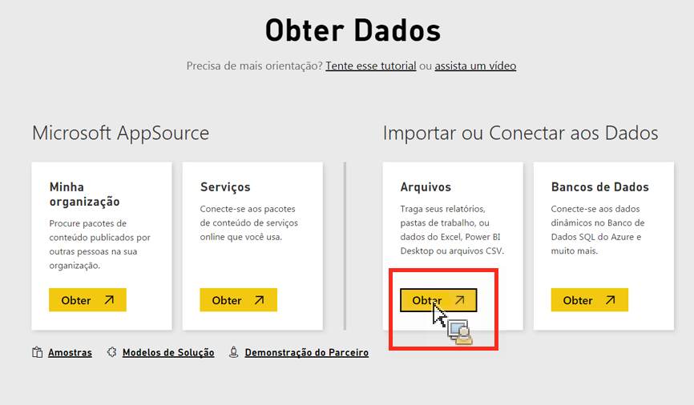

# Importar dados manualmente para o Power BI

Caso queira importar dados do Analytics manualmente para o Power BI, siga estas instruções.

1. No Power BI, clique em **[!UICONTROL Obter dados]no canto inferior esquerdo da tela.**
1. Under **[!UICONTROL Import or Connect to Data]** &gt; **[!UICONTROL Files]**, click **[!UICONTROL Get]**.

   

1. Clique em Arquivo local.

   

1. Escolha que arquivo deseja fazer upload e clique em **[!UICONTROL Abrir]**.
1. Clique em **[!UICONTROL Fazer upload]** em **[!UICONTROL Fazer upload de seu arquivo Excel para o Power BI]**.

   

1. A mensagem “Seu arquivo foi carregado” deve aparecer.

