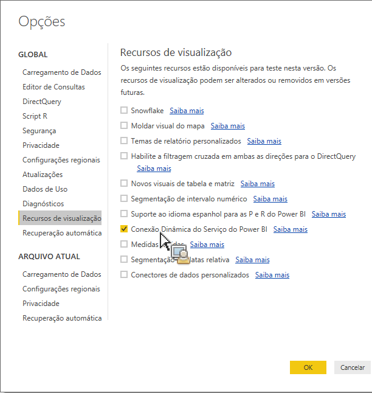

# Puxar ativos publicados para o Power BI Desktop

Explica como transferir ativos publicados do Construtor de relatórios para o Power BI Desktop

## Pré-requisitos {#section_BDFDAE1E300B429FB6EBCB21AD1383A0}

* É preciso ter a versão mais recente do Power BI Desktop instalada (versão de abril de 2017)
* Este processo pressupõe que você já tenha publicado tabelas formatadas ou solicitações do Construtor de relatórios no serviço do Power BI.

## Processo {#section_CB03E6E1B066457EA0F6FC08FFF5EFDD}

Na atualização de abril de 2017 do Power BI Desktop, a Microsoft liberou a habilidade de conectar a conjuntos de dados no serviço do Power BI. Esse recurso permite a criação de novos relatórios a partir de conjuntos de dados existentes já publicados na nuvem. Você pode aproveitar esse recurso para melhor colaborar e reduzir esforços duplicados em toda a equipe.

1. In Power BI Desktop, go to **[!UICONTROL File]** &gt; **[!UICONTROL Options and settings]** &gt; **[!UICONTROL Options]** &gt; **[!UICONTROL Preview features.]**
1. Ative **[!UICONTROL Conexão online com o serviço do Power BI]** e clique em **[!UICONTROL OK]**. 

1. Reinicie o Power Bi Desktop.
1. Once you have restarted the desktop, go to **[!UICONTROL Home]** &gt; **[!UICONTROL Get Data]** &gt; **[!UICONTROL More...]**.
1. Procure por e selecione **[!UICONTROL Serviço Power BI]**.
1. Under **[!UICONTROL Microsoft Power BI service]** &gt; **[!UICONTROL My Workspace]**, select the dataset that you had previously published from Report Builder.

Para obter mais informações, consulte esta [publicação do blog da Microsoft](https://powerbi.microsoft.com/en-us/blog/connecting-to-datasets-in-the-power-bi-service-from-desktop/).
