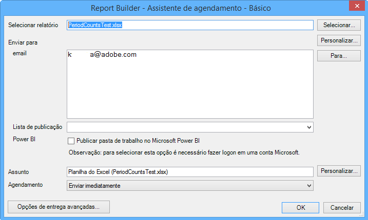
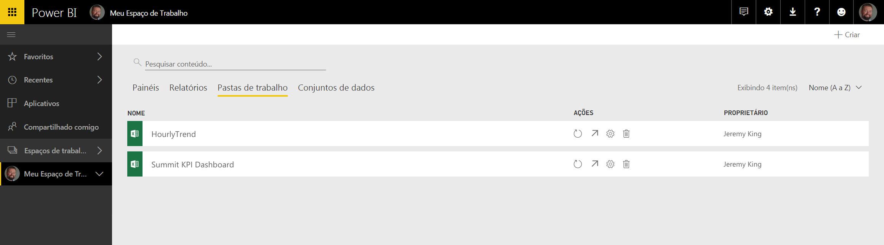
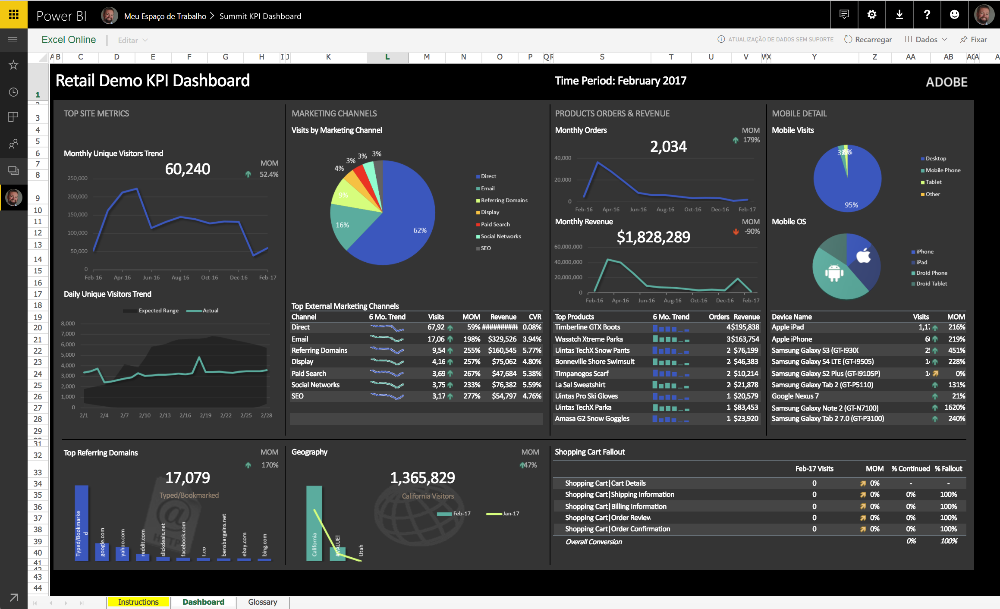
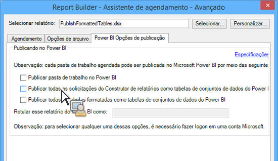
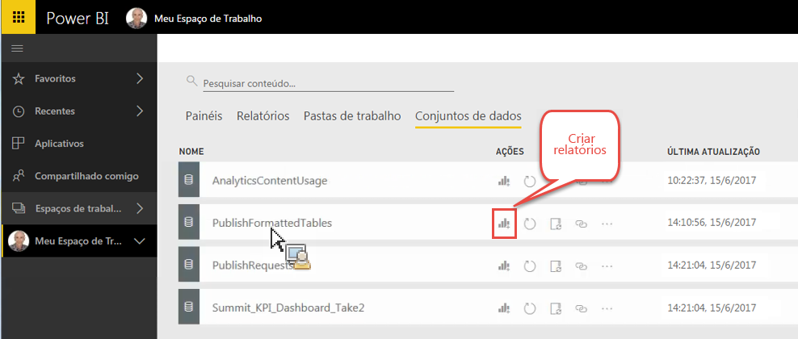
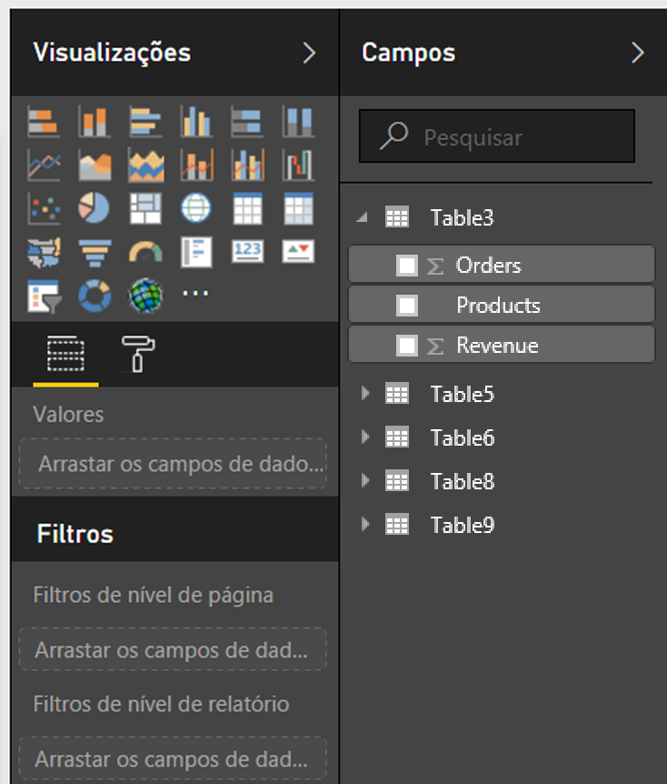
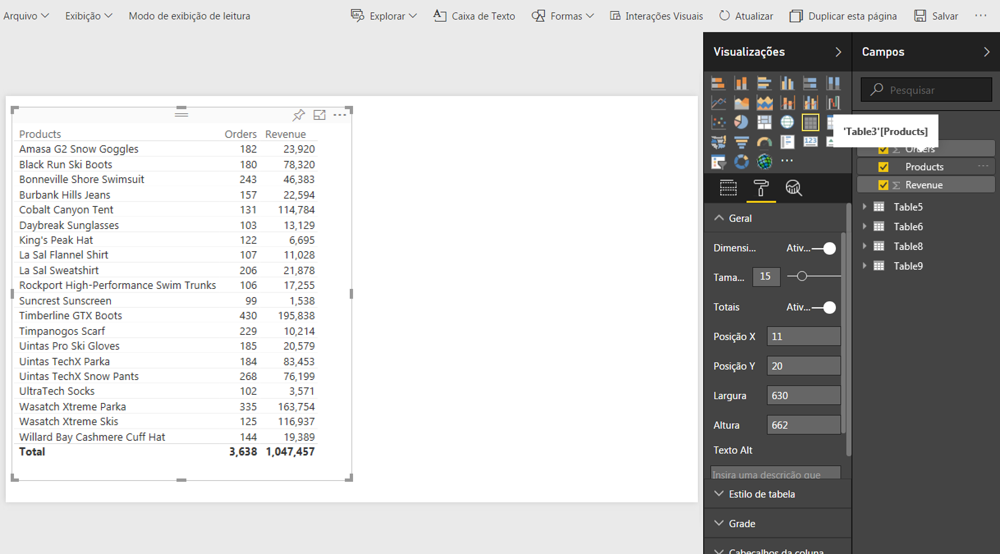
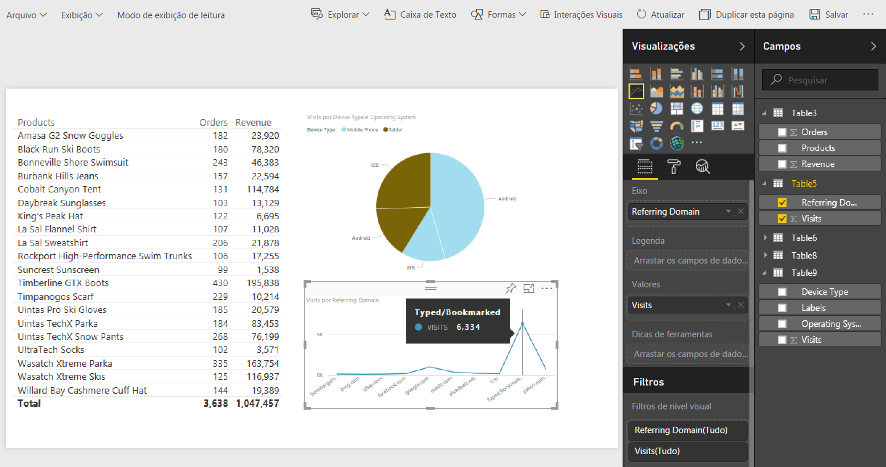
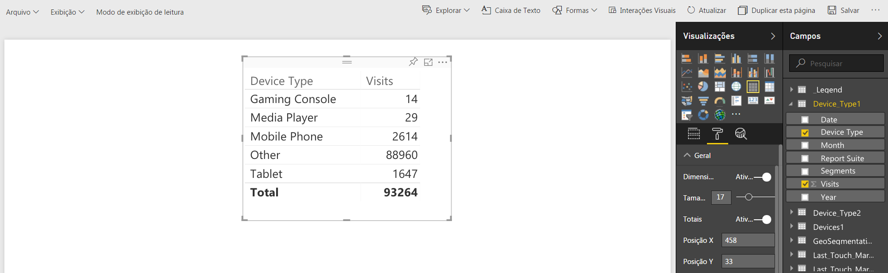
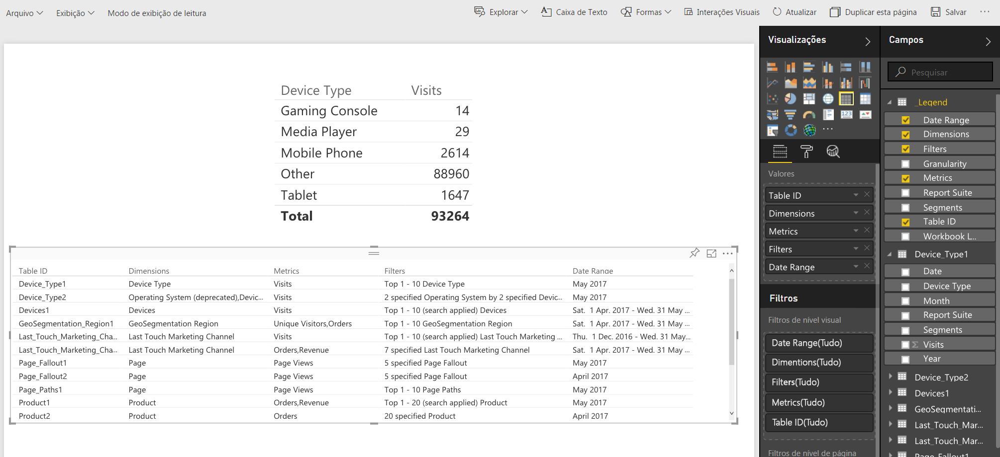

# Publicar no Power BI - Visão geral

O Microsoft Power BI é um conjunto de painéis de análise comercial usado para analisar dados e compartilhar insights. A integração do Adobe Analytics com o Power BI permite a visualização dos dados analíticos do Construtor de relatórios dentro do Microsoft Power BI e o seu fácil compartilhamento em toda a organização.

Anteriormente você, como um analista, agendaria pastas de trabalho do Construtor de relatórios para serem disseminadas via email (ou ftp). Agora você pode dar ao seu usuário empresarial interessado acesso (de dentro de suas contas do Power BI) a dados precisos e atualizados em um ambiente baseado na web que é acessível por todas as plataformas e dispositivos.

Combinar a capacidade de geração de relatórios do Construtor de relatórios com os recursos de visualização do Power BI torna as informações mais acessíveis para todos na organização. Com o Power BI, você também pode integrar o Adobe Analytics com outras fontes de dados (como pontos de venda, CRM) para descobrir percepções, associações e oportunidades de clientes únicos.

A integração com o Construtor de relatórios da Adobe permite

* [Publicar pastas de trabalho agendadas do Construtor de relatórios no Power BI](../../../analyze/report-builder/whats-new-arb.md#section_21CA66229EC240D49594A9A7D3FBA687)
* [Publicar todas as tabelas formatadas na pasta de trabalho como tabelas de conjuntos de dados do Power BI](../../../analyze/report-builder/whats-new-arb.md#section_7C54A54E75184DD6BAEF4ACCE241239A)
* [Publicar todas as solicitações do Construtor de relatórios como tabelas de conjuntos de dados do Power BI](../../../analyze/report-builder/whats-new-arb.md#section_0C26057C7DBB4068A643FDD688F6E463)

## Requisitos do sistema {#section_0B71092D853446F38FA36447DAC0D32B}

* Adobe Report Builder 5.5 [installed](../../../analyze/report-builder/setup/t-install-arb.md#task_0CA66703882F469EB6DBD9298975D6C3)
* Ative a conta da Microsoft que permite fazer logon no Power BI

## Publish workbook to Power BI {#section_21CA66229EC240D49594A9A7D3FBA687}

Pastas de trabalho agendadas são planilhas Excel formatadas populadas com dados do Adobe Analytics e enviadas regularmente de forma agendada.

**Publicar pasta de trabalho no Construtor de relatórios**

1. No Construtor de relatórios, gere e salve uma pasta de trabalho.
1. On the Report Builder Toolbar, click **[!UICONTROL Schedule]** &gt; **[!UICONTROL New]**.

1. No assistente básico de agendamento, clique na caixa próxima a **[!UICONTROL Publicar pasta de trabalho no Microsoft Power BI]**.

   

1. Especifique seu email e envie imediatamente ou especifique a frequência de agendamento (a cada hora, diariamente, etc.).
1. Clique em **[!UICONTROL OK]para publicar.**
1. Agora você deverá fazer logon na sua conta da Microsoft. Forneça suas credenciais.
1. A pasta de trabalho do Construtor de relatórios é agendada e publicada no Power BI.

   Com cada instância agendada e após o processo de agendamento do Construtor de relatórios ter atualizado a pasta de trabalho com dados atualizados do Analytics, ela será publicada no Microsoft Power BI.

**Exibir dados da pasta de trabalho do Construtor de relatórios no Power BI**

1. No Power BI, clique duas vezes na pasta de trabalho no menu [!UICONTROL Pastas de trabalho].

   

1. Agora você pode exibir os dados no painel da pasta de trabalho.  

1. Então é possível recortar uma área dessa pasta de trabalho de forma a incluí-la em qualquer um de seus painéis do Power BI.

## Publish all formatted tables in the workbook as Power BI dataset tables {#section_7C54A54E75184DD6BAEF4ACCE241239A}

>[!NOTE]
>
>Se a pasta de trabalho contiver uma macro, a opção «Publicar todas as tabelas formatadas na pasta de trabalho como tabelas de conjuntos de dados do Power BI» será desativada.

Ao invés de importar toda a pasta de trabalho, é possível importar apenas o conteúdo de todas as tabelas formatadas dentro dela.

**Caso de uso**: você tem uma pasta de trabalho do Excel que extrai dados de múltiplas solicitações do Construtor de relatórios e cria uma tabela de resumo com muitas fórmulas. É possível importar apenas a tabela de resumo para o Power BI e criar uma visualização para ela.

**Publicar uma tabela formatada no Construtor de relatórios**

1. No Construtor de relatórios, gere uma tabela de dados que inclua um linha de cabeçalho, seguida de uma linha de dados.
1. Selecione a tabela e selecione **[!UICONTROL Formatar como tabela]** no menu [!UICONTROL Início]. A tabela é nomeada por padrão (Tabela 1, Tabela 2, etc.), mas é possível alterar o nome no menu [!UICONTROL Design].

1. On the Report Builder Toolbar, click **[!UICONTROL Schedule]** &gt; **[!UICONTROL New]**.

1. No Assistente básico de agendamento, clique em **[!UICONTROL Opções de agendamento avançadas]**.
1. In the [!UICONTROL Scheduling Wizard - Advanced], on the **[!UICONTROL Publishing Options]**tab, check the box next to **[!UICONTROL Publish all Formatted Tables as Power BI dataset tables]**.

   

1. (Opcional) É possível personalizar o nome do ativo publicado no Power BI. Isso pode ser útil caso use o controle de versão como parte do nome da pasta de trabalho (como minhapastadetrabalho_v1.1.xlsx) e não queira que o número da versão apareça no nome do ativo publicado no Power BI. Isso possui a vantagem extra de que o ativo publicado não se alterará se a número da versão sofrer alteração. (Consulte as [especificações](../../../analyze/report-builder/c-publish-power-bi/specifications-limits.md#concept_1B6522B4D7A9482680198F125D94EEFD) aqui.)

**Exibir os dados da tabela no Power BI**

1. In Power BI, go to the **[!UICONTROL Workspaces]** &gt; **[!UICONTROL Datasets]** menu.

   

1. Selecione o conjunto de dados publicado e clique no ícone [!UICONTROL Criar relatório] próximo a ele. Note que as tabelas aparecerão como Campos.

   

1. Selecione uma tabela e suas colunas associadas.

   

1. No menu [!UICONTROL Visualizações], é possível selecionar como visualizar uma tabela no Power BI. Por exemplo, você pode escolher apresentar seus dados como um gráfico de linhas:

   

1. Daqui, é possível criar visualizações dessa tabela de conjunto de dados.

## Publish all Report Builder requests as Power BI Dataset tables {#section_0C26057C7DBB4068A643FDD688F6E463}

É possível transformar todas as suas solicitações em tabelas de conjuntos de dados e construir visualizações a partir delas.

>[!IMPORTANT]
>
>Se a pasta de trabalho contiver mais de 100 solicitações, apenas as primeiras 100 serão publicadas no Power BI. Mais, para cada solicitação que é publicada no Power BI, apenas as 10.000 primeiras linhas de dados serão publicadas. Então enquanto essas solicitações forem enviadas com sucesso pelo agendamento, o escopo de publicação para o Power BI é limitado.

1. No Construtor de relatórios, abra ou crie uma pasta de trabalho com solicitações do Construtor de relatórios.
1. On the Report Builder Toolbar, click **[!UICONTROL Schedule]** &gt; **[!UICONTROL New]**.

1. No Assistente básico de agendamento, clique em **[!UICONTROL Opções de agendamento avançadas]**.
1. In the [!UICONTROL Scheduling Wizard - Advanced], on the **[!UICONTROL Publishing Options]**tab, check the box next to **[!UICONTROL Publish all Report Builder Requests as Power BI Dataset Tables]** 

1. Clique em **[!UICONTROL OK]**.

**Exibir os dados de solicitação no Power BI**

Cada solicitação agendada do Construtor de relatórios será publicada como uma tabela no conjunto de dados. Cada tabela de solicitações é nomeada segundo a dimensão principal na solicitação e possui uma coluna [!UICONTROL Conjunto de relatórios] e uma coluna [!UICONTROL Segmentos].

1. In Power BI, go to the **[!UICONTROL Workspaces]** &gt; **[!UICONTROL Datasets]** menu.

1. Selecione a solicitação que você publicou e clique no ícone [!UICONTROL Criar relatório] próximo a ela.

   Note que as solicitações aparecem como tabelas no menu [!UICONTROL Campos].

   

   >[!NOTE]
   >
   >Não importa como você configurou sua solicitação do Construtor de relatórios para ser exibida na planilha (layout dinâmico, layout personalizado, algumas colunas invisíveis), o Construtor de relatórios sempre publicará sua solicitação no mesmo formato bidimensional e único de linha de cabeçalho: Data, Dimensões, Métricas, Conjuntos de relatórios, Segmentos.

1. Também note que existe uma tabela adicional chamada **[!UICONTROL Legenda]**. Caso retire uma solicitação do contexto do Construtor de relatórios, pode ser difícil se lembrar o que cada solicitação significa. O propósito da tabela Legenda é, por exemplo, mostrar o nome de cada solicitação na ID da tabela. Também é possível adicionar as outras colunas da Legenda para obter uma perspectiva completa da solicitação.

   

