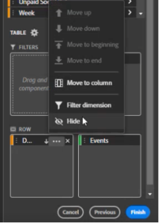

# Criar um bloco de dados

Um *bloco de dados* é a tabela de dados criada por uma única solicitação de dados. Uma pasta de trabalho Report Builder pode conter vários blocos de dados. Ao criar um bloco de dados, primeiro configure o bloco de dados e, em seguida, crie o bloco de dados.

## Configurar o bloco de dados

Configure os parâmetros do bloco de dados inicial para o local do bloco de dados, conjunto de relatórios e um intervalo de datas.

1. Clique em **[!UICONTROL Criar]**.

   

1. Defina a **[!UICONTROL localização do bloco de dados]**.

   A opção de localização do bloco de dados define o local da planilha no qual o Report Builder adiciona os dados à planilha.

   Para especificar o local do bloco de dados, selecione uma única célula na planilha ou insira um endereço de célula como a3, \\\$a3, a\\\$3 or sheet1!a2. A célula especificada marca o canto superior esquerdo do bloco de dados quando os dados são recuperados.

1. Escolha um **Conjunto de Relatórios**.

   A opção Conjuntos de relatórios permite escolher um conjunto de relatórios a partir de um menu suspenso ou fazer referência a um conjunto de relatórios a partir do local de uma célula.

1. Defina o **[!UICONTROL Intervalo de datas]**.

   A opção Intervalo de datas permite escolher um intervalo de datas. Os intervalos de datas podem ser fixos ou contínuos. Para obter informações sobre opções de intervalo de dados, consulte [Selecionar um intervalo de datas](select-date-range.md).

1. Clique em **[!UICONTROL Avançar]**.

   

   Após configurar o bloco de dados, é possível selecionar dimensões, métricas e segmentos para criar seu bloco de dados. As guias Dimensões, Métricas e Filtros são exibidas acima do painel do Criador de tabela.

## Criar o bloco de dados

Para criar o bloco de dados, selecione componentes do relatório e personalize o layout.

1. Adicionar Dimensões, Métricas e Filtros.

   Rolar as listas de componentes ou usar o campo **[!UICONTROL Pesquisa]** para localizar os componentes. Arraste e solte componentes no painel Tabela ou clique duas vezes em um nome de componente na lista para adicionar automaticamente o componente ao painel Tabela.

   Clique duas vezes em um componente para adicioná-lo a uma seção padrão da tabela.

   - Os componentes de Dimensão são adicionados à seção Linha ou à seção Coluna se você já tiver uma dimensão nas colunas.
   - Os componentes Data são adicionados à seção Coluna.
   - Os componentes de Filtro são adicionados à seção Filtros.

   **Data inicial como Dimension**

   Defina a **[!UICONTROL Data inicial]** como uma dimensão para identificar claramente a data inicial do bloco de dados. Isso é útil se você tiver um relatório agendado regularmente com um intervalo de datas em andamento ou se tiver um intervalo de datas não convencional e precisar estar claro sobre a data de início.

   {width="30%"}

1. Organize os itens no painel Tabela para personalizar o layout do bloco de dados.

   Arraste e solte componentes no painel Tabela para reorganizar os componentes ou clique com o botão direito do mouse em um nome de componente e selecione no menu opções.

   Quando você adiciona componentes à tabela, uma pré-visualização do bloco de dados é exibida no local do bloco de dados na planilha. O layout da pré-visualização do bloco de dados é atualizado automaticamente à medida que você adiciona, move ou remove itens na tabela.

   

   **Exibir ou ocultar cabeçalhos de linha e coluna**

1. Clique no ícone **[!UICONTROL Configurações da tabela]**.

   {width="35%"}

1. Marque ou desmarque a opção Display row and column headers. Os cabeçalhos são exibidos por padrão.

   **Ocultar ou mostrar rótulos de dimensão e cabeçalhos de métrica**

1. Clique no ícone de reticências nas dimensões ou nos cabeçalhos da coluna para exibir as configurações.

   {width="35%"}

1. Clique em Ocultar ou Mostrar para alternar os rótulos de dimensão ou cabeçalhos da coluna. Todos os rótulos são exibidos por padrão.

1. Clique em **[!UICONTROL Concluir]**.

   Uma mensagem de processamento é exibida enquanto os dados de análise são recuperados.

   

   O Report Builder recupera os dados e exibe o bloco de dados concluído na planilha.

   
