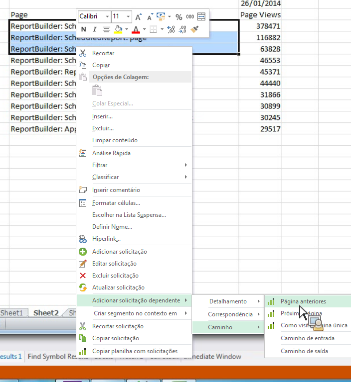

# Filtrar relatórios de caminho ao adicionar solicitações dependentes

Descreve como criar relatórios de caminho com filtros predefinidos.

Relatórios e análises de marketing oferece poucos relatórios independentes que são relatórios de caminho superior com filtros predefinidos, tais como relatórios [!UICONTROL Próxima] e [!UICONTROL Seção anterior], de sessão de site de Entrada e de [!UICONTROL Saída] e de [!UICONTROL Seção única do site].

Report Builder does not offer these as standalone reports, but you can create them through the **[!UICONTROL Add dependent request]** &gt; **[!UICONTROL Path]** context menus. Os relatórios a seguir estão disponíveis:

* Caminho &gt; Fallout da página
* Caminho &gt; Caminho de entrada
* Caminho &gt; Caminho de saída
* Caminho &gt; Próxima página
* Caminho &gt; Caminho de entrada &gt; Próxima página
* Caminho &gt; Página anterior
* Caminho &gt; Caminho de saída &gt; Página anterior
* Caminho &gt; Caminho de entrada &gt; Como página de entrada
* Caminho &gt; Caminho de saída &gt; Como página de saída

1. Select multiple rows from an existing request, then right-click **[!UICONTROL Add Dependent Request]** &gt; **[!UICONTROL Path]**.

    (Observe que você deve selecionar pelo menos 3 linhas se desejar visualizar o item de menu **[!UICONTROL Fallout de página]).**

   

1. Select the predefined filter, for example **[!UICONTROL Previous Page]**.

   O Assistente de solicitações aparece com a métrica Página anterior já selecionada. 1. Continue a refinar sua solicitação no Assistente de solicitações e gerar sua solicitação.
