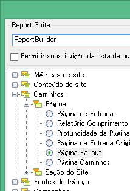
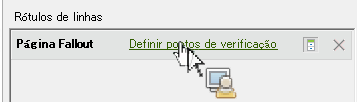

# Filtrar um relatório de fallout com o assistente de solicitação

Descreve as etapas envolvidas na aplicação de filtros para um relatório de fallout.

Esse exemplo mostra o relatório Fallout de página.

1. No Report Builder da Adobe, clique em **[!UICONTROL Criar]** para abrir o Assistente de solicitação.
1. Selecione o conjunto de relatórios apropriado.
1. Na visualização de árvore na esquerda, selecione **[!UICONTROL Caminhos]** > **[!UICONTROL Página]** > **[!UICONTROL Fallout de página]**.

   

1. Configure os [intervalos de datas](/help/analyze/report-builder/data-requests/configuring-report-dates/custom-calendar.md) apropriados.
1. Clique em **[!UICONTROL Próximo]**.
1. Na etapa 2 do assistente, em **[!UICONTROL Etiquetas de linha]**, clique no link **[!UICONTROL Definir pontos de verificação]**. (Em um relatório de fallout, é sempre necessário definir os elementos de caminho, diferente de um relatório de caminho, no qual o padrão é pré-aplicado).

   

1. Selecione a opção **[!UICONTROL Filtrar]**.

1. Na caixa de diálogo **[!UICONTROL Definir pontos de verificação de fallout da seção do site]**, defina os pontos de verificação a partir de várias células ou de uma lista. Em seguida, clique em **[!UICONTROL OK]**.
1. Decida se deseja selecionar a partir de várias células ou de uma lista.
1. Se você selecionar de uma lista, clique em **[!UICONTROL Adicionar]** para selecionar pontos de verificação a fim de adicionar ao caminho de fallout. Você pode definir entre 3 e 8 pontos de verificação. (Pesquisa por elementos disponíveis ao clicar em **[!UICONTROL Mais]**.)

   Para obter mais informações sobre como refina o filtro, consulte [Dimensões do filtro](/help/analyze/report-builder/layout/c-filter-dimensions/filter-dimensions.md). 1. Mova **[!UICONTROL Elementos disponíveis]** da coluna à esquerda para a direita ao selecioná-los e clicar na seta laranja.
1. Clique em **[!UICONTROL OK]** três vezes, em seguida, clique em **[!UICONTROL Concluir]**.

   O relatório deve atualizar agora.
