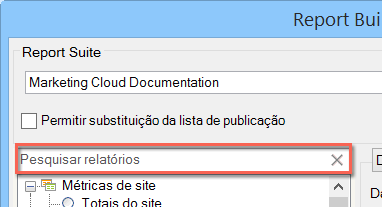

# Visão geral dos tipos de relatório

É possível selecionar o tipo de relatório base para sua solicitação de dados, como Métricas do site, Conteúdo do site e Vídeo.

Você pode escolher apenas um tipo de relatório básico para um intervalo de células da planilha. Se estiver editando uma solicitação criada anteriormente, você pode alterar o tipo de relatório na janela [!UICONTROL Assistente de solicitações: etapa 1] sem ter que redefinir outras configurações na solicitação.

É possível procurar relatórios com a barra de pesquisa de preenchimento automático. Depois de selecionar um relatório neste controle, a exibição em árvore selecionará automaticamente o nó correspondente.

