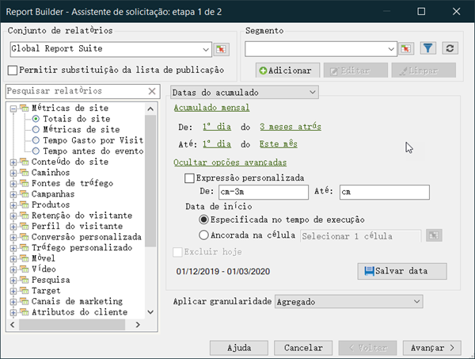

# Visão geral das Expressões de datas personalizadas

Você pode construir uma expressão personalizada para especificar um intervalo complexo de datas.

Recomendamos que você se refira a um calendário ao criar expressões para especificar o número de semanas e dias corretamente. O Excel tem várias funções incorporadas que permitem calcular o número de dias, dias úteis, meses e anos entre as datas. Você pode usar essas funções em fórmulas para calcular outros intervalos, como semanas e trimestres.

**Para habilitar expressões personalizadas**

Este é um exemplo de uso **[!UICONTROL Rolling Dates]**.

1. Na página [!UICONTROL Request Wizard: Step 1], em vez de usar **[!UICONTROL Preset Dates]**, selecione **[!UICONTROL Rolling Dates]**.

   

1. Alternar para semanal, mensal, trimestral ou anual. Observe como as opções abaixo mudam.
1. Para obter mais opções de personalização, clique em **[!UICONTROL Show Advanced Options]**.

   

1. Por exemplo, se você alterar as datas acima para rolar mensalmente do primeiro dia três meses atrás para o primeiro dia deste mês, as datas na parte de opções avançadas se atualizarão para refletir isso:

   

1. Ativar **[!UICONTROL Customize Expression]**. Ao selecionar as opções em **[!UICONTROL Rolling Dates]**, você pode ver facilmente a sintaxe das expressões de data personalizadas.

   

   Você pode usar Opções avançadas para combinar e combinar expressões de datas personalizadas. Por exemplo, se você quiser ver os dados do primeiro ano até o final do último mês completo, insira o seguinte: `From: cy` . `To: cm-1d`.. No assistente, essas datas são exibidas como 1/1/2020-1/31/2020.
