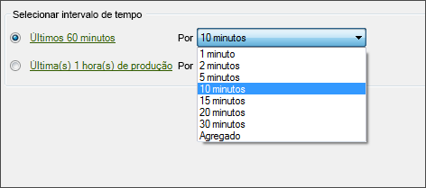

# Configurar uma solicitação em tempo real

Estas etapas descrevem como configurar datas de solicitação em tempo real.

1. Certifique-se de que o relatório em tempo real está habilitado nas [Ferramentas do Administrador](https://marketing.adobe.com/resources/help/en_US/reference/real_time_admin.html) em Relatórios e análises de marketing.
1. On the [!UICONTROL Request Wizard: Step 1], click **[!UICONTROL Real-Time Report]** &gt; **[!UICONTROL `<report type>`]**

   Por exemplo, selecione um Relatório de tráfego. Ao selecionar um tipo de relatório em tempo real, as opções [!UICONTROL Selecionar intervalo de tempo] são exibidas.

1. Selecione um intervalo de tempo em horas ou em minutos.

   

   O relatório em tempo real só está disponível para as últimas 20 horas. Para a granularidade, há opções que variam entre um minuto e 30 minutos.
1. Clique em **[!UICONTROL Avançar]** e continue [configurando o layout](/help/analyze/report-builder/layout/layout.md)da solicitação.
