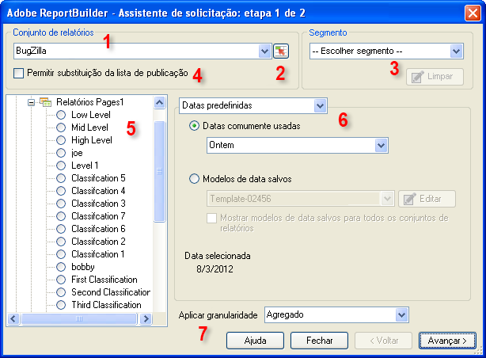

# Solicitações de dados - Etapa 1 do Assistente de solicitações

No Assistente de solicitações: etapa 1, selecione o conjunto de relatórios, o tipo de relatório, os segmentos e configure as datas.

1. **[!UICONTROL Conjunto de relatórios]**: A lista de conjuntos de relatórios disponíveis para você, com base em suas credenciais de logon. See [Select Report Suites](../../../analyze/report-builder/data-requests/selecting-report-suites/t-select-report-suites.md#task_59444416F6F042D1998217AE91580913).

1. **Seletor de intervalo**: Permite selecionar uma ID de conjunto de relatórios a partir de uma célula no Excel. Consulte [Selecionar os conjuntos de relatórios](../../../analyze/report-builder/data-requests/selecting-report-suites/t-select-report-suites.md#task_59444416F6F042D1998217AE91580913).

1. **Segmento**: Segmentos são subconjuntos personalizados de dados, ou dados filtrados por regras criadas por você. Segmentos têm por base acessos, visitas e visitantes. Consulte o [Guia de segmentação do Analytics](https://marketing.adobe.com/resources/help/en_US/analytics/segment/) para obter mais informações sobre segmentos.

   Por exemplo, você pode executar um [!UICONTROL Relatório de páginas] e, em seguida, aplicar um segmento de Visitantes em primeira visita.

1. **Permitir substituições da lista de publicação:** Quando você agenda um relatório, pode escolher uma lista de publicação para usar na distribuição. Publishing lists are set up in **[!UICONTROL Analytics]** &gt; **[!UICONTROL Admin tools]**. O conjunto de relatórios desta solicitação é substituído pela ID de conjunto de relatórios atribuída a cada destinatário na lista de publicação. Consulte [Permitir substituições da lista de publicação](../../../analyze/report-builder/data-requests/allow-publishing-list-overrides.md#concept_BCB19A20DC4B4B8D984F9670EE018D8C).

1. **Tipo de relatório:** Especifica o relatório básico que você deseja executar em sua solicitação de dados. Você executa um relatório para cada solicitação, que pode ter dimensões e métricas de um para muitos. As métricas e dimensões para um tipo de relatório são exibidas na interface do [!UICONTROL Assistente de solicitações: etapa 2]. Consulte [Selecione Tipos de relatório](../../../analyze/report-builder/data-requests/c-report-types/select-report-types.md#concept_C711B27E6FB64C18AC564EE142FC7EFC).

1. **Intervalos de data:** Define o período coberto pela solicitação. Vários tipos de períodos de solicitação estão disponíveis, como predefinido, fixo e acumulado. O número máximo de períodos é 366. Você também pode escolher um intervalo de datas especificado por uma célula e salvar intervalos de dados como modelos para uso futuro.  See [Configuring Report Dates](../../../analyze/report-builder/data-requests/configuring-report-dates/custom-calendar.md)

1. **Aplicar granularidade:** Especifica o nível de detalhes baseados em tempo a serem incluídos no relatório. Consulte [Granularidade](../../../analyze/report-builder/data-requests/configuring-report-dates/granularity.md#concept_A13CBA2962E24FF882456135431B7ADB).

>[!MORE_LIKE_THIS]
>
>* [Criar uma solicitação de dados](/help/analyze/report-builder/data-requests/t-create-a-data-request.md)