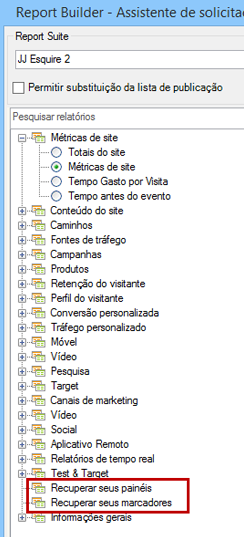

# Importar relatórios marcados e reportlets de painel

Todos os relatórios marcados e relatórios de painel agora são listados como dimensões na Etapa 1 do assistente de solicitação e podem ser importados como solicitações do Report Builder.

Ao selecionar um relatório marcado, o Assistente de solicitação preenche todas as dimensões e métricas que definem esse relatório marcado. O intervalo de datas, a granularidade e o segmento selecionado também são atualizados com base no marcador selecionado.

É assim que a Etapa 1 do Assistente de solicitações mostra um painel e seus reportlets:

Ao clicar **[!UICONTROL Retrieve your Dashboards]** ou **[!UICONTROL Retrieve your Bookmarks]**, seus dados de painel e/ou marcador existentes são recuperados e colados na planilha.

>[!NOTE] No Report Builder, a lista de painéis e marcadores disponíveis está limitada ao usuário, mas também aos que se aplicam ao conjunto de relatórios selecionado na Etapa 1 do assistente. Por outro lado, nos relatórios e análises de marketing, você recebe acesso aos marcadores e painéis acessíveis, independentemente dos conjuntos de relatórios que o painel e os marcadores usam.

>[!NOTE] Somente dados são importados, portanto, se o marcador contiver um gráfico, ou se o reportlet do painel consistir em apenas um gráfico, somente os dados utilizados para preencher o gráfico serão importados.

Depois de criar uma solicitação importando um reportlet de painel (ou um marcador), a solicitação será associada à dimensão primária do reportlet (ou marcador). Como resultado, se você editar a solicitação, a visualização em árvore não selecionará mais o nó de visualização da árvore do reportlet do painel (ou o nó do marcador): em vez disso, seleciona sua dimensão primária.

O miniaplicativo importado definirá apropriadamente o conjunto de relatórios, o segmento selecionado, a dimensão e as métricas selecionadas com os mesmos parâmetros expostos no marcador de Reports &amp; Analytics.

>[!IMPORTANT]
>
>O intervalo de datas será definido como estático; mesmo se esse intervalo de datas for cumulativo no marcador de Reports &amp; Analytics.

