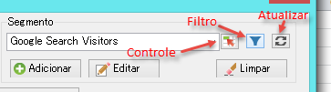
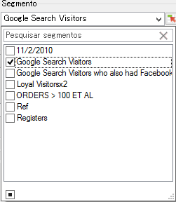
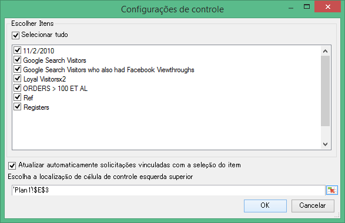
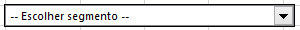
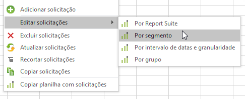

# Gerenciar segmentos

Como adicionar, editar, aplicar e filtrar segmentos do Adobe Analytics no Construtor de relatórios.

O Construtor de relatórios tem um novo painel de segmentação na Etapa 1 do Assistente de solicitação que permite criar e gerenciar segmentos.

## Adicionar ou editar segmentos {#section_B2BC136F9A53498D90C7C2ECC5DB892B}

> [!NOTE] Para adicionar ou editar segmentos, a interface de segmento do Construtor de relatórios inicia o construtor de segmentos do Analytics em uma janela do Microsoft Internet Explorer. Sua sessão do construtor de relatórios continuará ativa. Navegadores diferentes do Internet Explorer não são suportados nessa operação.

1. No painel de segmentos da Etapa 1 do Assistente de solicitação, clique em **[!UICONTROL Adicionar]**.
1. Uma janela do Internet Explorer aparece e abre a interface do Analytics Segment Builder. Para mais informações sobre como construir segmentos, consulte [https://marketing.adobe.com/resources/help/pt_BR/analytics/segment/](https://marketing.adobe.com/resources/help/en_US/analytics/segment/)
1. Depois de definir e salvar o segmento, volte para o Assistente de solicitação.
1. Clique no ícone Atualizar para atualizar a lista de segmentos.

>[!IMPORTANT]
>
>Essa lista é armazenada em cache e seu segmento recém-criado não será exibido, a menos que você faça uma atualização.

## Criar segmentos em contexto {#section_6DD2C663B2854469AA1075438F907678}

É possível ter combinações específicas de dimensões de relatórios que você deseja transformar em um segmento. É possível criar esses segmentos na interface do Construtor de relatórios. Por exemplo, selecione algumas páginas de uma saída de solicitação de Página e crie um segmento com base nesses calores.

1. Selecione os itens de saída do relatório que você deseja transformar em um segmento.
1. Clique com o botão direito para selecionar **[!UICONTROL Criar segmento no contexto em]e especifique o contêiner apropriado (Contêiner de ocorrências, Contêiner de visitas, Contêiner de visitantes).**

   

   Para obter mais informações sobre contêineres, consulte o [Guia de segmentação](https://marketing.adobe.com/resources/help/en_US/analytics/segment/).

1. A Interface do usuário do construtor de segmentos agora será inicializada no Internet Explorer. A Interface do usuário do construtor será inicializada com o contêiner e o filtro especificado.
1. Depois de adicionar um nome e a descrição ao segmento, salve-o.
1. Retorne ao construtor de relatórios e clique no ícone Atualizar para atualizar a lista de segmentos.
1. Agora você está pronto para aplicar esse segmento.

## Pesquisar por e aplicar segmentos {#section_CACA269B48E94CFD91C2D5A15E9C77B7}

Qualquer segmento criado em Relatórios e análises, Análise ad hoc, Construtor de relatórios ou Data warehouse aparece na lista de segmentos. Para atualizar a lista, clique no ícone Atualizar ( .

Você pode aplicar um ou mais segmentos a qualquer solicitação. Isso inclui segmentos sequenciais.

1. Vá até a lista suspensa **[!UICONTROL Segmento]** e clique na seta pequena para baixo na caixa **Escolher segmento]para exibir todos os segmentos.[!UICONTROL **

   

1. Marque quais segmentos você deseja aplicar.

> [!NOTE] Quer você seja um Administrador ou um não Administrador, no Construtor de relatórios você pode ver somente os segmentos que possui e os compartilhados com você. (na interface do usuário dos Relatórios e análises de marketing, o Administrador pode visualizar todos os segmentos da organização).

## Filtrar segmentos {#section_376E986D3E684999A7CDB08E53854159}

**Filtre** segmentos ao clicar no ícone Filtrar:  

Os filtros disponíveis incluem:

| Nome do filtro | Descrição |
|---|---|
| Tags | Permite que você filtre nos segmentos com tags específicas. Observe que os filtros de tags usam o operador E. Se você verificar duas tags, o painel direito mostra segmentos que foram marcados com **ambas** as tags. |
| Proprietários | Permite que você filtre segmentos por proprietário. Observe que os filtros Proprietários usam o operador OU. Se você marcar dois proprietários, o painel direito mostra segmentos de propriedade de **qualquer** proprietário. |
| Outros filtros &gt; Somente o *nome do conjunto de relatórios* | If you apply the "Only *report suite name*" filter in the Segment Builder in [!DNL marketing reports & analytics], and then display the Advanced Filter in [!DNL report builder], the Advanced filter will display the segment for the selected report suite only. |
| Outros filtros &gt; Meus | Mostra todos os seus segmentos. |
| Outros filtros &gt; Compartilhados comigo | Mostra todos os segmentos que outros compartilharam com você. |
| Outros filtros &gt; Favoritos | Mostra todos os segmentos que você marcou como Favoritos. |
| Outros filtros &gt; Aprovado | Mostra todos os segmentos aprovados oficialmente. |

## Adiciona um controle de segmento a uma pasta de trabalho {#section_E3E5149A8464441FA5445A98DBD520AC}

Adicionar um controle de segmento permite você alternar segmentos de uma pasta de trabalho em vez de precisar ir até o Assistente de solicitação.

1. Click the Control icon ( ) next to the segment drop-down.

   

1. Verifique todos os segmentos os quais você deseja que apareçam no controle de segmentos, ou marque **[!UICONTROL Selecionar tudo]**.
1. Observe a opção **[!UICONTROL Atualizar automaticamente solicitações vinculadas na seleção de item]**.

   * Se marcadas, todas as solicitações que usam esse controle são atualizadas.
   * Se não for marcada, os parâmetros de solicitação associados são atualizados, mas as solicitações não são atualizadas.

1. Especifique a localização de célula esquerda superior do controle de segmento.
1. Clique em **[!UICONTROL OK]e o controle de segmento aparece na localidade especificada.**

   

## Atualizar a lista de segmentos {#section_22E4A86789444B4A998532396B476EFB}

Any time you add a new segment or edit an existing one, you should click the Refresh icon (  to refresh the cached list of segments.

## Gerenciamento de segmentos em solicitações {#section_C3D63FCBE1A94369A319243313B03C93}

Antes do v5.4, o Construtor de relatórios permitia que os usuários alterassem segmentos em várias solicitações. No entanto, esse processo sempre substituiu os segmentos existentes. Os usuários que queriam adicionar um novo segmento a cada solicitação não poderiam fazer isso, pois a adição do segmento removeria o conjunto anterior de segmentos já atribuídos às solicitações.

O Construtor de relatórios 5.4 permite adicionar, remover, substituir e substituir todos os segmentos em várias solicitações:

1. Selecione várias solicitações em uma pasta de trabalho.
1. Right-click and select **[!UICONTROL Edit Requests]** &gt; **[!UICONTROL By Segment]**.

   

1. Na caixa de diálogo Editar grupo, selecione uma destas quatro opções:

   | Opção | Descrição |
   |---|---|
   | Adicionar segmento | Permite escolher um ou mais segmentos a serem adicionados à lista de segmentos atuais. |
   | Substituir segmento(s) | Permite escolher os segmentos a serem substituídos por um ou mais segmentos. |
   | Substituir todos os segmentos por | Permite escolher um ou mais segmentos a serem substituídos pelos segmentos atuais. |
   | Remover segmento(s) | Permite remover segmentos das solicitações. |

