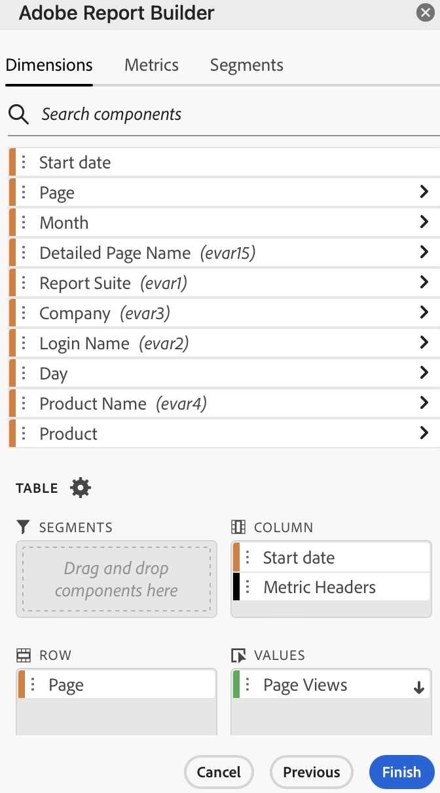

# Filtrar dimensões

Por padrão, cada item de dimensão na tabela retorna os 10 itens principais para essa dimensão.

Para alterar os itens de dimensão retornados para cada dimensão

1. Selecione um bloco de dados e clique em **[!UICONTROL Editar bloco de dados]** no painel COMANDOS.

1. Clique em **[!UICONTROL Avançar]** para exibir a guia Dimension.

1. Clique no ícone **...** ao lado do nome de um componente na tabela.

   

1. Selecione **[!UICONTROL Filtrar dimensão]** no menu pop-up para exibir o painel **[!UICONTROL Filtrar dimensão]**.

1. Selecione **[!UICONTROL Mais popular]** ou **[!UICONTROL Específico]**.

   

1. Selecione as opções apropriadas com base no tipo de filtro escolhido.

1. Clique em **[!UICONTROL Aplicar]** para adicionar o filtro.

   O Report Builder exibe uma notificação para confirmar o filtro adicionado.

Para exibir os filtros aplicados, passe o mouse sobre uma dimensão. Dimensões com filtros aplicados exibem um ícone de filtro à direita do nome da Dimensão.

## Tipo de filtro

Há duas maneiras de filtrar itens de dimensão: Mais popular e Específica.

## Mais popular

A opção [!UICONTROL Mais popular] permite filtrar dinamicamente itens de dimensão com base em valores de métrica. A filtragem [!UICONTROL Mais popular] retorna os itens de dimensão com classificação mais alta com base nos valores de métrica. Por padrão, os primeiros 10 itens de dimensão são listados, classificados pela primeira métrica adicionada ao bloco de dados.

### Opções de Página e Linhas

Use os campos de **Página** e **Linhas** para dividir os dados em grupos sequenciais ou páginas. Isso permite que você obtenha valores de linhas classificadas diferentes dos valores mais altos em seu relatório. Esse recurso é especialmente útil para obter dados além do limite de 50.000 linhas.

#### Padrões de Página e Linhas

- Página = 1
- Linhas = 10

As configurações padrão de Página e Linhas identificam que cada página tem 10 linhas de dados. A página 1 retorna os 10 itens principais, a página 2 retorna os 10 itens seguintes e assim por diante.

A tabela abaixo lista exemplos de valores de página e linha e a saída resultante.

| Página | Linha | Saída |
|------|--------|----------------------|
| 1 | 10 | 10 itens principais |
| 2 | 10 | Itens 11-20 |
| 1 | 100 | 100 itens principais |
| 2 | 100 | Itens 101-200 |
| 2 | 50.000 | Itens 50.001-100.000 |

#### Valores mínimo e máximo

- Página de início: Mín. = 1, Máx.: 50 milhões
- Número de linhas: Mín = 1, Máx.: 50.000

### Incluir &quot;Nenhum valor&quot;

No Adobe Analytics, algumas dimensões coletam uma entrada &quot;sem valor&quot;. Esse filtro permite excluir esses valores dos relatórios. Por exemplo, é possível criar uma classificação como o Nome do produto com base na chave SKU do produto. Se um SKU de produto específico não tiver sido configurado com sua classificação de Nome de produto específica, seu valor de Nome de produto será definido como &quot;nenhum valor&quot;.

Incluir &quot;**Nenhum valor**&quot; é selecionado por padrão. Desmarque essa opção para excluir entradas sem valor.

### Filtrar por critérios

Você pode filtrar itens de dimensão com base no fato de todos os critérios serem atendidos ou caso qualquer critério seja atendido.

Definição dos critérios de filtragem

1. Selecione um operador na lista suspensa.

   

1. Insira um valor no campo de pesquisa.

1. Clique em **[!UICONTROL Adicionar linha]** para confirmar a seleção e adicionar outro item de critério.

1. Clique no ícone Excluir para remover um item de critério.

   É possível incluir até 10 itens de critério.

### Alterar o filtro e a ordem de classificação

Uma seta é exibida ao lado da métrica usada para filtrar e classificar o bloco de dados. A direção da seta indica se a métrica é classificada do maior para o menor ou do menor para o maior.

Para alterar a direção da classificação, clique na seta ao lado da métrica.

Para alterar a métrica usada para filtrar e classificar o bloco de dados,

1. Passe o mouse sobre o componente de métrica desejado no Criador de tabela para exibir opções adicionais.

2. Clique na seta da métrica preferida.

   

## Filtragem específica

A opção Específico permite criar uma lista fixa de itens de dimensão para cada dimensão. Use o tipo de filtro **[!UICONTROL Específico]** para especificar os itens de dimensão exatos a serem incluídos no filtro. É possível selecionar itens de uma lista ou de um intervalo de células.

### A partir da lista

1. Selecione a opção **[!UICONTROL Da lista]** para procurar e selecionar itens de dimensão.

   Ao selecionar a opção **[!UICONTROL Da lista]**, a lista é preenchida com itens de dimensão com mais eventos primeiro.

   

   A lista de **[!UICONTROL Itens disponíveis]** é ordenada a começar pelos itens de dimensão com mais eventos para aqueles com menos eventos.

1. Insira um termo de pesquisa no campo **[!UICONTROL Adicionar item]** para pesquisar na lista.

1. Para pesquisar um item não incluído nos últimos 90 dias de dados, clique em **[!UICONTROL Mostrar itens para os últimos 6 meses]** para estender a pesquisa.

   

   Após carregar os dados dos últimos 6 meses, o Report Builder atualiza o link para **[!UICONTROL Mostrar itens para os últimos 18 meses]**.

1. Selecionar um item de dimensão.

   Os itens de dimensão selecionados são adicionados automaticamente à lista **[!UICONTROL Itens selecionados]**.

   

   Para excluir um item da lista, clique no ícone excluir para remover o item da lista.

   Para mover um item na lista, arraste e solte o item ou clique em ... para exibir o menu de movimentação.

   

1. Clique em **[!UICONTROL Aplicar]**

   O Report Builder atualiza a lista para mostrar a filtragem específica aplicada.

### A partir de intervalo de células

Selecione a opção **[!UICONTROL A partir de intervalo de células]** para escolher um intervalo de células que contenha a lista de itens de dimensões a serem correspondidos.

Ao selecionar um intervalo de células, considere as seguintes restrições:

- O intervalo deve ter pelo menos uma célula.
- O intervalo não pode ter mais de 50.000 células.
- O intervalo deve estar em uma única linha ou coluna ininterrupta.

Sua seleção pode conter células vazias ou células com valores que não correspondem a um item de dimensão específico.

### A partir da guia Dimensões no Criador de tabela

Na guia **[!UICONTROL Dimensões]**, clique no ícone de divisa ao lado do nome de uma dimensão para exibir a lista de itens de dimensão.

Você pode arrastar e soltar itens na **[!UICONTROL Tabela]** ou clicar duas vezes em um nome de item para adicioná-lo ao construtor de **[!UICONTROL Tabelas]**.
