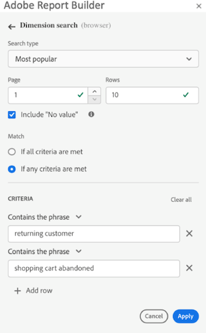
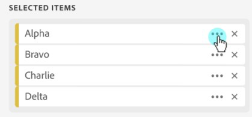

# Filtrar dimensões

Por padrão, cada item de dimensão na tabela retorna os 10 itens principais para essa dimensão.

Para alterar os itens de dimensão retornados para cada dimensão:

1. Selecione uma célula no bloco de dados.

1. Selecione  **[!UICONTROL Editar bloco de dados]** no painel **[!UICONTROL Comandos]**.

1. Selecione **[!UICONTROL Avançar]** para exibir a guia **[!UICONTROL Dimensões]**.

1. Selecione  ao lado do nome de um componente na tabela.

   {zoomable="yes"}

1. Selecione **[!UICONTROL Filtrar dimensão]** no menu pop-up para exibir o painel **[!UICONTROL Filtrar dimensão]**.

1. Selecione **Mais popular** ou **Específico** como o **[!UICONTROL Tipo]**.

   {zoomable="yes"}

1. Selecione as opções apropriadas com base no [tipo de filtro](#filter-type) escolhido.

1. Selecione **[!UICONTROL Aplicar]** para adicionar o filtro.

1. O Report Builder exibe uma notificação para confirmar o filtro adicionado.

Para exibir os filtros aplicados, passe o mouse sobre uma dimensão. Dimensões com filtros aplicados exibem um ícone de filtro  ao lado do nome da dimensão.

## Alterar o filtro e a ordem de classificação

Uma  ou  aparece ao lado da métrica usada para filtrar e classificar o bloco de dados. A direção da seta indica se a métrica é classificada em ordem crescente ou decrescente.

Para alterar a ordem de classificação:

- Selecione  ou  ao lado da métrica para alternar a ordem de classificação.

Para alterar a métrica usada para filtrar e classificar o bloco de dados:

1. Passe o mouse sobre o componente de métrica desejado no Criador de tabela para exibir opções adicionais.

2. Selecione  para a métrica preferencial.

   {zoomable="yes"}

## Tipo de filtro

Há duas maneiras de filtrar itens de dimensão: [Mais popular](#most-popular) e [Específico](#specific-filtering)

### **[!UICONTROL Mais popular]**

A opção **[!UICONTROL Mais popular]** permite filtrar dinamicamente itens de dimensão com base em valores de métrica. Mais popular retorna os itens de dimensão com classificação mais alta com base nos valores de métrica. Por padrão, os primeiros 10 itens de dimensão são listados, classificados pela primeira métrica adicionada ao bloco de dados.

{zoomable="yes"}

#### Opções de Página e Linhas

Use os campos de **[!UICONTROL Página]** e **[!UICONTROL Linhas]** para dividir os dados em grupos sequenciais ou páginas. Esse recurso permite que você obtenha valores de linhas classificadas diferentes dos valores mais altos em seu relatório. E é especialmente útil para obter dados além do limite de 50.000 linhas.

O padrão para Página é `1` e para Linhas é `10`. Esses padrões implicam que cada página tem 10 linhas de dados. A página 1 retorna os 10 itens principais, a página 2 retorna os 10 itens seguintes e assim por diante.

A tabela abaixo lista exemplos de valores de página e linha e a saída resultante.

| Página | Linha | Saída |
|------|--------|----------------------|
| 1 | 10 | 10 itens principais |
| 2 | 10 | Itens 11-20 |
| 1 | 100 | 100 itens principais |
| 2 | 100 | Itens 101-200 |
| 2 | 50.000 | Itens 50.001-100.000 |

A tabela abaixo lista os valores mínimos e máximos para página e linhas.

|       | Valores mínimos | Valores máximos |
|-------|---------------:|---------------:|
| Página inicial | 1 | 50 milhões |
| Número de linhas | 1 | 50.000 |

#### Incluir &quot;Nenhum valor&quot;

No Customer Journey Analytics, algumas dimensões coletam uma entrada *Nenhum valor*. A configuração **[!UICONTROL Incluir &quot;Nenhum valor&quot;]** permite excluir esses valores dos relatórios. Por exemplo, é possível criar uma classificação como o Nome do produto com base na chave SKU do produto. Se um SKU de produto específico não tiver sido configurado com sua classificação de Nome de Produto específica, seu valor de Nome de Produto será definido como *Nenhum valor*.

**[!UICONTROL Incluir &quot;Nenhum valor&quot;]** está selecionado por padrão. Desmarque essa opção para excluir entradas sem valor.

#### Filtrar por critérios

Você pode filtrar itens de dimensão com base no fato de todos os critérios serem atendidos ou caso qualquer critério seja atendido.

Para definir critérios de filtragem:

1. Selecione um operador no menu suspenso de operadores. Por padrão, **[!UICONTROL Contém a frase]** está selecionada

   {zoomable="yes"}

1. Insira um termo de pesquisa.

1. Selecione  **[!UICONTROL Adicionar linha]** para confirmar a seleção e adicionar outro item de critério.

1. Selecione  para remover um item de critério.

É possível incluir até 10 itens de critério.

### **[!UICONTROL Específico]**

A opção **[!UICONTROL Específico]** permite criar uma lista fixa de itens de dimensão para cada dimensão. Use o tipo de filtro **[!UICONTROL Específico]** para especificar os itens de dimensão exatos a serem incluídos no filtro. É possível selecionar itens de uma lista ou de um intervalo de células.

{zoomable="yes"}

#### A partir da lista

1. Selecione a opção **[!UICONTROL Da lista]** para procurar e selecionar itens de dimensão.

   Ao selecionar a opção **Da lista**, a lista **[!UICONTROL Itens de Dimension]** é preenchida com itens de dimensão ordenados pelo número de eventos.

   {zoomable="yes"}

1. Insira um termo de pesquisa em  **[!UICONTROL _Adicionar item_]** para pesquisar na lista.

1. Para pesquisar um item não incluído nos últimos 90 dias de dados, selecione **[!UICONTROL Mostrar itens para os últimos 6 meses]** para estender a pesquisa. Após carregar os dados dos últimos 6 meses, o Report Builder atualiza o link para **[!UICONTROL Mostrar itens para os últimos 18 meses]**.

1. Para excluir um item da lista **[!UICONTROL Itens selecionados]**, selecione .

1. Para mover um item na lista **[!UICONTROL Itens selecionados]**, arraste e solte o item ou selecione  para exibir o menu de contexto e selecione nas opções de movimentação.

1. Selecione **[!UICONTROL Aplicar]**.

O Report Builder atualiza a lista para mostrar a filtragem específica aplicada.

#### A partir de intervalo de células

Selecione a opção **De intervalo de células** para escolher um intervalo de células que contenha a lista de itens de dimensões a serem correspondidos.

{zoomable="yes"}

Ao selecionar um intervalo de células, considere as seguintes restrições:

- O intervalo deve ter pelo menos uma célula.
- O intervalo não pode ter mais de 50.000 células.
- O intervalo deve estar em uma única linha ou coluna ininterrupta.

Sua seleção pode conter células vazias ou células com valores que não correspondem a um item de dimensão específico.

### Filtrar rapidamente uma dimensão

Para filtrar uma dimensão para a qual nenhum filtro é aplicado no momento:

1. Selecione  para uma dimensão. Por exemplo, **[!UICONTROL canal de interação]**.

1. Selecione duas vezes itens de dimensão para adicionar ao filtro. Como alternativa, selecione um ou mais itens de dimensão e arraste e solte a seleção na seção  **[!UICONTROL Row]**.

   {zoomable="yes"}

<!--

By default, each dimension item in the table returns the top 10 items for that dimension.

To change the dimension items returned for each dimension

1. Click **[!UICONTROL Manage]** and select a data block from the list.

   

1. Click **[!UICONTROL Edit data block]** in the COMMANDS panel.

1. Click **[!UICONTROL Next]** to display the Dimensions tab.

1. Click the **...** icon next to a component name in the table.

    

1. Select **[!UICONTROL Filter dimension]** in the pop-up menu to display the **[!UICONTROL Filter dimension]** pane.

1. Select **[!UICONTROL Most popular]** or **[!UICONTROL Specific]**.

    

1. Select appropriate options based on the filter type chosen.

1. Click **[!UICONTROL Apply]** to add the filter.

    Report Builder displays a notification to confirm the added filter.

To display applied filters, hover over a dimension. Dimensions with applied filters display a filter icon to the right of the Dimension name.

## Filter Type

There are two ways to filter dimension items: Most popular and Specific.

## Most popular

The [!UICONTROL Most popular] option allows you to dynamically filter dimension items based on metric values. [!UICONTROL Most popular] filtering returns the highest ranked dimension items based on metric values. By default, the first 10 dimensions items are listed, sorted by the first metric added to the data block.

 

### Page and Rows options

Use the **Page** and **Rows** fields to divide data into sequential groups or pages. This allows you to pull ranked row values other than the top-most values into your report. This feature is especially useful for pulling data beyond the 50,000 row limit.

#### Page and Rows defaults

- Page = 1
- Rows = 10

The Page and Rows default settings identify that each page has 10 rows of data. Page 1 returns the top 10 items, page 2 returns the next 10 items, and so on.

The table below lists examples of page and row values and the resulting output.

| Page | Row    | Output               |
|------|--------|----------------------|
| 1    | 10     | Top 10 items         |
| 2    | 10     | Items 11-20          |
| 1    | 100    | Top 100 items        |
| 2    | 100    | Items 101-200        |
| 2    | 50,000 | Items 50,001-100,000 |

#### Minimum and maximum values

- Starting page: Min = 1, Max: 50 million
- Number of rows: Min = 1, Max: 50,000

### Include "No value"

In Adobe Analytics, some dimensions collect a "no value" entry. This filter allows you to exclude these values from reports. For example, you can create a classification such as the Product Name classification based on the Product SKU key. If a specific product SKU has not been set up with its specific Product Name classification, its Product Name value is set to "no value".

Include "**No value**" is selected by default. Deselect this option to exclude entries with no value.

### Filter by Criteria

You can filter dimension items based on whether all criteria are met or if any criteria are met.

To set filtering criteria

1. Select an operator from the drop-down list.

    

1. Enter a value into the search field.

1. Click **[!UICONTROL Add row]** to confirm the selection and add another criteria item.

1. Click the delete icon to remove a criteria item.

    You can include up to 10 criteria items.

### Change the filter and sort order

An arrow appears next to the metric used to filter and sort the data block. The direction of the arrow indicates whether the metric is sorted greatest to least or least to greatest.

To change the sort direction, click the arrow next to the metric.

To change the metric used to filter and sort the data block,

1. Hover over the desired metric component in the Table builder to display additional options.

2. Click the arrow on the preferred metric.

   

## Specific filtering

The Specific option allows you to create a fixed list of dimension items for each dimension. Use the **[!UICONTROL Specific]** filtering type to specify the exact dimension items to include in your filter. You can select items from a list or from a range of cells.

### From list

1. Select the **[!UICONTROL From list]** option to search for and select dimension items.

    When you select the **[!UICONTROL From list]** option, the list is populated with dimension items with the most events first.

    

    The **[!UICONTROL Available items]** list is ordered from dimension items with the most events to those with the least.

1. Enter a search term in the **[!UICONTROL Add item]** field to search the list.

1. To search for an item not included in the last 90 days of data, click **[!UICONTROL Show items for the last 6 months]** to extend the search.

    

    After data from the past 6 months loads, Report Builder updates the link to **[!UICONTROL Show items for last 18 months]**.

1. Select a dimension item.

    Selected dimension items are automatically added to the **[!UICONTROL Selected items]** list.

    

    To delete an item from the list, click the delete icon to remove the item from the list.

    To move an item in the list, drag and drop the item or click ... to display the move menu.

    

1. Click **[!UICONTROL Apply]**

    Report Builder updates the list to show the specific filtering you applied.

### From range of cells

Select the **[!UICONTROL From range of cells]** option to choose a range of cell that contain the list of dimensions items to match.

 

When you select a range of cells, consider the following restrictions:

- The range must have at least one cell.
- The range can't have more than 50,000 cells.
- The range must be in a single uninterrupted row, or column.

Your selection can contain empty cells or cells with values that don't match with a specific dimension item.

### From the Dimensions tab in the Table builder

From the **[!UICONTROL Dimensions]** tab, click the chevron icon next to a dimension name to view the list of dimension items.

 

You can drag and drop items onto the **[!UICONTROL Table]** or double-click an item name to add it to the **[!UICONTROL Table]** builder.

-->