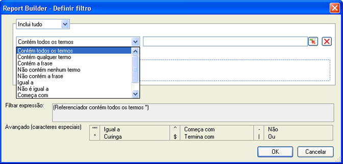

# Filtrar visão geral das dimensões

Você pode filtrar pelas dimensões que adiciona à grade de rótulos de linhas. Os filtros restringem os dados retornados pelas solicitações e podem ser aplicados a partir de layouts pivô ou personalizados. Quando você configura a filtragem de dimensões a partir do layout dinâmico, pode especificar, adicionalmente, o número de entradas da célula.

O formulário de filtro selecionado agora é preenchido com base no elemento e na métrica selecionada na solicitação do construtor de relatórios.

## Define filter - values and special characters {#section_15840216A4044C40974945FAA435AD93}

Information about filters in the **[!UICONTROL Most Popular Filter]** &gt; **[!UICONTROL Define Filter]** panel.

As seguintes tabelas fornecem exemplos e informações sobre filtros:

<table id="table_8AC3A26FF02143DBA949B30F2A46CF11"> 
 <thead> 
  <tr> 
   <th colname="col1" class="entry"> Filtro </th> 
   <th colname="col02" class="entry"> Descrição </th> 
   <th colname="col2" class="entry"> Exemplo de filtro </th> 
   <th colname="col3" class="entry"> Resultados da correspondência </th> 
  </tr> 
 </thead>
 <tbody> 
  <tr> 
   <td colname="col1"> 
Contém todos os termos 
 </td> 
   <td colname="col02"> 
Contém cada valor delimitado por espaços em qualquer ordem. 
 </td> 
   <td colname="col2"> 
a b c 
 </td> 
   <td colname="col3"> 
Corresponde  a bpode  b c, e assim por diante. 
 </td> 
  </tr> 
  <tr> 
   <td colname="col1"> 
Contém qualquer termo 
 </td> 
   <td colname="col02"> 
Contém pelo menos um dos filtros (delimitado por espaços). 
 </td> 
   <td colname="col2"> 
A B C 
 </td> 
   <td colname="col3"> 
Corresponde  A1,  B2,  C3, mas não  D4. 
 </td> 
  </tr> 
  <tr> 
   <td colname="col1"> 
Contém a frase 
 </td> 
   <td colname="col02"> 
Contém o filtro de pesquisa e possivelmente outros termos. 
 </td> 
   <td colname="col2"> 
abc 
 </td> 
   <td colname="col3"> 
Corresponde  abc e  abc def. 
 </td> 
  </tr> 
  <tr> 
   <td colname="col1"> 
Não contém nenhum termo 
 </td> 
   <td colname="col02"> 
Retorna tudo a não ser que contenha um valor que você inserir. 
 </td> 
   <td colname="col2"> 
a b c 
 </td> 
   <td colname="col3"> 
Corresponde  d e f mas não  c d e f. 
 </td> 
  </tr> 
  <tr> 
   <td colname="col1"> 
Não contém a frase 
 </td> 
   <td colname="col02"> 
Retorna tudo que não contém sua frase. 
 </td> 
   <td colname="col2"> 
abc 
 </td> 
   <td colname="col3"> 
Exclui  abc,  abc def e corresponde a  def 
 </td> 
  </tr> 
  <tr> 
   <td colname="col1"> 
Igual 
 </td> 
   <td colname="col02"> 
Retorna uma correspondência exata. 
 </td> 
   <td colname="col2"> 
abc 
 </td> 
   <td colname="col3"> 
  abc é devolvido, e nada mais. 
 </td> 
  </tr> 
  <tr> 
   <td colname="col1"> 
Não é igual 
 </td> 
   <td colname="col02"> 
Retorno qualquer item que não corresponde exatamente à entrada. 
 </td> 
   <td colname="col2"> 
a 
 </td> 
   <td colname="col3"> 
Não corresponde  a. 
 
Matches  a b c. 
 
Corresponde a  abc. 
 </td> 
  </tr> 
  <tr> 
   <td colname="col1"> 
Inicia com 
 </td> 
   <td colname="col02"> 
Retorna os resultados que começam com um valor específico. 
 </td> 
   <td colname="col2"> 
abc 
 </td> 
   <td colname="col3"> 
Corresponde  abcd , mas não  1abc 
 </td> 
  </tr> 
  <tr> 
   <td colname="col1"> 
Termina com 
 </td> 
   <td colname="col02"> 
Retorna os resultados que terminam com um valor específico. 
 </td> 
   <td colname="col2"> 
xyz 
 </td> 
   <td colname="col3"> 
Corresponde  wxyz , mas não  wxyz0 
 </td> 
  </tr> 
  <tr> 
   <td colname="col1"> 
Avançado (caracteres especiais) 
 </td> 
   <td colname="col02"> 
Fornece caracteres regex: 
 
 <code> "", ^, -, *, $, | </code> 
 </td> 
   <td colname="col2"> 
"^Página*Inicial$" | esportes 
 </td> 
   <td colname="col3"> 
 Isso define um filtro que começa com  Home, and then looks for zero or more characters, and then ends with  Page. 
 
Além disso, qualquer página com  esportes . 
 
Alguns exemplos de correspondências: 
 
    <ul id="ul_72D76C5AFEAF405E8A0E4E3C604D10AE"> 
     <li id="li_4D490059B667450DA8A0103167C7B391">HomePage </li> 
     <li id="li_1351619156274092AEB2771D882AD357">Página inicial e (outros caracteres) </li> 
     <li id="li_940EAA99A8CF49308E8471065EB317B1">Página inicial de esportes </li> 
     <li id="li_50A895F14A454BE9BF06EE0F07F99B3B">página de esportes </li> 
     <li id="li_F3CE0D07941D4C2485D2DE0B73E00677">esportes </li> 
     <li id="li_E84C15C061824A5D922D9900392F2996">xyz esportes abc </li> 
    </ul> </td> 
  </tr> 
 </tbody> 
</table>

<table id="table_8BBB06C8860745DEA41B39673699DC0F"> 
 <thead> 
  <tr> 
   <th colname="col1" class="entry"> Caracteres especiais </th> 
   <th colname="col2" class="entry"> Propósito </th> 
   <th colname="col3" class="entry"> Notas </th> 
  </tr> 
 </thead>
 <tbody> 
  <tr> 
   <td colname="col1"> " " </td> 
   <td colname="col2"> Igual </td> 
   <td colname="col3"> 
Sem espaço a não ser quando emparelhado com outra citação. Por exemplo, A exibição  de 17" não é uma frase. 
 </td> 
  </tr> 
  <tr> 
   <td colname="col1"> * </td> 
   <td colname="col2"> Caractere curinga </td> 
   <td colname="col3"> 
Igual ao asterisco usado em uma expressão regular. 
 </td> 
  </tr> 
  <tr> 
   <td colname="col1"> ^ </td> 
   <td colname="col2"> Inicia com </td> 
   <td colname="col3"> </td> 
  </tr> 
  <tr> 
   <td colname="col1"> $ </td> 
   <td colname="col2"> Termina com </td> 
   <td colname="col3"> </td> 
  </tr> 
  <tr> 
   <td colname="col1"> - </td> 
   <td colname="col2"> Não </td> 
   <td colname="col3"> </td> 
  </tr> 
  <tr> 
   <td colname="col1"> | </td> 
   <td colname="col2"> Ou </td> 
   <td colname="col3"> 
Suportado somente no  Filtro avançado (caracteres especiais) . 
 </td> 
  </tr> 
 </tbody> 
</table>
