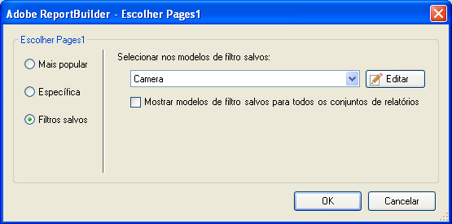

# Filtros salvos

Você pode salvar filtros ou outros parâmetros no Report Builder e usá-los em outras planilhas ou pastas de trabalho. Esses parâmetros são salvos no Analytics a fim de garantir que fiquem disponíveis para outros usuários do Report Builder em outros computadores.

Você salva os filtros no formulário [!UICONTROL Escolher página] quando cria os filtros. Como um exemplo desse procedimento, consulte [Filtros específicos](/help/analyze/report-builder/layout/c-filter-dimensions/t-specific-filters.md).

