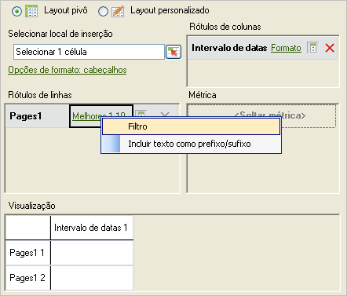
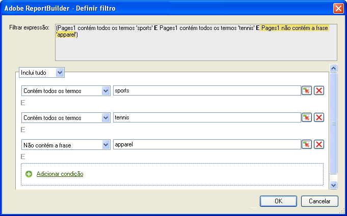
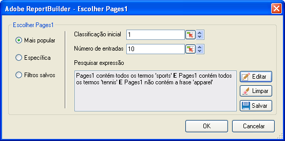

# Filtragem mais popular

Filtros de classificação e condicionais que você configura usando lógica booleana com expressões de pesquisa E/OU.

Most Popular filters are expression filters that you configure using Boolean logic with AND/OR conditions, such as [!UICONTROL Page does not contain]*`<product name>`* with conditions or groups of conditions like [!UICONTROL Includes All], [!UICONTROL Includes Any], or [!UICONTROL Excludes All]. You can [save](/help/analyze/report-builder/layout/c-filter-dimensions/saved-filters.md) these expressions for other request in this workbook, or in other workbooks.

**Para criar um filtro mais popular**

1. Crie ou edite uma solicitação e então acesse o [!UICONTROL Assistente de solicitações: etapa 2].

   

1. No [!UICONTROL Assistente de solicitações: etapa 2]**, clique no link ao lado da dimensão na grade e, em seguida, escolha[!UICONTROL Filtro]**.
1. No formulário [!UICONTROL Escolher página]**, habilite[!UICONTROL Mais popular]** e, então, configure as seguintes opções:

   **Classificação inicial:** A classificação inicial de uma dimensão. A classificação padrão de 1 indica o item no topo da lista de dados relatados. Por exemplo, para a dimensão [!UICONTROL Página], a marca inicial 1 indica a página mais solicitada de seu site. Você poderia especificar 10 ou outro valor como a célula de classificação inicial, o que produz um relatório que começa com 10 como a mais alta. As métricas são organizadas em ordem decrescente, de modo que os itens de linha com maior atividade sejam relatados primeiro na lista. Se você precisar de mais de 50.000 nomes de páginas em uma solicitação, mas tiver milhares de páginas sobre as quais emitir relatórios, poderá copiar a solicitação e alterar a classificação inicial para recuperar os dados apropriados em blocos de 50.000.

   **Número de entradas:** (somente [!UICONTROL Layout dinâmico]) Define quantos itens são relatados para uma métrica específica para um intervalo de datas. Algumas métricas podem listar centenas de entradas, enquanto outras podem mostrar apenas algumas. Por exemplo, para a dimensão [!UICONTROL Seção do site], um número de entradas de 25 indica que o relatório mostra as 25 páginas mais visitadas.

   Setas permitem alterar a [!UICONTROL Classificação inicial] e o [!UICONTROL Número de entradas] do primeiro ponto de dados na planilha. Por padrão, a [!UICONTROL Classificação inicial] é definida como 1 e o [!UICONTROL Número de entradas] como 10. Esses valores são ajustáveis com no mínimo 1 e no máximo 50.000 para determinadas métricas. Cada métrica tem seu próprio teto para o [!UICONTROL Número de entradas]. Valores negativos ou zero não são permitidos nesses campos. Se você escolher 15 para a [!UICONTROL Classificação inicial] e 10 para o [!UICONTROL Número de entradas], as solicitações de dados para a métrica retorna as 10 páginas mais visitadas, onde a primeira página mais visitada é a número 15 na lista para o intervalo de datas especificado. Todas as páginas mais solicitadas classificadas de 15ª a 25ª são listadas em ordem decrescente.

   >[!NOTE]
   >
   >Aplicar filtros a solicitações existentes resulta em alterações nos dados apresentados. Suponha que você mapeou as dez principais [!UICONTROL Páginas] para as células $A$1 a $A$10, com 1 para a [!UICONTROL Classificação inicial] e 10 para o [!UICONTROL Número de entradas]. Se você alterar esses valores para mostrar 1 para [!UICONTROL Classificação inicial] e somente 3 para [!UICONTROL Número de entradas], os dados que anteriormente preenchiam as células $A$4 a $A$10 não serão mais exibidos.

1. Para criar uma expressão de pesquisa, clique em **[!UICONTROL Adicionar]**.

   

1. No formulário [!UICONTROL Definir filtro], configure as condições apropriadas para as suas necessidades.

   : Permite localizar uma condição definida no valor de uma célula.

   **Adicionar condição:** Adiciona uma condição à expressão. Não há limite para o número de condições que podem ser adicionadas.

1. Clique em **[!UICONTROL OK]**.

   

1. No formulário [!UICONTROL Escolher página]**, clique em[!UICONTROL Salvar]** para salvar a expressão.
1. Clique em **[!UICONTROL OK]**.
