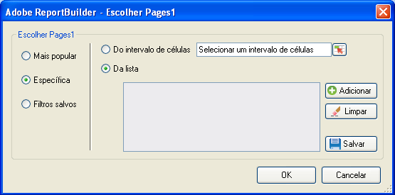

# Filtros específicos

Filtros que aplicam termos de dimensões específicos.

Você pode pesquisar por itens de dimensão específicos criando um filtro que corresponda a critérios exatos. Por exemplo, você pode criar o seguinte tipo de filtro: página em [!DNL homepage.htm], [!DNL contact_us.html], [!DNL corporate_info.html].

**Para criar um filtro Específico**

1. Crie ou edite uma solicitação e então acesse o [!UICONTROL Assistente de solicitações: etapa 2].

   

1. No [!UICONTROL Assistente de solicitações: etapa 2], clique no link ao lado da dimensão na grade e, em seguida, escolha **[!UICONTROL Filtro]**.

   

1. Habilite **[!UICONTROL Específico]** e, em seguida, habilite uma das seguintes opções:

   * **A partir de um intervalo de células:** Permite selecionar dados a partir de células. Você pode selecionar:
   * **Todas as células do intervalo:** Permite mapear cada célula para o intervalo. Texto descritivo explica quantos grupos de células precisam ser selecionados. Para mapear mais de um grupo de células, pressione a tecla Ctrl à medida que faz seleções sucessivas. Se o intervalo a ser mapeado contiver somente uma célula, essa será a única opção disponível
   * **Primeira célula do intervalo:** Você precisa somente selecionar a célula superior esquerda do intervalo e, em seguida, escolher uma direção para os dados. Além disso, se a solicitação tiver vários períodos, você escolhe a direção dos períodos e se deseja pular um número definido de células entre os períodos.
   * **A partir da lista:** Permite selecionar dados de uma lista à qual você pode adicionar dados.
1. Se você habilitar **[!UICONTROL A partir da lista]**, selecione quaisquer itens listados disponíveis ou clique em **[!UICONTROL Adicionar]**.

   When you click **[!UICONTROL Add]**, the [!UICONTROL Select From List] form displays a list of available dimension items for the current request date range, limited to the first 10,000 items. Você pode pesquisar nesses itens ou clicar em **[!UICONTROL Mais...]** para exibir o [!UICONTROL Formulário Pesquisar], que permite criar uma pesquisa mais detalhada das dimensões.
1. Em [!UICONTROL Selecionar da lista], clique em **[!UICONTROL OK]**.
1. No formulário [!UICONTROL Escolher página], salve seu filtro Específico se desejar e, em seguida, clique em **[!UICONTROL OK]**.
