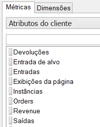
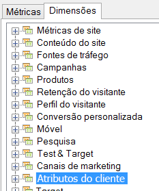

# Atributos do cliente

Os atributos do cliente são armazenados em um novo tipo de elemento chamado VisAttr, que pode ser configurado como uma dimensão ou uma métrica.

Para obter informações detalhadas sobre como fazer upload dos atributos do cliente, consulte a ajuda da [Experience Cloud](https://docs.adobe.com/content/help/en/core-services/interface/customer-attributes/attributes.html).

* Se for configurada como métrica, a VisAttr é exposta como "dimensão" e métrica.

    

* Comporta o mesmo detalhamento que uma eVar (qualquer item pode ser detalhado por qualquer coisa).
* A VisAttr é compatível com todas as métricas de eVar.
* A VisAttr como uma métrica suporta a "compartimentalização" (como Tempo gasto no site: 0 a 30, 31 a 60…)
* A VisAttr está disponível como uma dimensão de segmentação.

