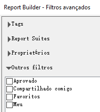
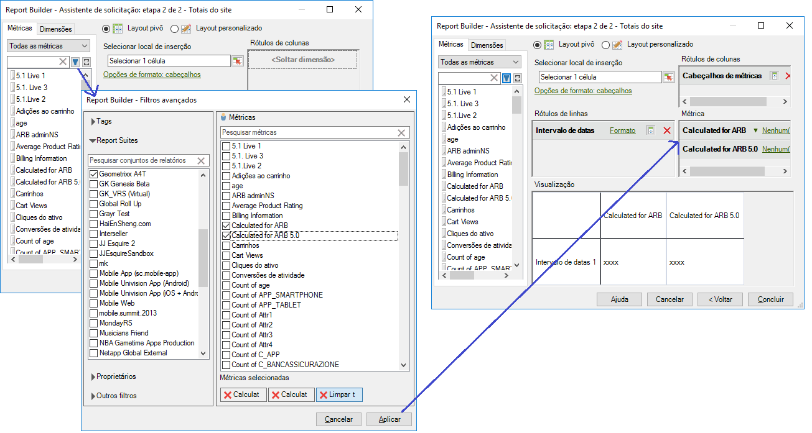

# Métricas calculadas

O Report Builder 5.2 é compatível com as métricas calculadas unificadas do Adobe Analytics. Entre outra inovações, todas as métricas calculadas agora contam com uma ID global: elas não ficam mais restritas a um único conjunto de relatórios.

>[!NOTE] As pastas de trabalho atuais talvez indiquem solicitações com as IDs da métrica herdada. Ao usar o Report Builder 5.2, essas IDs da métrica herdada serão convertidas para a nova ID global. Se você compartilhar essa pasta de trabalho com um usuário do Report Builder v5.1 ou anterior, ele não conseguirá visualizar as métricas calculadas.

Para saber mais sobre como criar e gerenciar métricas calculadas com o novo Criador e gerenciador de métricas calculadas, consulte o Guia de métricas  calculadas.

Na Etapa 2 do Assistente de solicitações, você pode filtrar e aplicar métricas calculadas.

## Filtrar métricas calculadas {#section_376E986D3E684999A7CDB08E53854159}

Para **filtrar** as métricas calculadas, clique no ícone Filtrar:  

. A caixa de diálogo Filtros avançados é preenchida com métricas padrão e calculadas.

Os filtros disponíveis incluem:

| Nome do filtro | Descrição |
|---|---|
| Tags | Permite filtrar métricas calculadas com tags específicas. Observe que os filtros de tags usam o operador E. Se você marcar duas tags, o painel direito mostrará as métricas que foram marcadas com **ambas** as tags. |
| Conjuntos de relatórios | Se você aplicar o filtro &quot;Somente o *nome do conjunto de relatórios*&quot; no Construtor de métricas calculadas em [!DNL Reports & Analytics] e, em seguida, exibir o filtro Avançado no [!DNL Report Builder], o filtro Avançado exibirá as métricas calculadas somente para o conjunto de relatórios selecionados. |
| Proprietários | Permite filtrar métricas por proprietário. Observe que os filtros Proprietários usam o operador OU. Se você marcar dois proprietários, o painel direito mostrará as métricas pertencentes a **qualquer** proprietário. |
| Outros filtros > Aprovado | Mostra todos os segmentos métricas aprovadas. |
| Outros filtros > Favoritos | Mostra todas as métricas que você marcou como Favoritos. |
| Outros filtros > Meus | Mostra todas as métricas que você possui. |
| Outros filtros > Compartilhados comigo | Mostra todas as métricas que outras pessoas compartilharam com você. |

## Aplicação de métricas calculadas {#section_DF5CF349460A45FDA4B6E6BB8B52F18E}

Depois de selecionar os filtros, clique em **[!UICONTROL Apply]** para aplicá-los à solicitação. As métricas selecionadas agora são adicionadas ao layout do relatório.

