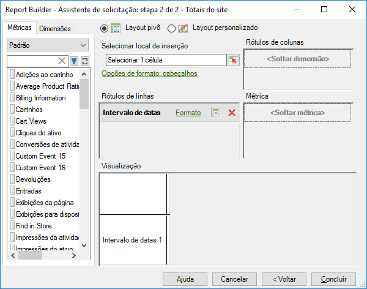

# Combinar métricas de tráfego e comércio na mesma solicitação

Agora você pode combinar esses dois tipos de métricas em uma ou na mesma solicitação, em vez de precisar criar solicitações separadas.

As métricas de tráfego e comércio agora são exibidas na mesma categoria de métricas na Etapa 2 do Assistente de solicitação. Anteriormente, essas métricas eram separadas em uma categoria de Comércio e uma categoria de Tráfego.

A nova categoria agrupada é identificada como **[!UICONTROL Padrão]**. .

