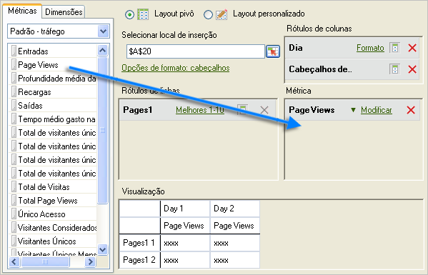
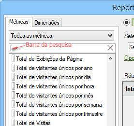
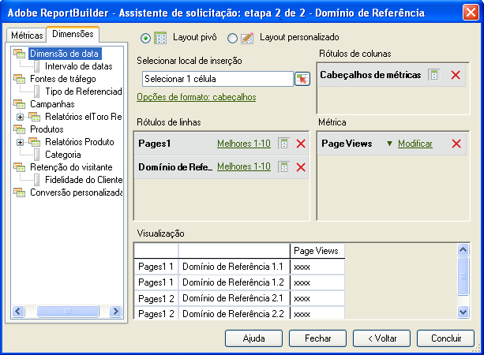

# Adicionar métricas e dimensões

Etapas para adicionar métricas e dimensões a uma solicitação.

1. [Crie a solicitação de dados](../../../../analyze/report-builder/data-requests/data-requests.md#concept_E14C1E6B63C44D02BF8D80021B4B0F89) no [!UICONTROL Assistente de solicitações: etapa 1], e então clique em **[!UICONTROL Próximo]**.
1.  No [!UICONTROL Assistente de solicitações: etapa 2], clique duas vezes em métricas, ou arraste-as para a posição desejada.

   

   Quando você adiciona métricas, elas não são removidas da guia [!UICONTROL Métricas], porque você pode exibir as métricas várias vezes em uma solicitação. Por exemplo, você pode exibir o subtotal da métrica além de cada valor. No entanto, a lista de métricas disponíveis muda toda vez que você adiciona ou remove uma dimensão.

   É possível adicionar métricas somente à seção de layout [!UICONTROL Métricas]. As métricas adicionadas ao layout do [!UICONTROL Rótulo de coluna] como [!UICONTROL Cabeçalho de métrica]. Se você transferir um [!UICONTROL Cabeçalho de métrica] de um [!UICONTROL Layout de coluna] para [!UICONTROL Layout de linha], ele é exibido lá e usado como métrica e análise.

   Observe que uma barra de pesquisa aparece na guia Métricas, logo acima da lista de Métricas.

   

   Lembre-se:

   * À medida que você insere um termo de pesquisa, a lista será atualizada automaticamente para exibir somente as métricas cujos rótulos correspondem ao termo de pesquisa.
   * A correspondência faz a distinção entre maiúsculas e minúsculas, e é equivalente a uma pesquisa com "contém".
   * Pesquisas por palavras completas ou outro sinalizador de pesquisa especial (começa com, termina com, E, OU etc.) não são suportados.

      O termo de pesquisa será apagado se você sair do Assistente de pesquisa (isto é, clicar em Concluir ou Cancelar), voltar para a Etapa 1 do Assistente de pesquisa ou alterar a categoria Métrica.

      O termo de pesquisa não será apagado nos seguintes casos:

   * Ao arrastar e soltar (ou clicar duas vezes) um item de métrica da lista para que ele seja adicionado ao Painel de métricas de layout dinâmico/personalizado.
   * Ao remover os itens da métrica do Painel de métricas de layout dinâmico/personalizado.
   * Ao clicar na guia Dimensão e, em seguida, retornar para a guia Métrica.
   * Ao invocar outros subformulários (modal ou sem modo) que retornarão à Etapa 2 do Assistente de solicitações ao sair. Os exemplos de formulários são

      * Formulários de filtro de dimensão
      * Formulários de formatação por intervalos de datas
      * Formulário de opções de formato
      * Formulário de texto anterior-posterior
      * Formulário de localização do intervalo de saída

1. (Opcional) Para classificar uma solicitação por métrica, apenas clique na etiqueta da métrica.
1. Adicionar dimensões da mesma maneira que adiciona métricas.

Na guia [!UICONTROL Dimensões], o sistema exibe dimensões que se quebram ou que sejam uma classificação de qualquer relatório básico selecionado na Etapa 1 e na configuração do conjunto de relatórios. Quando você solta uma dimensão nas grades do layout, ela é removida da visualização em árvore e recalcula a lista de dimensões disponíveis restantes. 

A dimensão [!UICONTROL Data] é adicionada automaticamente. As dimensões de data disponíveis mudam, dependendo da granularidade selecionada no [!UICONTROL Assistente de solicitações: etapa 1]. (Os valores válidos são:

    * Hora
    * Dia
    * Semana
    * Mês
    * Ano
    * Intervalo de datas (quando nenhuma granularidade é especificada)

1. Modify metrics and dimensions by configuring [format options](../../../../analyze/report-builder/layout/t-format-display-headers.md#task_45C7C4938C2C47FCB02634A1248AA831) and filters.
1. Clique em **[!UICONTROL Concluir]**.
No exemplo a seguir, dimensões estão relacionadas à métrica [!UICONTROL Página]. Aqui, a dimensão [!UICONTROL Domínio de referência] cria um relatório de detalhamento entre [!UICONTROL Página] e [!UICONTROL Domínio de referência]. A guia [!UICONTROL Dimensão] é atualizada apenas com as dimensões que você pode adicionar a um relatório de detalhamento.

