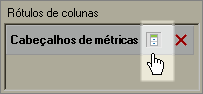

# Ocultar ou mostrar cabeçalhos

Este procedimento descreve como ocultar ou mostrar cabeçalhos.

Clique em **[!UICONTROL Ocultar/Exibir]** na saída do [!UICONTROL Layout dinâmico] ou do [!UICONTROL Layout personalizado] no formulário [!UICONTROL Assistente de solicitações: etapa 2].

