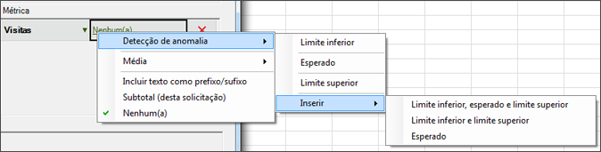
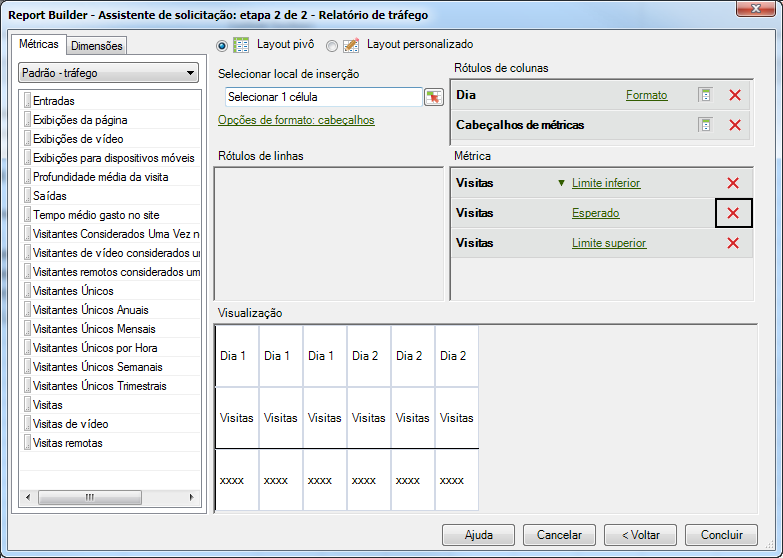

# Configurar uma solicitação de detecção de anomalias

Essas etapas descrevem como criar uma solicitação de detecção de anomalias no construtor de relatórios.

1. Selecione um relatório de tendências, como um **relatório deMétricas do site** &gt; **[!UICONTROL Relatório de]** tráfego.
1. No menu [!UICONTROL Aplicar granularidade]**, selecione[!UICONTROL Dia]**.

   >[!NOTE]
   >
   >The [!UICONTROL Anomaly Detection] menu is available only when you select Day granularity. Os 30 dias anteriores de dados são utilizados como dados estatísticos durante o período de treinamento, qualquer que seja o intervalo de datas selecionado.

1. After configuring date ranges, click **[!UICONTROL Next]**.

   Resultado da etapa 1. On the Request Wizard: Step 2 of 2, add a metric, such as **[!UICONTROL Visits]**.

   Resultado da etapa 1. For the added metric, click the **[!UICONTROL None]** link.

   

1. Select **[!UICONTROL Anomaly Detection]** &gt; **[!UICONTROL `<selection>`]**.

   

   Ao selecionar uma destas opções, o sistema cria cópias da detecção de anomalias da métrica original. Por exemplo, para a métrica Visitas, uma métrica de Visitas de limite inferior é adicionada ao grupo [!UICONTROL Métrica].
1. Click **[!UICONTROL Finish]** and select the cell for output to Excel.

   See [Anomaly Detection](../../../analyze/analysis-workspace/virtual-analyst/c-anomaly-detection/anomaly-detection.md#concept_9476D6C093334B1A8044AE63835BDBE7) for definitions.
