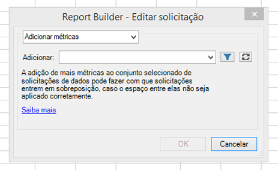
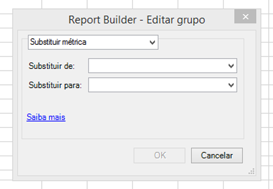
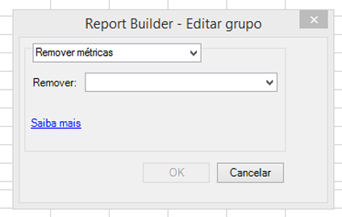

# Editar métricas em várias solicitações

O recurso Editar métricas em várias solicitações permite adicionar, remover ou substituir facilmente as métricas em uma solicitação pré-existente ou em um grupo de solicitações.

## Adicionar métricas {#section_3FBDA9668039404895059618D70FCBCD}

Lembre-se

* Métricas podem ser adicionadas somente a solicitações de Layout dinâmico. Se algumas das solicitações selecionadas forem Layouts personalizados, as métricas não serão adicionadas. Isso ocorre porque o Report Builder não sabe onde colocar a nova métrica na planilha, uma vez que o layout é personalizado.
* Então, se você selecionar apenas solicitações de Layout personalizado, a opção **[!UICONTROL Adicionar métricas]** não estará disponível.
* A adição de métricas aumentará o tamanho de uma solicitação e poderá fazer com que seja sobreposta a outra solicitação. Verifique se a solicitação tem espaço suficiente para adicionar métricas.
* Se a métrica adicionada já estiver presente em uma das solicitações selecionadas, ela será adicionada a essa solicitação.

Para adicionar uma ou mais métricas:

1. Selecione uma ou mais solicitações no Excel e clique com o botão direito do mouse para selecionar **[!UICONTROL Editar métricas]**. (Ou clique em **[!UICONTROL Gerenciar]** > **[!UICONTROL Editar várias]** > `<choose metric>` > **[!UICONTROL Editar grupo]** para selecionar o grupo de solicitações a serem modificadas.)
1. Selecione **[!UICONTROL Adicionar métricas]** e selecione as métricas a serem adicionadas.

   

1. Atualize a solicitação para ver os dados reais. Serão exibidos dados offline até que você atualize.

## Substituir métrica {#section_D773AAC7B30C4FBEBDB66B203C217818}

Lembre-se

* Apenas as substituições 1:1 são permitidas, e não 1:muitas ou muitas:1.
* Se a métrica selecionada a ser substituída não estiver presente em uma das solicitações indicadas, essa solicitação ficará inalterada.
* A nova métrica será colocada no mesmo local da métrica substituída. Isso significa o seguinte:

   * **Em um Layout dinâmico**: se uma solicitação de layout dinâmico exibir data, visita, visitantes, individuais diários, e “visitantes” for substituído por “receita”, o layout de solicitação atualizado será: data, visita, receita, individuais diários.
   * **Em um Layout personalizado**: se a métrica “visitantes” for exibida na célula F11, o layout de solicitação atualizado mostrará “receita” na mesma célula F11.

* Se a métrica substituída tiver uma operação aplicada (média, texto pré-pendente, texto pós-pendente, micrográfico), essas operações também serão aplicadas à nova métrica.

Para substituir uma métrica

1. Selecione uma ou mais solicitações no Excel e clique com o botão direito do mouse para selecionar **[!UICONTROL Editar métricas]**. (Ou clique em **[!UICONTROL Gerenciar]** > **[!UICONTROL Editar várias]** > **`<choose metric>`** > **[!UICONTROL Editar grupo]** para selecionar o grupo de solicitações a serem modificadas.)

1. Selecione **[!UICONTROL Substituir métrica]**.

   

1. Selecione a métrica que será substituída e a métrica que a substituirá.
1. Atualize a solicitação. Serão exibidos dados offline até que você atualize.

## Remover métricas {#section_D3CD5BAC7670416593B633B2B8423C60}

Lembre-se

* Se as métricas selecionadas a serem removidas não estiverem presentes em uma das solicitações indicadas, essa solicitação ficará inalterada.
* Em um Layout dinâmico, a remoção de uma métrica faz com que o layout se desloque para as métricas que estão localizadas após a métrica removida.

   **Exemplo**: se uma solicitação de layout dinâmico exibir data, visitas, visitantes, individuais diários, e você remover “visitas”, o layout atualizado da solicitação mostrará: data, visitantes, individuais diários.

Para remover métricas:

1. Selecione uma ou mais solicitações no Excel e clique com o botão direito do mouse para selecionar **[!UICONTROL Editar métricas]**. (Ou clique em **[!UICONTROL Gerenciar]** > **[!UICONTROL Editar várias]** > **`<choose metric>`** > **[!UICONTROL Editar grupo]** para selecionar o grupo de solicitações a serem modificadas.)

1. Selecione **[!UICONTROL Remover métricas]**.

   

1. Selecione uma ou mais métricas para remover da solicitação.
1. Atualize a solicitação. Serão exibidos dados offline até que você atualize.

