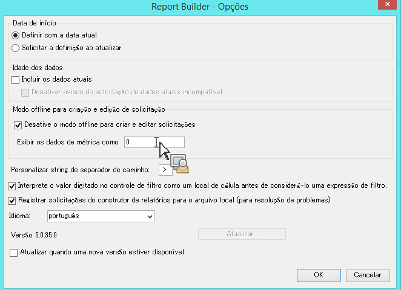
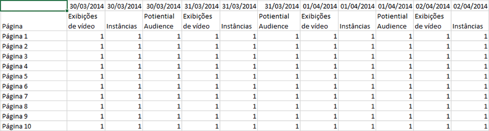

# Modo offline para criar e editar solicitações

O modo offline retorna dados de espaço reservado para acelerar o processo de criação e edição de solicitações.

Ao criar ou editar uma nova solicitação, são efetuadas chamadas da API de relatório para recuperar a resposta. Isso reduz o processo de criação de solicitação, pois é necessário aguardar para que os dados retornem antes de seguir para a próxima etapa. O modo offline retorna apenas dados do espaço reservado, portanto, não é necessário efetuar chamadas de API.

Para habilitar o modo offline:

1. Clique em **[!UICONTROL Opções]no menu do Construtor de relatórios.**

   

1. Marque a caixa de seleção ao lado de **[!UICONTROL Ativar o modo offline para criar e editar solicitações]**.
1. No campo **[!UICONTROL Exibir dados de métrica como], insira os dados de espaço reservado os quais você deseja que retornem na solicitação.** Por exemplo, digite "1".
1. Clique em **[!UICONTROL OK]**.
1. Agora, crie e execute sua solicitação (no modo offline) com o Assistente de solicitação.
1. Sua solicitação com "1" como dados de espaço reservado são semelhantes a isto:

   

   >[!IMPORTANT]
   >
   >Certifique-se de desativar o Modo offline antes de executar suas solicitações com dados reais. Para fazer isso, retorne às **[!UICONTROL Opções]e remova a marca de seleção.**

