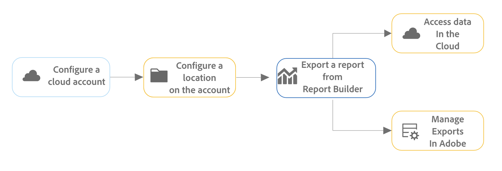

# Agendar pastas de trabalho exportando para destinos na nuvem

Você pode exportar pastas de trabalho do Adobe Analytics do Report Builder para provedores de nuvem como Google, Azure e Amazon.

Como alternativa, você pode compartilhar pastas de trabalho com outras pessoas usando o email, conforme descrito em [Agendar pastas de trabalho para compartilhamento por email](/help/analyze/report-builder/schedule-reportbuilder.md).

[As vantagens de exportar relatórios do Report Builder para a nuvem](#advantages-of-exporting-to-the-cloud) incluem a capacidade de usar relatórios em ferramentas de terceiros ou combiná-los com dados externos.

Antes de exportar pastas de trabalho do Report Builder para um destino na nuvem, verifique se seus blocos de dados, seu ambiente e suas permissões atendem aos [requisitos de exportação](#export-requirements).

## Entender o processo de exportação

Use o processo a seguir ao exportar pastas de trabalho do Report Builder para a nuvem:

1. [Configurar uma conta na nuvem](/help/components/locations/configure-import-accounts.md)

1. [Configurar um local na conta](/help/components/locations/configure-import-locations.md)

1. [Exportar um relatório do Report Builder](#export-a-report-from-report-builder)

<!--

1. Access data in your cloud account and [Manage exports in Adobe](/help/components/exports/manage-exports.md)

-->

## Exportar um relatório do Report Builder {#export-from-report-builder}

>[!NOTE]
>
>Antes de exportar os dados conforme descrito nesta seção, saiba mais sobre o [processo de exportação](#understand-the-export-process) na seção acima.

Para exportar relatórios do Report Builder:

1. Caso ainda não o tenha feito, configure uma conta e um local para a exportação, conforme descrito em [Configurar contas de exportação para a nuvem](/help/components/locations/configure-import-accounts.md).

1. Na planilha do Excel que contém os dados que você deseja exportar, abra o painel direito **[!UICONTROL Adobe Report Builder]**.

1. Selecione [!UICONTROL **Agendar**].

<!-- add screenshot -->

1. Na guia **[!UICONTROL Pastas de Trabalho]**, selecione o ícone de adição para criar um novo agendamento

   

   Ou

   Para exportar a pasta de trabalho para um agendamento já criado, selecione o agendamento na lista de agendamentos e selecione **[!UICONTROL Enviar conforme agendado]**.

1. No painel direito do [!UICONTROL **Adobe Report Builder**], especifique as seguintes informações para continuar criando um novo agendamento:

   | Nome do campo | Função |
   |---------|----------|
   | **[!UICONTROL Arquivo]** | Exibe o arquivo de pasta de trabalho selecionado para exportação no momento. Selecione o ícone da pasta de trabalho  ao lado do nome do arquivo para escolher a pasta de trabalho atual se ela ainda não estiver selecionada. |
   | **[!UICONTROL Nome do arquivo]** <!--should be File name --> | Permite alterar o nome do arquivo antes de exportar a pasta de trabalho.
O nome de arquivo da pasta de trabalho é padronizado como o nome da pasta de trabalho
 |
   | **[!UICONTROL Tipo de arquivo]** | Escolha o tipo do arquivo exportado. Você pode escolher Excel, PDF ou CSV.
Ao selecionar **[!UICONTROL CSV]**, saiba que a pasta de trabalho agendada é enviada como um anexo ZIP. Algumas administrações de e-mail corporativas podem bloquear e-mails com anexos ZIP. Você verá um aviso adequadamente.
 |
   | **[!UICONTROL Anexar carimbo de data/hora ao nome do arquivo]** | Selecione essa opção para incluir um carimbo de data e hora da exportação no nome do arquivo exportado. |
   | **[!UICONTROL Visualização do nome do arquivo]** <!--should be File name preview --> | Mostra uma visualização de como o nome do arquivo aparecerá após a exportação. |
   | **[!UICONTROL Proteger a pasta de trabalho com senha]** | Especifique uma senha para proteger o arquivo exportado para que somente as pessoas com a senha possam acessá-lo. 
As senhas devem ter pelo menos 8 caracteres e conter pelo menos 1 número e 1 caractere especial (como `!`,`@`,`#` e `$`).
 |
   | **[!UICONTROL Email]** | Selecione essa opção para enviar o arquivo para um endereço de email específico. Para obter mais informações sobre esta opção, consulte [Agendar pastas de trabalho por compartilhamento por email](/help/analyze/report-builder/schedule-reportbuilder.md). |
   | **[!UICONTROL Outras entregas]** | Selecione esta opção para enviar o arquivo para uma conta de nuvem e, em seguida, use os menus suspensos **[!UICONTROL Conta]** e **[!UICONTROL Local]** descritos abaixo para selecionar a conta e o local. |
   | **[!UICONTROL Conta]** | Selecione a conta de exportação para a nuvem à qual deseja enviar os dados. 
Ou, se ainda não tiver configurado uma conta na nuvem que deseja usar, é possível configurar uma nova conta:<ol><li>Selecione [!UICONTROL **Adicionar conta**] e especifique as seguintes informações:<ul><li>[!UICONTROL **Nome da conta de localização**]: especifique um nome para a conta de localização. Esse nome aparece ao criar uma localização </li><li>[!UICONTROL **Descrição da conta de localização**]: insira uma breve descrição da conta para ajudar a diferenciá-la de outras contas do mesmo tipo. </li><li>**[!UICONTROL Disponibilizar a conta para todos os usuários na sua organização]**: selecione esta opção para permitir que outros usuários na sua organização usem a conta. Considere o seguinte ao compartilhar contas:<ul><li>As contas compartilhadas não podem ter o compartilhamento cancelado.</li><li>As contas compartilhadas podem ser editadas somente pelo proprietário da conta.</li><li>Qualquer pessoa pode criar um local para a conta compartilhada.</li></ul></li><li>[!UICONTROL **Tipo de conta**]: selecione o tipo de conta de nuvem para a qual você está exportando. Os tipos de conta disponíveis são Amazon S3 Role ARN, Google Cloud Platform, Azure SAS e Azure RBAC.</li></ul><li>Para concluir a configuração da sua conta, continue com a Etapa 6 em [Configurar contas de importação e exportação na nuvem](/help/components/locations/configure-import-accounts.md) e expanda a seção que corresponde ao [!UICONTROL **Tipo de conta**] selecionado. 
Os seguintes tipos de conta estão disponíveis:
<ul><li>Amazon S3 Role ARN</li><li>Google Cloud Platform</li><li>Azure SAS</li><li>Azure RBAC</li></ul></ol> |
   | **[!UICONTROL Localização]** | Selecione a localização na conta aonde deseja que os dados de exportação sejam enviados.
Ou, se ainda não tiver configurado a localização que deseja usar na conta selecionada, você pode configurar uma nova localização:<ol><li>Selecione [!UICONTROL **Adicionar localização**] e especifique as seguintes informações: <ul><li>[!UICONTROL **Nome**]: o nome da localização.</li><li>[!UICONTROL **Descrição**]: insira uma breve descrição da localização para ajudar a diferenciá-la de outras localizações na conta.</li><li>**[!UICONTROL Disponibilizar a localização a todos os usuários na sua organização]**: selecione esta opção para permitir que outros usuários na sua organização usem a localização. Considere o seguinte ao compartilhar contas:<ul><li>Os locais compartilhados não podem ter o compartilhamento cancelado.</li><li>Os locais compartilhados podem ser editados somente pelo proprietário da conta.</li><li>Os locais podem ser compartilhados somente se a conta à qual o local está associado também for compartilhada.</li></ul></li><li>[!UICONTROL **Conta de localização**]: selecione a conta na qual deseja criar a localização.</li></ul><li>Para concluir a configuração da sua localização, continue com o link abaixo que corresponda ao tipo de conta selecionado no campo [!UICONTROL **Conta de localização**]:<ul><li>[Amazon S3 Role ARN](/help/components/locations/configure-import-locations.md#amazon-s3-role-arn)</li><li>[Google Cloud Platform](/help/components/locations/configure-import-locations.md#google-cloud-platform)</li><li>[Azure SAS](/help/components/locations/configure-import-locations.md#azure-sas)</li><li>[Azure RBAC](/help/components/locations/configure-import-locations.md#azure-rbac)</li></ul> |
   | **[!UICONTROL Mostrar opções de agendamento]** | Selecione esta opção para exibir opções adicionais para agendar a exportação. Deixe essa opção desmarcada se desejar enviar a exportação apenas uma vez. Quando essa opção não está selecionada, a exportação é iniciada imediatamente. |
   | **[!UICONTROL Começando em]** | O dia e a hora em que a exportação agendada deve começar. 
Esta opção está disponível somente ao escolher uma frequência de exportação agendada.
 |
   | **[!UICONTROL Terminando em]** | O dia e a hora em que a exportação agendada vence. A exportação agendada não será mais executada após a data e a hora definidas. 
Esta opção está disponível somente ao escolher uma frequência de exportação agendada.
 |
   | **[!UICONTROL Frequência]** | Você pode definir a frequência por hora, dia, semana, mês ou ano em um dia específico. Por exemplo, você pode configurar um agendamento para enviar a pasta de trabalho no primeiro domingo à noite do mês, para que os recipients tenham o email em sua caixa de entrada logo na segunda-feira de manhã. |

   {style="table-layout:auto"}

1. Selecione [!UICONTROL **Enviar de acordo com a programação**] para exportar a pasta de trabalho.

   Os dados são enviados à conta da nuvem especificada com a frequência especificada.

   Você verá uma janela de confirmação na parte inferior do hub do Report Builder e a pasta de trabalho agendada será listada na guia Pastas de trabalho.

## Vantagens de exportar para a nuvem {#advantages}

A exportação de dados do Adobe Analytics para a nuvem permite:

* Exporte para um local compartilhado, como Google Cloud Platform, Microsoft Azure e Amazon S3.

* Armazenar grandes quantidades de dados históricos.

  Esse tipo de dado pode ser usado para detectar tendências de longo prazo e obter inteligência de negócios, e, em última análise, levar a uma melhor tomada de decisões comerciais.

* Incluir métricas calculadas nos dados exportados do Adobe Analytics.

* Saída de dados de estrutura como valores concatenados.

* Exportar uma vez ou de acordo com um agendamento.

* Exporte arquivos no formato Excel, PDF ou CSV.

* Exportar blocos de dados que incluem várias dimensões.

## Requisitos para exportação {#export-requirements}

### Requisitos mínimos

Verifique se os blocos de dados, o ambiente e as permissões atendem aos seguintes requisitos:

* **Blocos de dados:** Todos os blocos de dados devem incluir pelo menos um componente para uma coluna, linha ou valor.

* **Ambiente:** verifique se os [Endereços IP](/help/technotes/ip-addresses.md) e [Domínios](/help/technotes/domains.md) usados pela Adobe Analytics são permitidos por meio do firewall da organização.

<!--
## Manage exports

After data is exported from Analysis Workspace, you can edit, re-export, duplicate, tag, or delete existing exports, as described in [Manage exports](/help/components/exports/manage-exports.md). 

-->

## Gerenciar pastas de trabalho agendadas

Para obter informações sobre como gerenciar pastas de trabalho já agendadas, consulte [Gerenciar pastas de trabalho agendadas](/help/analyze/report-builder/manage-schedules-reportbuilder.md).

