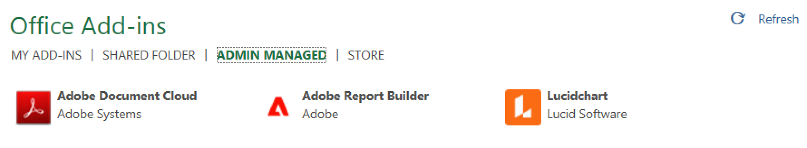

# Configuração do Report Builder

Você pode acessar rapidamente o Report Builder usando o menu Suplemento do Excel.

## Requisitos

O Report Builder para Adobe Analytics é suportado nos seguintes sistemas operacionais e navegadores da web.

### macOS

- macOS versão 10.x ou posterior
- Todas as versões do Microsoft Excel

### Windows

- Windows 10, versão 1904 ou posterior
- Versão do Excel 2106 ou posterior

  Todos os usuários do Excel para desktop do Windows devem instalar o Microsoft Edge Webview2 para usar o suplemento. Para instalar o controlador:

   1. Vá para <https://aka.ms/webview2installer>.
   1. Selecione e baixe o instalador autônomo Evergreen.
   1. Siga o assistente de instalação.

### Web Office

- Suporta todos os navegadores e versões

## Suplemento Report Builder para o Excel

Você deve instalar o Suplemento Report Builder Excel para usar o Report Builder para Adobe Analytics. Depois de instalar o Suplemento Report Builder para Excel, você pode acessar o Report Builder a partir de uma pasta de trabalho aberta do Excel.

### Baixe e instale o Suplemento Report Builder

Para baixar e instalar o Suplemento Report Builder

1. Inicie o Excel e abra uma nova pasta de trabalho.

1. Selecione **[!UICONTROL Inserir]** > **[!UICONTROL Obter Suplementos]**.

1. Na caixa de diálogo Suplementos do Office, selecione a guia Loja.

1. Procure por &quot;Report Builder&quot; e clique em **[!UICONTROL Adicionar]**.

1. Na caixa de diálogo Termos de licença e política de privacidade, clique em **[!UICONTROL Continuar]**.

**Se a guia Loja não for exibida**

1. No Excel, selecione Arquivo > Conta >Gerenciar configurações.

1. Marque a caixa ao lado de &quot;Habilitar experiências conectadas opcionais&quot;

1. Reinicie o Excel.

**Se sua organização bloquear o acesso à Microsoft Store**

Entre em contato com a equipe de TI ou de segurança para solicitar aprovação para o Suplemento Report Builder. Após a concessão da aprovação, na caixa de diálogo Suplementos do Office, selecione a guia Administrador Gerenciado.

Depois de instalar o Suplemento Report Builder, o ícone de Report Builder é exibido na faixa de opções da guia Página inicial, do Excel.

## Fazer logon no Report Builder

Depois de instalar o Suplemento Report Builder for Excel na sua plataforma operacional ou navegador, siga estas etapas para fazer logon no Report Builder.

1. Abra uma pasta de trabalho do Excel.

1. Clique no ícone Report Builder para iniciar o Report Builder.

1. Na barra de ferramentas do Adobe Report Builder, clique em **[!UICONTROL Logon]**.

   

1. Insira as informações da conta de ID da Adobe Experience. As informações da sua conta devem corresponder às suas credenciais da Adobe Analytics.

   

Depois de fazer logon, o ícone de logon e a organização aparecem na parte superior do painel

## Alternar organizações

Ao fazer logon pela primeira vez, você faz logon na organização padrão atribuída ao perfil.

1. Clique no nome da organização que é exibida ao fazer logon.

1. Selecione uma organização na lista de organizações disponíveis. Somente as organizações às quais você tem acesso são listadas.

   

## Fazer logoff

Você pode fazer logoff do Report Builder a partir do perfil do usuário.

1. Salve as alterações em qualquer pasta de trabalho aberta.

1. Clique no ícone de avatar para exibir seu perfil de usuário.

   

1. Clique em **Fazer logoff**.
