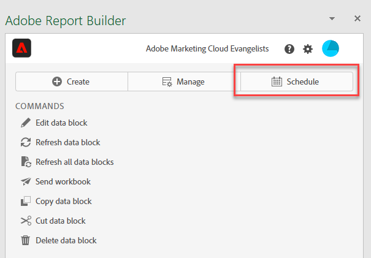
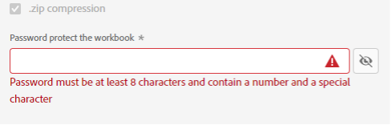

# Agendar pastas de trabalho compartilhando por email

>[!NOTE]
>
>Além de agendar pastas de trabalho para compartilhamento por email, conforme descrito nesta seção, você pode agendar pastas de trabalho para serem exportadas para destinos na nuvem, conforme descrito em [Agendar pastas de trabalho para exportação para destinos na nuvem](/help/analyze/report-builder/report-builder-export.md).

Depois de salvar a pasta de trabalho e concluir a análise, é possível compartilhar facilmente a pasta de trabalho com outras pessoas em sua equipe usando o recurso de programação. O recurso Programação permite criar um uma programação que atualiza automaticamente os dados na pasta de trabalho e envia por email o arquivo .xlsx da pasta de trabalho do Excel como um anexo para o público-alvo especificado em uma data e hora específicas. Configurar uma programação fornece atualizações regulares aos recipients automaticamente. Você também pode usar o recurso de programação para enviar a pasta de trabalho uma vez sem programar atualizações automáticas.

Você pode criar várias programações para uma única pasta de trabalho. Por exemplo, você pode enviar uma pasta de trabalho para sua equipe diariamente e enviar a pasta de trabalho para seu gerente uma vez por semana criando duas programações diferentes.

O recurso Programação também permite que você configure a proteção por senha para uma pasta de trabalho e edite pastas de trabalho previamente programadas.

>[!BEGINSHADEBOX]

Consulte  [Agendar pastas de trabalho](https://video.tv.adobe.com/v/3413079?quality=12&learn=on){target="_blank"} para ver um vídeo de demonstração.

>[!ENDSHADEBOX]

## Agendar uma pasta de trabalho

Use o botão Agendar no hub do Report Builder para criar rapidamente um agendamento e distribuir automaticamente um arquivo do Excel (.xlsx) da pasta de trabalho a um indivíduo ou grupo.

1. Clique no botão Programação no hub do Report Builder.

   {width="55%"}

1. Clique em Programar pasta de trabalho ou no botão de mais no canto superior esquerdo para criar uma nova pasta de trabalho programada.

   {width="55%"}

   O painel de programação exibe algumas informações predefinidas sobre a pasta de trabalho, como o nome da pasta de trabalho e a última data em que a pasta de trabalho foi modificada.

   {width="55%"}

1. (Opcional) Insira um nome de arquivo.

   O nome do arquivo da pasta de trabalho é padronizado com o nome da pasta de trabalho, mas você pode alterá-lo se quiser. Se estiver enviando a mesma pasta de trabalho para vários públicos-alvo e quiser nomeá-la de forma um pouco mais intuitiva para um determinado público-alvo, é possível alterar o nome.

1. (Opcional) Selecione **Anexar carimbo de data/hora ao nome do arquivo**.

   Você pode anexar um carimbo de data e hora ao nome do arquivo para identificar a data em que a pasta de trabalho foi atualizada. Isso é útil para ver rapidamente qual versão de uma pasta de trabalho foi enviada em uma data específica. A **Visualização do nome do arquivo** mostra como o nome do arquivo da pasta de trabalho será exibido no email quando a pasta de trabalho for distribuída. O formato do carimbo de data e hora é AAAA-MM-DD.

1. (Opcional) Selecione **Compactação .zip** para compactar o arquivo e configurar a proteção por senha no arquivo.

   Ao fazer essa seleção, você deverá digitar uma senha para abrir o arquivo. Isso é útil se você tiver dúvidas sobre a segurança de dados e quiser proteger a pasta de trabalho por senha. A proteção do arquivo com uma senha exige que você selecione **Compactação .zip**. A senha deve ter pelo menos 8 caracteres e conter um número e um caractere especial.

   {width="55%"}

1. Insira os **Recipients**. Você pode inserir o nome de uma pessoa reconhecida em sua organização ou pode inserir um endereço de email de uma pessoa dentro ou fora da organização.

1. Insira o **Assunto** do email e uma descrição para seus recipients. O assunto assume o padrão do nome do arquivo da pasta de trabalho, mas você pode modificar o assunto, se necessário. Você pode adicionar detalhes na seção de descrição.

   {width="55%"}

1. Configure as opções de programação para definir a data e a hora em que deseja que a pasta de trabalho seja enviada por email para os recipients.

   Escolha a data inicial e final e os intervalos de tempo. Pode ser a data de hoje ou uma data no futuro.

   Escolha a **Frequência** no menu suspenso. Você pode definir a frequência por hora, dia, semana, mês ou ano em um dia específico. Por exemplo, você pode configurar uma programação para enviar a pasta de trabalho na primeira noite de domingo do mês, para que os recipients tenham o email na caixa de entrada logo na segunda-feira de manhã.

   {width="55%"}

1. Após definir a programação, clique em **Enviar de acordo com a programação**.

   {width="55%"}

   Você verá uma janela de confirmação na parte inferior do hub do Report Builder e a pasta de trabalho agendada será listada na guia Pastas de trabalho.

   {width="55%"}

## Agendar uma pasta de trabalho convertida {#converted}

1. Agendar uma pasta de trabalho herdada [convertida](/help/analyze/report-builder/convert-workbooks.md).

   Um pop-up é exibido perguntando se você deseja usar a metada de agendamento da pasta de trabalho herdada para criar uma nova tarefa agendada.

1. Se você selecionar **[!UICONTROL Usar]**, o Report Builder preencherá automaticamente as informações de agendamento herdadas.

1. Verifique se essas informações estão corretas e programadas.

1. Se quiser enviar a pasta de trabalho em um cronograma diferente, agende uma tarefa agendada totalmente nova.

## Enviar a pasta de trabalho apenas uma vez

Você também pode enviar a pasta de trabalho apenas uma vez.

1. Desmarcar **Mostrar opções de programação**

   {width="40%"}

1. Clique em **Enviar agora**.

## Gerenciar pastas de trabalho agendadas

Para obter informações sobre como gerenciar pastas de trabalho já agendadas, consulte [Gerenciar pastas de trabalho agendadas](/help/analyze/report-builder/manage-schedules-reportbuilder.md).
