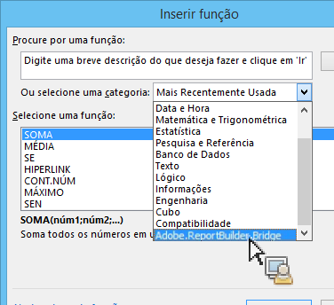
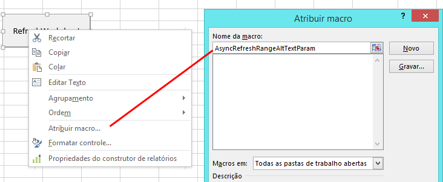
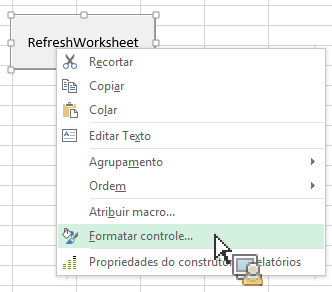
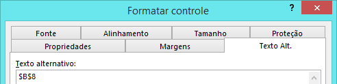

# Invocar a funcionalidade do Report Builder a partir de funções do Microsoft Excel

Essa capacidade integra ainda mais o uso do Report Builder no fluxo de trabalho natural do Excel, sem exigir acesso à interface do usuário do Report Builder.

Por exemplo, você pode querer atualizar automaticamente as solicitações do Report Builder cujo filtro de entrada tem por base dados obtidos no Excel de outras fontes. Agora você pode fazer isso com função da sequência de caracteres RefreshRequestsInCellsRange(..) . Todas as chamadas são assíncronas. Elas retornam imediatamente e não aguardam para que a chamada seja totalmente executada.

> [!NOTE] É preciso ter o Report Builder 5.0 (ou posterior) instalado para que essa funcionalidade funcione.

Esta é uma tabela com a lista de funções expostas:

| Nome da função | Descrição |
|---|---|
| string AsyncRefreshAll() | Atualiza todas as solicitações do Report Builder presentes em uma pasta de trabalho. |
| string AsyncRefreshRange(string rangeAddressInA1Format) | Atualiza todas as solicitações do Report Builder presentes no endereço do intervalo de células especificado (uma expressão da sequência de caracteres que representa um intervalo de células no formato A1, por exemplo &quot;Sheet1!A2:A10&quot;). |
| string AsyncRefreshRangeAltTextParam() | Atualiza todas as solicitações do Report Builder presentes no intervalo de células especificado que é passado para Texto alternativo do Controle de formulários da Ms. |
| string AsyncRefreshActiveWorksheet() | Atualiza todas as solicitações do Report Builder presentes na planilha ativa. |
| string AsyncRefreshWorksheet(string worksheetName) | Atualiza todas as solicitações do Report Builder presentes na planilha especificada (o nome da planilha como aparece na guia). |
| string AsyncRefreshWorksheetAltTextParam(); | Atualiza todas as solicitações do Report Builder presentes no nome da planilha específica que foi passada para Texto alternativo do Controle de formulários da Ms |
| string GetLastRunStatus() | Retorna uma sequência de caracteres que descreve o status da última execução. |

Para acessar essas funções no Report Builder, vá até [!UICONTROL Fórmulas] > [!UICONTROL Inserir função]. Na parte inferior da lista de categorias, você encontrará Adobe.ReportBuilder.Bridge:



## Usar essas funções em uma fórmula {#section_034311081C8D4D7AA9275C1435A087CD}

Por exemplo, a fórmula

```
=IF(OR(ISTEXT(P5),ISBLANK(P5)),AsyncRefreshRange("P9"),"")
```

diz &quot;Se o valor na célula P5 é texto ou está em branco, atualize o intervalo na célula P9&quot;.

## Usar as funções do Report Builder com controle de formato {#section_26123090B5BD49748C8D8ED7A1C5ED84}

Você pode atribuir uma macro a um controle criado e esse controle pode ser uma função que atualiza uma solicitação da pasta de trabalho. Por exemplo, a função AsyncRefreshActiveWorksheet atualizará todas as solicitações em uma pasta de trabalho. Às vezes, você pode atualizar somente algumas solicitações, não todas.

1. Definir o parâmetro da macro.
1. Clique com o botão direito no controle e selecione **[!UICONTROL Atribuir macro]**.
1. Insira o nome da função do Report Builder (sem parâmetros ou parênteses).



## Passar parâmetros para funções do Report Builder pelo controle de formatos {#section_ECCA1F4990D244619DFD79138064CEF0}

As duas funções que captam um parâmetro podem ser usadas com Controle de formato, mas somente através do campo Texto alternativo:

* AsyncRefreshRange(string rangeAddressInA1Format)
* AsyncRefreshWorksheet(string worksheetName)

1. Clique com o botão direito no controle e selecione **[!UICONTROL Controle de formato]**.

   

1. Clique na guia [!UICONTROL Texto alternativo].

   

1. Em [!UICONTROL Texto alternativo], insira o intervalo de células que você deseja atualizar.
1. Abra a lista de parâmetros do Report Builder em [!UICONTROL Fórmulas] > [!UICONTROL Inserir função] > [!UICONTROL Adobe.ReportBuilder.Bridge].

1. Selecione uma das duas funções que terminam com AltTextParam e clique em **[!UICONTROL OK]**.

