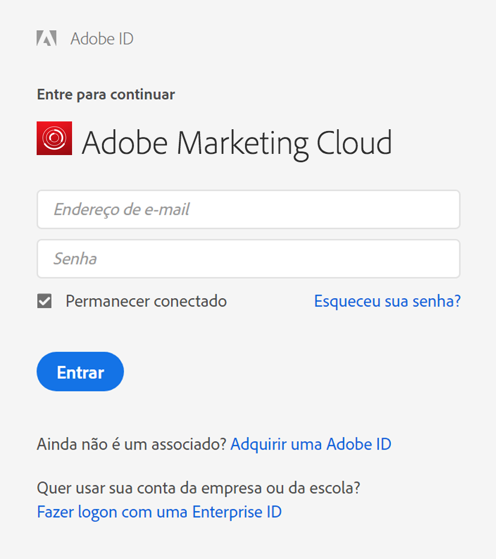

# Logon no Construtor de relatórios

Informações sobre as três formas de fazer logon no Construtor de relatórios.

Atualmente, as seguintes opções de logon estão disponíveis quando você clica em **[!UICONTROL Conectar]no Construtor de relatórios.**

* [Padrão](../../../analyze/report-builder/setup/login.md#section_6D54B8ADAE7F416BB83F5082B3771CFA)
* [Logon único](../../../analyze/report-builder/setup/login.md#section_6970A5F926774976B85FFE576610E85F)
* [Experience Cloud e logon único](../../../analyze/report-builder/setup/login.md#section_1FA230F35AB54021A874A7A28DE4C850)

## Padrão {#section_6D54B8ADAE7F416BB83F5082B3771CFA}

Use essa opção se desejar fazer logon no Construtor de relatórios usando as credenciais do Adobe Analytics.

**Logon do Construtor de relatórios - definições de campo**

| Campo | Definição |
|--- |--- |
| Empresa | A credencial de logon da Empresa que você usa para acessar o Adobe Analytics. |
| Nome de usuário | O Nome de usuário que você usa para fazer logon no Adobe Analytics. As tarefas agendadas para um usuário estão vinculadas ao nome do usuário. Você pode ver suas tarefas agendadas em qualquer computador, se fizer logon no Construtor de relatórios com as mesmas credenciais de logon. |
| Senha | Sua senha do Analytics. |
| Lembrar meus dados | As informações de logon são criptografadas e armazenadas no arquivo de perfil do usuário na máquina em que o Construtor de relatórios está instalado. Como as informações de logon são salvas, qualquer pessoa que use o mesmo PC que o criador do relatório que abra uma planilha que contém um relatório poderá atualizar e editar os dados. Se você compartilha seu computador com outras pessoas e desejar manter os dados da planilha confidenciais, não ative essa opção.  Para desativar a configuração de logon automático, clique em **[!UICONTROL Fazer logon com credenciais diferentes]** na barra de ferramentas e desative **[!UICONTROL Lembrar meus dados]**. |
| Usar um servidor proxy | Ative se você estiver acessando a Internet através de um servidor proxy e for solicitado a fornecer um nome de usuário proxy e senha. |

## Logon único {#section_6970A5F926774976B85FFE576610E85F}

Este logon único (herdado) permite acessar o Adobe Analytics apenas, não toda a Experience Cloud.

Também é possível inserir um domínio que será reconhecido pelo sistema e redirecionará o usuário até a página de logon único da empresa; lá, o usuário poderá fazer logon no Adobe Analytics.

## Experience Cloud {#section_1FA230F35AB54021A874A7A28DE4C850}

O logon da Experience Cloud permite o uso da Enterprise ID (email e senha) para fazer logon na Adobe Experience Cloud. Click **[!UICONTROL Sign In]** &gt; **[!UICONTROL Sign in with an Enterprise ID]** to be redirected to your company's single sign-on page. Para saber mais sobre a Enterprise ID, clique [aqui](https://helpx.adobe.com/enterprise/kb/enterprise-id-faq.html#whatis).

>[!NOTE]
>
>O logon da Experience Cloud é baseado em sessão e o token expira após 30 dias.

