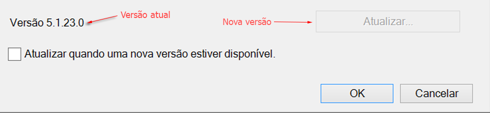
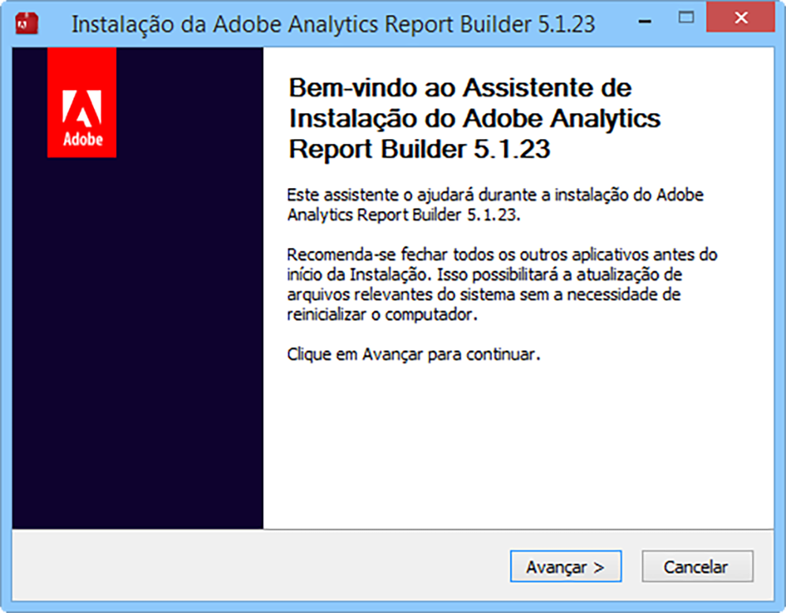

# Atualizar o Construtor de relatórios

Etapas e considerações relacionadas à atualização do Construtor de relatórios.

## Atualizar perguntas frequentes {#section_AFE40FF5544C418790A1C298C25CC18A}

**P: Devo manter a versão antiga do Construtor de relatórios ao atualizar?**

R: Não, a versão antiga será removida.

**P: Perderei os relatórios atuais?**

R: Não, todos os relatórios atuais continuarão funcionando.

**P: É necessário autenticar novamente para a nova versão?**

R: Não, todas as configurações, inclusive as configurações de autenticação, continuarão funcionando.

## Upgrade instructions {#section_73B8110A619549189A30079735E81867}

1. Faça logon na versão atual do Construtor de relatórios.
1. Acesse o menu **[!UICONTROL Opções]para atualizar até a versão mais recente.** O número da versão atual é exibido na parte inferior da caixa de diálogo Opções.

   

1. Se uma nova versão estiver disponível, clique em **[!UICONTROL Atualizar...]**. O botão mostrará para qual versão você está atualizando, por exemplo: "Atualizar para a versão 5.0.50"

   >[!NOTE]
   >
   >Se esse botão estiver acinzentado, nenhuma nova versão do Construtor de relatórios estará disponível.

1. Optionally select the **[!UICONTROL Update when a new version is available]**checkbox. Futuramente, isso iniciará o processo de atualização automaticamente quando uma nova versão estiver disponível.
1. Quando a tela de configuração aparecer, clique em **[!UICONTROL Avançar &gt;]**.

   

1. Depois que a atualização for concluída, faça logon novamente no construtor de relatórios.

## Manual upgrade instructions {#section_27A0200010DC4747A718F1A65B180599}

Você sempre pode obter a versão mais recente do Construtor de relatórios do Adobe Analytics.

1. Faça logon no Adobe Analytics e acesse **[!UICONTROL Ferramentas]**.
1. Clique em **[!UICONTROL Construtor de relatórios]**.
1. Na tela **[!UICONTROL Visão geral], selecione a versão de 32 bits ou 64 bits.**
1. Clique em **[!UICONTROL Descarregar agora!]**.

