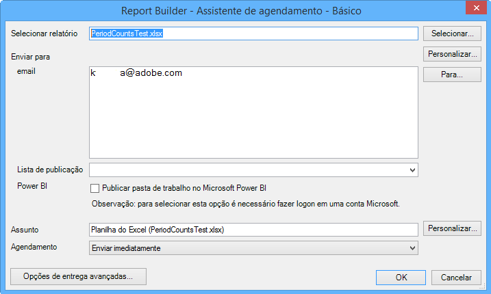

# Agendar pastas de trabalho

Você pode agendar pastas de trabalho, especificar opções avançadas de entrega, especificar destinatários e exibir o histórico da programação. As opções avançadas de entrega permitem configurar pastas de trabalho que você deseja enviar em um horário específico ou em intervalos. Você também pode especificar o formato de arquivo no qual enviar a pasta de trabalho.

For example, you can schedule workbooks to be delivered immediately or on a recurring schedule, and specify the file format in [!DNL Advanced Delivery Options]. O limite de tamanho de arquivo é de 5 MB para um upload de pasta de trabalho.

Additionally, after you create a workbook schedule in Report Builder, you can view and edit the schedule in **[!UICONTROL Analytics]** &gt; **[!UICONTROL Reports]**. (Consulte [Agendamento e distribuição de relatórios](/help/analyze/reports-analytics/scheduling.md) na ajuda do Relatórios e análises).

> [!NOTE] É necessário ter o Excel 2007 ou o pacote de compatibilidade instalado para agendar uma pasta de trabalho. Você pode ter no máximo 10 pastas de trabalho programadas por licença do Construtor de relatórios. No entanto, é possível aumentar esse número ao subtrair de outras licenças. To do so, go to **[!UICONTROL Admin]** &gt; **[!UICONTROL Company Settings]** &gt; **[!UICONTROL Report Builder Reports]**. Uma pasta de trabalho que foi agendada (ou carregada na Biblioteca de pastas de trabalho) e que não foi tocada (atualizada, substituída) em mais de 28 meses será excluída.

> [!NOTE] A "Hora de entrega"/"Hora do dia" inserida pelo usuário especifica a hora em que a pasta de trabalho deve começar a ser processada, não a hora em que ela será realmente entregue. O tempo real em que a pasta de trabalho será entregue baseia-se principalmente no tempo necessário para o processamento (pastas de trabalho complexas e grandes demoram mais para serem processadas do que pastas de trabalho mais simples). Por exemplo, se uma pasta de trabalho levar 15 minutos para ser processada, o tempo de entrega real será de pelo menos 15 minutos depois do "Tempo de entrega"/"Hora do dia" especificado originalmente.
>Além disso, há vários outros fatores que podem aumentar ainda mais o atraso antes que a pasta de trabalho seja realmente entregue:
>
> * **A execução de várias programações diferentes do mesmo tipo ao mesmo tempo** pode sobrecarregar o sistema. O sistema de Agendamento permite que algumas (5-10) pastas de trabalho de qualquer tipo sejam executadas simultaneamente, de modo que, quando mais de 5-10 estiverem programadas ao mesmo tempo, algumas precisarão aguardar a conclusão de outras pastas de trabalho na linha para que possam começar a processar. Esse problema pode ser atenuado pela programação de pastas de trabalho de uma empresa em horários escalonados ao longo do dia ou da hora, e não simultaneamente.
> * Além do tipo de pasta de trabalho específico, as pastas de trabalho também aguardarão em linha se a empresa tiver **mais de 15 a 20 de qualquer tipo de pasta de trabalho programada ao mesmo tempo (em todos os tipos diferentes de pasta de trabalho)**. Isso pode ser atenuado por horários de programação impressionantes, em vez de muitos serem executados ao mesmo tempo.
> * **Problemas em serviços** downstream nos quais o Agendador depende também podem afetar a entrega de pastas de trabalho. Por exemplo, se você estiver usando independentemente as APIs para executar pastas de trabalho e preencher a fila de solicitações da API, suas pastas de trabalho agendadas podem ser entregues lentamente enquanto você compete por esse recurso.
> * **A latência** do conjunto de relatórios (um atraso na coleta de dados) também pode atrasar algumas pastas de trabalho programadas.

## Agendar uma pasta de trabalho

1. Gerar e salvar uma pasta de trabalho.
1. On the Report Builder Toolbar, click **[!UICONTROL Schedule]**.

   A guia [!UICONTROL Relatórios agendados] resume todas as tarefas que você tiver criado, bem como o número de tarefas restantes.
1. Na guia **Relatórios agendados**, clique em **[!UICONTROL Novo]**.
1. O assistente básico de agendamento mostrará:

   

1. No [!UICONTROL Assistente básico de agendamento], configure as seguintes opções:

| Campo | Descrição |
|--- |--- |
| Selecionar relatório | O nome da pasta de trabalho. Para novos relatórios agendados, este campo é preenchido com o nome da pasta de trabalho ativa. |
| Selecionar | Exibe a página Selecionar relatório. Você pode selecionar um relatório do servidor (onde todas as pastas de trabalho previamente agendadas estão armazenadas), ou de sua máquina local. Se você selecionar uma pasta de trabalho na unidade local no formato .xls, o sistema converterá o arquivo em .xlsx. Como parte da conversão, o arquivo é aberto no Excel e ativado. Se a pasta de trabalho selecionada para o relatório agendado tiver o mesmo nome de arquivo da pasta de trabalho aberta no momento no Excel, o sistema selecionará o arquivo local em vez do arquivo carregado previamente. Se você selecionar um relatório do repositório de agendamento, uma cópia da pasta de trabalho será criada no servidor, com seu nome de arquivo atualizado com 1. O relatório agendado recém-criado usa a pasta de trabalho copiada. |
| Personalizar | Permite a personalização do formato de data. |
| Para | Exibe seu Catálogo de endereços do Outlook, se aplicável. |
| Enviar para: Email | O destinatário do email da pasta de trabalho. |
| Enviar para: Lista de publicação | Exibe uma lista de listas de distribuição disponíveis para essa empresa. |
| Power BI | Consulte [Publicação de pasta de trabalho no Microsoft Power BI](/help/analyze/report-builder/c-publish-power-bi/integration-power-bi.md) para mais informações. |
| Assunto | Uma descrição definida pelo usuário. |
| Agendamento | Permite especificar quando enviar a pasta de trabalho. (Imediatamente, a cada hora, diariamente, semanalmente, mensalmente e anualmente.) |

## Opções avançadas de entrega

1. Click **[!UICONTROL Advanced Delivery Options]** to configure file and publishing options:

| Campo | Descrição |
|--- |--- |
| Guia **Agendamento** |  |
| Hora de entrega | Permite agendar a pasta de trabalho imediatamente ou para um momento posterior. A hora do dia é relativa ao fuso horário especificado no computador. |
| Padrão de recorrência | Envia a pasta de trabalho com base em suas seleções. |
| Intervalo de recorrência | Permite especificar quando iniciar e parar de receber a pasta de trabalho.   Observação:  Agendar uma pasta de trabalho no primeiro dia de qualquer período atual (semana, mês, trimestre ou ano) retorna dados somente para o primeiro dia. |
| Guia **Opções de arquivo** |  |
| Formato do arquivo | Permite selecionar um formato de entrega do Excel 2007 (.xlsx) ou 2003 (.xls), .pdf, .csv, .mht, .txt e .xml. |
| Destino do arquivo | Especifica Email ou FTP. As opções na página mudam, dependendo da sua seleção. Para FTP, você precisa garantir que o host esteja disponível externamente. |
| Lista de Publicação | Se você enviar a pasta de trabalho agendada para várias listas de publicação, ela será executada uma vez para cada lista. Conjuntos de relatórios variáveis são substituídos pelo conjunto de relatórios atribuído à lista de publicação. |
| Idioma do conteúdo do arquivo | Especifica o idioma a ser usado na carta de apresentação. Você pode selecionar chinês (simplificado ou tradicional), alemão, francês, japonês, coreano, português brasileiro ou espanhol. |
| Guia **Opções de publicação** |  |
| Publicação no Power BI | <ul><li>Publicar pasta de trabalho no Power BI</li><li>Publicar todas as solicitações do Construtor de relatórios como conjuntos de dados do Power BI</li><li>Publicar todas as tabelas formatadas como conjuntos de dados do Power BI</li></ul> |
| Rotule esse relatório do Power BI como | Detalhes da rotulação |

1. Click **[!UICONTROL OK]**, then click **[!UICONTROL Exit]**.

   Report Builder displays the scheduled workbook in the [Scheduled Task Manager](/help/analyze/report-builder/r-arb-scheduled-reports.md).

