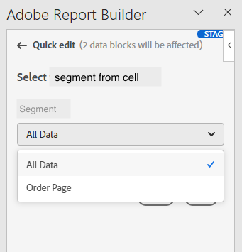

# Trabalhar com segmentos

Você pode aplicar segmentos ao criar um novo bloco de dados ou ao selecionar **[!UICONTROL Editar bloco de dados]** no painel **[!UICONTROL Comandos]**.

## Aplicar segmentos a um bloco de dados

Para aplicar um segmento a todo o bloco de dados, selecione duas vezes um segmento ou arraste e solte segmentos da lista de componentes na seção segmentos da Tabela.

## Aplicar filtros a métricas individuais

Para aplicar filtros usando segmentos a métricas individuais:

* Arraste e solte um ou mais segmentos de **[!UICONTROL Segmentos]** em uma métrica na tabela.

* Alternativamente:

   1. Selecione  para uma métrica específica no painel **[!UICONTROL Tabela]** e selecione **[!UICONTROL Filtrar métrica]**.

      {zoomable="yes"}

   1. Selecione um ou mais segmentos do menu suspenso **[!UICONTROL Segmentos]**. Os segmentos são adicionados à lista **[!UICONTROL Segmentos aplicados]**.

      
   1. Selecione  para remover um segmento da lista **[!UICONTROL Segmento aplicado]**. Ou selecione **[!UICONTROL Limpar tudo]** para remover todos os segmentos da lista **[!UICONTROL Segmento aplicado]**.
   1. Selecione **[!UICONTROL Aplicar]**.

Para exibir os filtros aplicados, selecione uma métrica no painel Tabela ou passe o mouse sobre ela. Métricas com segmentos aplicados exibem um ícone de segmento.

## Segmentos de edição rápida

Você pode usar o painel **[!UICONTROL Edição rápida]** para adicionar, remover ou substituir segmentos de blocos de dados existentes.

Quando você seleciona um intervalo de células na planilha, o link **[!UICONTROL Segmentos]** no painel **[!UICONTROL Edição rápida]** exibe uma lista de resumo dos segmentos usados pelos blocos de dados nessa seleção.

Para editar segmentos usando o painel **[!UICONTROL Edição rápida]**:

1. Selecione um intervalo de células de um ou vários blocos de dados.

1. Selecione o link **[!UICONTROL Segmentos]** para iniciar o painel **[!UICONTROL Edição rápida]** **[!UICONTROL Segmentos]**.

### Adicionar ou remover segmentos

É possível adicionar ou remover segmentos usando as opções Adicionar/Remover.

1. Selecione a guia **[!UICONTROL Adicionar/Remover]** no painel **[!UICONTROL Edição rápida]** **[!UICONTROL Segmentos]**.

   1. Selecione um ou mais segmentos do menu suspenso **[!UICONTROL Segmentos]**. Os segmentos são adicionados à lista **[!UICONTROL Segmentos aplicados]**.
   1. Selecione  para remover um segmento da lista **[!UICONTROL Segmento aplicado]**.
   1. Selecione **[!UICONTROL Aplicar]**.

O Report Builder exibe uma mensagem para confirmar as alterações no segmento aplicado.

### Substituir segmentos

É possível substituir um segmento existente por outro para alterar a forma como os dados são segmentados.

1. Selecione a guia **[!UICONTROL Substituir]** no painel **[!UICONTROL Edição rápida]** **[!UICONTROL Segmentos]**.

1. Use o campo de pesquisa **Lista de pesquisa** para localizar segmentos específicos.

1. Selecione um ou mais segmentos que deseja substituir.

1. Procure um ou mais segmentos no menu suspenso Substituir por para adicionar o segmento à lista **[!UICONTROL Substituir por]**.

1. Selecione **[!UICONTROL Aplicar]**.

O Report Builder atualiza a lista de segmentos para refletir a substituição.

## Definir segmentos de bloco de dados a partir da célula

Blocos de dados podem fazer referência a segmentos de uma célula. Vários blocos de dados podem fazer referência à mesma célula para segmentos, permitindo que você alterne segmentos facilmente para vários blocos de dados de uma vez.

Para aplicar segmentos a partir de uma célula:

1. [Crie um novo bloco de dados](create-a-data-block.md#create-a-data-block) ou edite um bloco de dados existente.
1. Selecione a guia **[!UICONTROL Segmentos]** para definir segmentos.
1. Selecione .

   {zoomable="yes"}

1. Selecione a célula da qual deseja que os blocos de dados façam referência a um segmento.

1. Selecione duas vezes para adicionar um segmento à célula. Como alternativa, arraste e solte um ou mais segmentos na seção **[!UICONTROL Segmentos incluídos]**.

1. Selecione **[!UICONTROL Aplicar]** para criar a célula de referência.

1. Na guia **Segmentos**, adicione o segmento de célula de referência recém-criado ao bloco de dados.

   Guia {zoomable="yes"}

1. Selecione **[!UICONTROL Concluir]**.

Para aplicar a célula de referência como um segmento a outros blocos de dados, use a referência da célula como um dos segmentos da lista **[!UICONTROL Segmentos]** na guia **[!UICONTROL Tabela]**.

### Usar uma célula de referência para alterar segmentos de blocos de dados

1. Selecione a célula de referência na planilha.

1. Selecione o link em **[!UICONTROL Segmentos da célula]** no menu **[!UICONTROL Edição rápida]**.

   {zoomable="yes"}

1. Selecione o segmento no menu suspenso.

1. Selecione **[!UICONTROL Aplicar]**.

<!--
You can apply segments when you create a new data block or when you select the **Edit data block** option from the COMMANDS panel.

## Apply segments to a data block

To apply a segment to the entire data block, double-click a segment or drag and drop filters from the components list into the Segments section of the Table.

## Apply segments to individual metrics

To apply segments to individual metrics, drag and drop a segment onto a metric in the table. You can also click the **...** icon to the right of a metric in the Table pane and then select **[!UICONTROL Segment metric]**. To view applied segments, hover over or select a metric in the Table pane. Metrics with applied segments display a filter icon.

## Quick edit segments

You can use the Quick edit panel to add, remove, or replace segments for existing data blocks.

When you select a range of cells in the spreadsheet, the **[!UICONTROL Segments]** link in the Quick edit panel displays a summary list of the segments used by the data blocks in that selection.

To edit segments using the Quick edit panel

1. Select a range of cells from one or multiple data blocks.

    

1. Click the link underneath **[!UICONTROL Segments]** to launch the Quick edit - Filters panel.

    

### Add or remove a segment

You can add or remove segments using the Add/Remove options.

1. Select the **[!UICONTROL Add/Remove]** tab in the Quick edit-segments panel.

    All segments applied to the selected data blocks are listed in the Quick Edit-segments panel. Segments applied to all data blocks in the selection are listed under the **[!UICONTROL Applied to all selected data blocks]** heading. Segments applied to some but not all data blocks are listed under the **[!UICONTROL Applied to 1 or more selected data blocks]** heading.

    When multiple segments are present in the selected data blocks, you can search for specific segments using the **[!UICONTROL Add Filter]** search field.

    

1. Add segments by selecting segments from the **[!UICONTROL Add segment]** drop down menu.

    The list of searchable segments includes all segments accessible to the report suites that are present in one or more of the selected data blocks as well as all the segments that are available globally in the organization.

    Adding a segment applies the segment to all data blocks in the selection.

1. To remove segments, click the delete icon **x** to the right of segments in the **[!UICONTROL Segments applied]** list.

1. Click **[!UICONTROL Apply]** to save changes and return to the hub panel.

    Report Builder displays a message to confirm the applied segment changes.

### Replace a segment

You can replace an existing segment with another segment to change how the data is segmented.

1. Select the **[!UICONTROL Replace]** tab in the Quick edit-segment panel.

    

1. Use the **[!UICONTROL Search list]** search field to locate specific segments.

1. Choose one or more segments that you want to replace.

1. Search for one or more segments in the Replace with field.

    Selecting a filter adds it to the **[!UICONTROL Replace with]**... list.

1. Click **[!UICONTROL Apply]**.

    Report Builder updates the list of segments to reflect the replacement.

### Define data block segments from cell

Data blocks can reference segments from a cell. Multiple data blocks can reference the same cell for segments, allowing you to easily switch segments for multiple data blocks at a time.

To apply segments from a cell

1. Navigate to Step 2 in either the data block creation or editing process. See [Create a Data Block](./create-a-data-block.md).
1. Click the **[!UICONTROL Segments]** tab to define filters.
1. Click **[!UICONTROL Create segment from cell]**.

    

1. Select the cell from which you want the data blocks to reference a segment.
   
1. Add the segment choice you wish to add to the cell by either double clicking the segment, or by dragging and dropping it into the **[!UICONTROL Segments Included]** section. 
   
   Note: Only one choice may be selected for the given cell at one time.

    

1. Click **[!UICONTROL Apply]** to create the reference cell.

1. From the **[!UICONTROL Segments]** tab, add the newly created reference cell segments to your data block.

    

1. Click **[!UICONTROL Finish]**.

    Now this cell can be referenced by other data blocks in their segments. To apply the reference cell as a segment to other data blocks, simply add the cell reference to their segments from the Segments tab. 

#### Use the reference cell to change data block segments

1. Select the reference cell in your spreadsheet.

1. Click the link under **[!UICONTROL Segments from Cell]** in the Quick Edit menu.

    

1. Select your segment from the drop-down menu.

    

1. Click **[!UICONTROL Apply]**.
-->