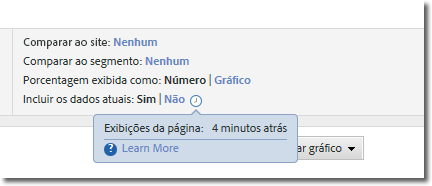
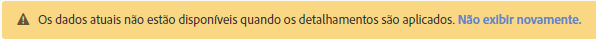

# Dados atuais

A opção Incluir dados atuais do Reports &amp; Analytics permite exibir os dados mais recentes do Analytics, geralmente antes que sejam totalmente processados e finalizados. Os dados atuais exibem a maioria das métricas comuns em minutos, fornecendo dados acionáveis para proporcionar uma tomada de decisão rápida.

É visível como uma opção como parte das configurações de um relatório:

Os dados atuais são ativados por padrão em todos os relatórios que os suportam. Se você preferir exibir todas as métricas depois que os dados forem processados, há várias opções:

* Use a Analysis Workspace, que usa dados totalmente processados.
* Clique em "Não" na configuração do relatório de dados atual para usar somente dados totalmente processados.
* Remova o item de permissão «Dados atuais» de um perfil de produto no Console de administração para impedir que usuários não administradores vejam esta opção. See [Analytics Tools permission items](../../admin/admin-console/permissions/analytics-tools.md) in the Admin user guide for more information.

Devido à priorização da disponibilidade de dados, os dados atuais atualmente não podem ser usados com segmentos, classificações, detalhamentos, definição de caminho e algumas métricas. Se um desses recursos for usado, os dados atuais serão forçados para "Não" no relatório e um aviso amarelo será mostrado explicando por que os dados atuais não estão disponíveis.

## Latência dos dados atuais comuns

As métricas aparecem em um dos seguintes três intervalos de tempo. Clique no ícone de relógio ao lado da alternância Incluir dados atuais para ver o novo valor de latência atual de cada métrica em um relatório.

| Intervalo de Tempo | Métricas |
| --- | --- |
| Menos de 10 minutos | Instâncias e exibições de página em variáveis de tráfego |
| Entre 10 e 35 minutos | Eventos de conversão, Instâncias e exibições de página em variáveis de conversão |
| Entre 45 e 120 minutos | Todos os outros dados, como visitas, visitantes únicos e participação |

Como alguns dados exibidos na exibição de dados atuais não foram totalmente processados, você pode ver uma diferença entre os valores relatados na exibição de dados atuais e na visualização finalizada. Nos relatórios de tendências, a diferença entre dados normalmente fica dentro de 1%.

## Métricas calculadas

Como é possível criar métricas calculadas por meio de métricas com latência diferente, alguns valores recentes talvez sejam calculados usando dados incompletos na visualização de dados atuais.

For example, you create the calculated metric 'Page Views per Visit using the formula `Page Views divided by Visits`. Normalmente, as Exibições de página aparecem dentro de 10 minutos e as Visitas normalmente aparecem dentro de 2 horas, as métricas calculadas nesta janela de latência são calculadas usando métricas incompletas. Se você postar uma nova página que obtém 4000 ocorrências a partir de 4000 visitas diferentes em um intervalo de tempo de 2 horas, a diferença de latência entre essas métricas pode causar cálculos incompletos.

Essa diferença de dados é mais visível ao relatar sobre novos valores ou usar quadros de tempo curtos. Quando um relatório usa intervalos de datas mais longos, as diferenças de latência que ocorrem nas últimas horas do relatório provavelmente terão um impacto notório nas métricas calculadas.

Se você tiver calculado métricas que possam ser afetadas por essas diferenças, desative os dados atuais ou use métricas com a mesma janela de latência esperada.

## Relatórios baixados

Quando você faz o download de um relatório com a visualização de dados atuais ativada, o relatório é colocado na fila, gerado e retornado para o navegador. Se os dados forem coletados enquanto o relatório estiver gerando, esses dados aparecerão no relatório. Esta janela de tempo pode levar o relatório baixado a ter mais dados.
