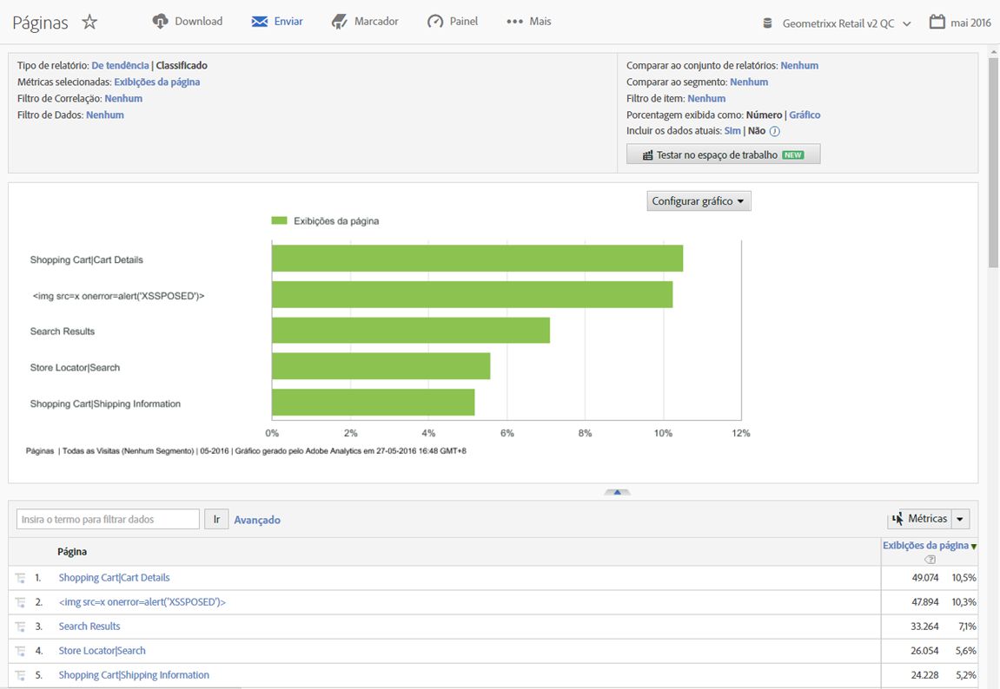

# Introdução ao Relatórios e análises

Antes de usar o Reports and Analytics, compreenda as tarefas básicas de logon e de configuração e como acessar as informações da conta.

## Getting started with Reports and Analytics {#concept_8C531D94965743BFBED7A87FE5473FF0}

Antes de usar o Reports and Analytics, compreenda as tarefas básicas de logon e de configuração e como acessar as informações da conta.

Os relatórios fornecem informações de seus canais com base na Web tradicionais e também de canais móveis, vídeo e de redes sociais. Alguns exemplos de relatórios de marketing incluem:

* Quantas pessoas visitam o seu site
* Quantos desses visitantes são visitantes únicos (contados somente uma vez)
* Como eles chegaram até o site (se os visitantes seguiram um link ou chegaram diretamente ao site)
* Quais palavras-chave os visitantes usaram para pesquisar pelo conteúdo do site
* Por quanto tempo os visitantes permaneceram em uma página específica ou no site
* Em quais links o visitante clicou e quando ele deixou o site
* Quais canais de marketing são os mais eficazes na geração de receita ou eventos de conversão
* Quanto tempo foi utilizado ao assistir a um vídeo
* Quais navegadores e dispositivos eles utilizaram para visitar seu site

## Browser and system requirements {#concept_7E987A1E578940B1859D89CA14FAFF34}

Requisitos do navegador e do sistema necessários para fazer logon na interface do Reports &amp; Analytics.

<!-- 

requirements.xml

 -->

* Navegadores:

   * Preferencial: versões mais recentes do Firefox, Chrome, Safari ou do Edge.
   * Versão mais recente do Microsoft Internet Explorer 11

      >[!NOTE]
      >
      >A Adobe encerrou o suporte ao Internet Explorer 11 no Adobe Analytics em 13 de novembro de 2018. Alterne para o Microsoft Edge ou um outro navegador compatível assim que possível.

* É necessário habilitar os cookies e o JavaScript.
* Resolução do monitor de 1024 x 768 com intensidade de cor de 16 bits (ou superior).

## Log in to Reports and Analytics {#concept_27B0A630D26D497E98F6A4AFA579BA9A}

Antes de acessar a interface, verifique com seu Gerente de contas ou com o Atendimento ao cliente a configuração da conta da sua empresa.

## Log in using the Experience Cloud {#task_BDC7532F7CBF4689A2079BB2CCD64F01}

Etapas que descrevem como fazer logon pela Adobe Experience Cloud.

<!-- 

t_login_sso.xml

 -->

1. Em um computador com acesso à Internet, inicie o Navegador.
1. Go to [!DNL https://login.experiencecloud.adobe.com/].
1. Na página [!UICONTROL Conectar]**, clique em[!UICONTROL Logon único]**.
1. Complete the following information, then click **[!UICONTROL Sign In]**.

   **[!UICONTROL Empresa]**: especifique a ID da empresa.

   **[!UICONTROL Nome do Usuário]**: especifique a ID da conta 

   **[!UICONTROL Senha]**: especifique a senha da conta 
1. From the Experience Cloud home page, go to **Analytics &gt; Reports**.

   A Experience Cloud encerra a sessão automaticamente após 30 minutos de inatividade.

## Executar um relatório {#task_C6772791AFD642CFB9C51ADB9E5932A5}

Etapas que descrevem como gerar um relatório.

<!-- 

t_running_report.xml

 -->

1. Faça logon em [!UICONTROL Reports &amp; Analytics].

   The Reports menu displays, or a [dashboard](../../analyze/reports-analytics/dashboard.md#concept_8CD3ACA2830A4994A68A31D8773B57E0) displays, if you have set one up.

1. Click **[!UICONTROL Site Content]** &gt; **[!UICONTROL Pages]** (for example).

   

   See [Report Features](../../analyze/reports-analytics/overview/report-overview.md#concept_AEA3BBC8167040198E0FECEAB2E0A677) for information about interface features of a report.

## Editar as configurações de conta do usuário {#concept_7FAF5B923B984426B7F64E026EA2DCAA}

Informações sobre edição de contas de usuários, redefinição de senhas e edição de informações de contato.

<!-- 

t_acct_info.xml

 -->

Você pode visualizar e editar informações de contato, especificar uma senha, visualizar informações de serviços da Web e excluir este computador da coleta de dados.

Click the Account icon  at the top right, then click the **[!UICONTROL Account Settings]** (wheel) icon next to your login name.

Todos os utilizadores têm acesso à página de [!UICONTROL Informações da conta]. As informações a seguir estão disponíveis para visualização ou edição:

<table id="table_58F5D292485F45F9902B372E4E1E3103"> 
 <thead> 
  <tr> 
   <th colname="col1" class="entry"> Tipo de informação </th> 
   <th colname="col2" class="entry"> Definição </th> 
  </tr> 
 </thead>
 <tbody> 
  <tr> 
   <td> 
Contato 
 </td> 
   <td> 
Especifique as seguintes informações pessoais para a sua conta do  
 
    <ul id="ul_7925E35904EB47E3AC648FA80A09EF91"> 
     <li id="li_CDD8D7B73A1D4C78A41FF02BD0E5E788">Primeiro nome (obrigatório) </li> 
     <li id="li_7255F50ABFFA4EE8A0A9D04F92BE432D">Sobrenome (obrigatório) </li> 
     <li id="li_3DF6107291CC4D46AAA0E4A13D59128F">Título </li> 
     <li id="li_B5BE95E0FE594939A2D4C6680A6B8BDD">Endereço(s) de email </li> 
     <li id="li_B764239241CE4F1CA74F77D796E7AB1D">Número de telefone </li> 
    </ul> </td> 
  </tr> 
  <tr> 
   <td> 
 Logon 
 </td> 
   <td> 
Exibe o nome de usuário, e permite que você altere a senha da conta. 
 
Consulte também: <a href="https://helpx.adobe.com/analytics/kb/How-to-Reset-Report-and-analytics-password.html" format="html" scope="external">Como redefinir a senha da conta de Reports &amp; Analytics</a>. 
 </td> 
  </tr> 
  <tr> 
   <td> 
Serviços web 
 </td> 
   <td> 
Exibe o nome de usuário dos serviços da web e a senha compartilhada associada a esta conta do Use essas credenciais ao acessar a Experience Cloud por meio das APIs dos serviços da Web. Para obter mais informações, consulte o site <a href="https://marketing.adobe.com/developer" scope="external" format="https">Developer Connection</a>. 
 
 
Nota: essas informações são exibidas somente se a conta estiver autorizada como usuário de serviços da Web. 
 
 </td> 
  </tr> 
  <tr> 
   <td> 
 Excluir este computador 
 </td> 
   <td> 
Aplica um cookie ao computador atual para excluí-lo da coleta de dados do Isso é útil se você não desejar que suas atividades online afetem as contagens de Exibição de página e Visitantes em seu domínio. 
 
 
Nota: Para usar este recurso, seu navegador deve ter os cookies ativados. Se você excluir os cookies de seu computador, é necessário redefinir o cookie de exclusão. 
 
 </td> 
  </tr> 
 </tbody> 
</table>

## Alterar o idioma da interface {#task_E20F9C7713C444998C883CFF93DC848A}

Etapas que descrevem como alterar o idioma da interface. Você pode exibir a interface do Reports and Analytics no idioma escolhido.

<!-- 

t_changing_language.xml

 -->

1. Fazer Logon.
1. Clique no menu **Visualizar em** e, em seguida, clique em um idioma:

* Inglês
* Francês
* Chinês tradicional
* Chinês simplificado
* Alemão
* Japonês
* Coreano
* Espanhol
* Português

   Normalmente, a documentação mais atualizada é a versão em inglês. Você pode acessar a documentação e a Página inicial da Adobe Experience Cloud. ( **[!UICONTROL Help]** &gt; **[!UICONTROL Help Home]**.)
