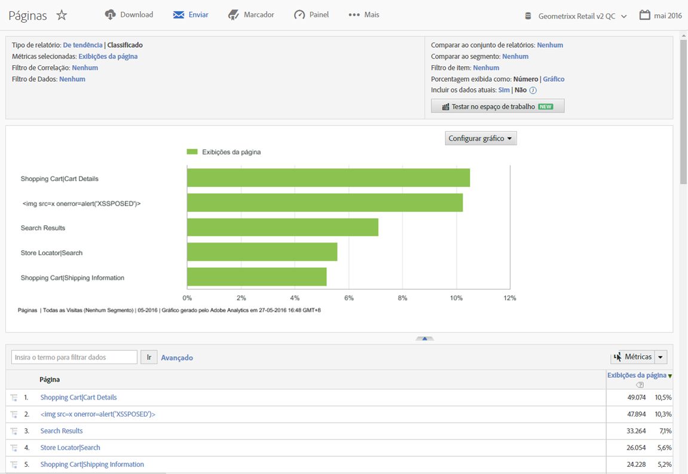
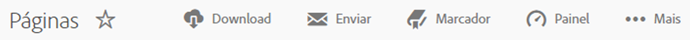
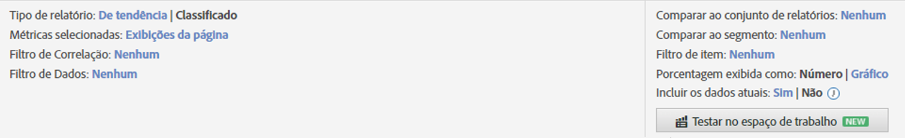
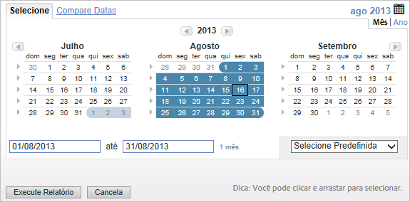
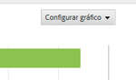
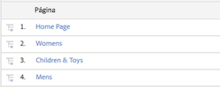

# Recursos do relatório{#report-features}

Uma introdução aos recursos de um relatório, incluindo a barra de ferramentas, o calendários e a tabela de detalhes.

Este exemplo mostra um [!UICONTROL Relatório de páginas]. As opções de configuração podem variar, dependendo do relatório que você está executando. Por exemplo, em vez de selecionar Com Tendência ou Classificado em um [!UICONTROL Relatório de conteúdo do sie], você pode especificar a granularidade e o nome da página para um relatório de [!UICONTROL Métricas do site].

## Exemplo de relatório de páginas {#section_288CC85536684C2DB184141358481EF0}

An example of a Pages Report ( **[!UICONTROL Reports]** &gt; **[!UICONTROL Site Content]** &gt; **[!UICONTROL Pages Reports]** &gt; **[!UICONTROL Pages]**).

{width = "672 px"}

## Barra de ferramentas de relatório {#section_0D674177AE6C4A71B07234DB25910ECD}

Compartilhe os dados do relatório com os tomadores de decisão que podem mudar o seu site ou as estratégias de marketing com base nos dados.

{width = "672 px"}

Also refer to [Customizing a Report](../../../analyze/reports-analytics/reports-customize/customizing-reports-overview.md).

## Cabeçalho e configurações do relatório {#section_12A90FAE02EC43FB9F11F0E2CE8FAE8F}

Exibe as configurações de relatório e permite que você configure o tipo de relatório, selecione métricas e muito mais. As opções disponíveis nesse grupo variam de acordo com o relatório que você está executando. 

{width = "672 px"}

See [Customizing a Report](../../../analyze/reports-analytics/reports-customize/customizing-reports-overview.md) for more information.

## Calendário {#section_8C6C4AD84D9043E8ABD53FF8F645AAB1}

Especifique a data clicando no botão de calendário e selecionando um intervalo de datas. Você também pode selecionar dois intervalos de tempo para comparar o desempenho. 

{width = "672 px"}

See [Selecting a Date or Date Range](../../../analyze/reports-analytics/reports-customize/customizing-reports-overview.md#task_9BEF7D4D839A4748B76E8500D1406C34) and [Comparing Dates](../../../analyze/reports-analytics/reports-customize/customizing-reports-overview.md#task_95155C3700774B709F5FB81AE96B0824).

## Tipo de gráfico {#section_8B9CBA4096E64FC3B744E2E06EB83C19}

Selecione o tipo de gráfico ou tabela que deseja visualizar.

Consulte [Mudando gráficos do relatório](../../../analyze/reports-analytics/reports-customize/t-reports-graphs.md#task_B290BF0B82124111AA19B3F3ACED500A).

## Exibição do gráfico {#section_4C78ADC82C234CC6841AC92C803636F4}

Dependendo do tipo de gráfico selecionado, você poderá visualizar os principais itens da lista de detalhes. Se o seu gráfico é um gráfico de tendências de diferentes períodos, todos os períodos de tempo serão exibidos

Consulte [Personalização de relatórios](../../../analyze/reports-analytics/reports-customize/customizing-reports-overview.md).

## Métricas {#section_8B8F9EC72B864E29B91039E7B7381EAD}

Adicione métricas a um relatório: Os administradores podem especificar métricas padrão.

Consulte [Métricas](../../../analyze/reports-analytics/metrics.md#concept_EB00207C07BD4481AB116E62EC24E686).

## Tabela de detalhes {#section_449A5DC848744F65A10DA12E189B835D}

Os detalhes são a maior parte dos dados do relatório. Neste caso, eles estão indicados em páginas e medidos por visualizações de página, representando quantas vezes eles foram carregados durante o período.

Na tabela de detalhes, você pode filtrar dados, criar análises, adicionar métricas e muito mais.

Consulte [Personalização de relatórios](../../../analyze/reports-analytics/reports-customize/customizing-reports-overview.md).
