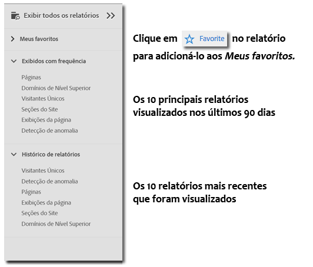
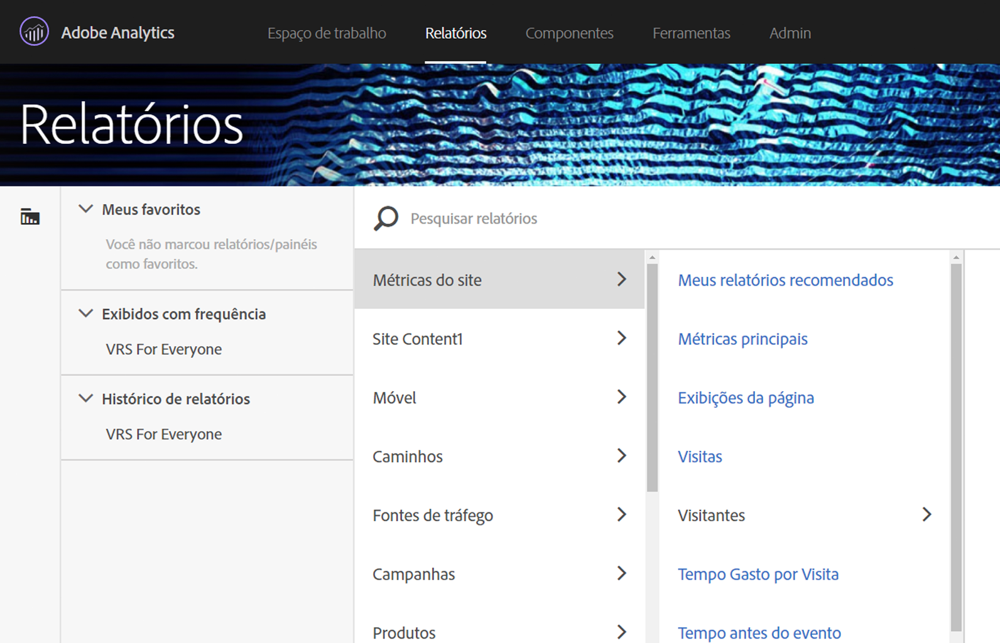
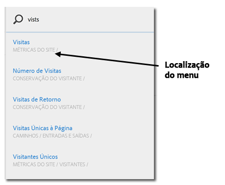

# Menu de relatórios{#reports-menu}

Uma visão geral do menu Relatórios em Reports &amp; Analytics.

O menu Relatórios proporciona:

* Acesso ao conjunto completo de relatórios
* Capacidade de definir relatórios favoritos para acesso rápido
* Relatórios exibidos com frequência
* Pesquisa aprimorada

Meus favoritos, Exibidos com frequência e Histórico de relatórios são específicos do conjunto de relatórios. Se você alterar os conjuntos de relatórios, todas as três listas serão alteradas.

É possível navegar pelos relatórios através de uma exibição de coluna hierárquica. Clique em **[!UICONTROL Exibir todos os relatórios]**, ou pressione a tecla de barra (/) e a tecla de seta para baixo (↓) para exibir e navegar pelo menu rapidamente usando as teclas de seta. Pressione a tecla Escape para fechar o menu sem alterar o relatório atual ou pressione Enter para carregar o relatório selecionado.

{width=&quot;672px&quot;}

Para obter detalhes sobre relatórios individuais, consulte as [Descrições de relatórios](https://marketing.adobe.com/resources/help/pt_BR/reference/reports_descriptions.html).

## Pesquisar relatórios {#section_E5EF11E36CB9451AA7B079E585CA7DB6}

O menu Relatórios apresenta uma experiência de pesquisa aprimorada. Clique em **[!UICONTROL Exibir todos os relatórios]**, ou pressione a tecla de barra (/) e comece a digitar para encontrar rapidamente um relatório. A pesquisa de relatórios foi expandida para incluir tudo que está presente no menu de navegação esquerdo do Analytics (Administrador, Componentes etc.).

Pressione a tecla Tab ou a seta para baixo (↓) para navegar pela lista de relatórios. Pressione a tecla Escape para fechar a pesquisa sem alterar o relatório atual, ou pressione Enter para carregar o relatório selecionado.

> [!NOTE] Também é possível pesquisar a lista de relatórios por propriedade, eVar e número do evento. Na barra de pesquisa, insira a propriedade, eVar ou o número de eventos.

## Visão geral da navegação {#section_A6A0A369207149BABE504753B48A42D7}

<table id="table_3BA295966BBC4C94ABDC3718D1894698"> 
 <thead> 
  <tr> 
   <th colname="col1" class="entry"> Item de Menu </th> 
   <th colname="col2" class="entry"> Descrição </th> 
  </tr>
 </thead>
 <tbody> 
  <tr> 
   <td colname="col1">Menu Soluções da Experience Cloud  </td> 
   <td colname="col2"> Clicar nesse ícone expande o menu da Experience Cloud e permite que você acesse outras soluções da Marketing Cloud. </td> 
  </tr> 
  <tr> 
   <td colname="col1">Alternar o menu Relatórios  </td> 
   <td colname="col2"> Clicar neste botão expande ou comprime o menu Relatórios para que seja possível exibir um relatório usando a largura total da janela do navegador. </td> 
  </tr> 
  <tr> 
   <td colname="col1">Segmentos  </td> 
   <td colname="col2">Exibe o painel de segmentos, que permite adicionar ou gerenciar os segmentos. Nesse painel, também é possível acessar as interfaces do <a href="https://marketing.adobe.com/resources/help/pt_BR/analytics/segment/seg_build_ui.html"  >Construtor de segmentos</a> e do <a href="https://marketing.adobe.com/resources/help/pt_BR/analytics/segment/seg_manage.html"  >Gerenciador de segmentos</a>. </td> 
  </tr> 
  <tr> 
   <td colname="col1">Métricas  </td> 
   <td colname="col2"> Exibe o painel de métricas, que permite adicionar ou gerenciar métricas e métricas calculadas. </td> 
  </tr> 
  <tr> 
   <td colname="col1"> Exibir todos os relatórios </td> 
   <td colname="col2">Todos os relatórios, painéis, marcações, métricas calculadas e metas específicas do conjunto de relatórios constam nas seções Exibir todos os relatórios. Clique aqui a qualquer momento para navegar em tudo o que está disponível para você. </td> 
  </tr> 
  <tr> 
   <td colname="col1">Barra de pesquisa em Exibir todos os relatórios </td> 
   <td colname="col2"> 
 Permite pesquisar o recurso necessário. Ela usa a pesquisa chamada "fuzzy" para que não seja necessário inserir a expressão exata que está procurando. Os resultados da pesquisa são exibidos em uma lista consecutiva que pode ser navegada usando as setas para cima, para baixo e para os lados. Pressionar Enter em um resultado da pesquisa leva você diretamente para o relatório em questão. 
 </td> 
  </tr> 
  <tr> 
   <td colname="col1"> Meus favoritos  </td> 
   <td colname="col2">É possível recuperar facilmente os relatórios marcados como Adicionado aos favoritos nessa área. Mostra os dez Favoritos e um link Mais... por usuário e por conjunto de relatórios, caso tenha mais de dez favoritos. 
Observe que é possível renomear os relatórios em Meus favoritos, mas não os painéis. 
 
Os favoritos são semelhantes aos marcadores, embora não fiquem armazenados em uma pasta nem sejam gerenciados por meio do <a href="/help/analyze/reports-analytics/bookmarks.md"  > Gerenciador de marcador</a>, como é o caso dos marcadores. 
 </td> 
  </tr> 
  <tr> 
   <td colname="col1"> Exibidos com frequência </td> 
   <td colname="col2"> O Adobe Analytics mantém um registro dos dez relatórios executados com maior frequência durante os últimos 90 dias e os exibe aqui, ordenados de acordo com frequência com a qual foram executados. Caso não tenha usado este conjunto de relatórios por mais de 90 dias, ele preencherá a lista com uma lista geral dos dez relatórios populares. </td> 
  </tr> 
  <tr> 
   <td colname="col1">Histórico de relatórios  </td> 
   <td colname="col2"> Nele, você encontra os dez relatórios ou painéis mais recentes acessados nos últimos 90 dias. Você pode encontrar com facilidade uma maneira de voltar para uma etapa anterior na sua análise ou relatório. </td> 
  </tr> 
  <tr> 
   <td colname="col1"> Baixar </td> 
   <td colname="col2">Permite baixar o relatório nos formatos PDF, CSV, Excel e Word. </td> 
  </tr> 
  <tr> 
   <td colname="col1"> Enviar </td> 
   <td colname="col2">Permite enviar o relatório por email imediatamente ou agendar o email de uma vez ou de forma recorrente. As opções de formato incluem PDF, CSV, Excel, HTML, Word ou para dispositivos móveis (somente texto).</td> 
  </tr> 
  <tr> 
   <td colname="col1"> Marcador... </td> 
   <td colname="col2">Permite <a href="/help/analyze/reports-analytics/bookmarks.md"  > marcar</a> o relatório. </td> 
  </tr> 
  <tr> 
   <td colname="col1"> Painel... </td> 
   <td colname="col2">Permite adicionar o relatório a um <a href="/help/analyze/reports-analytics/dashboard.md"  >painel</a>. </td> 
  </tr> 
  <tr> 
   <td colname="col1"> Mais... </td> 
   <td colname="col2"> Permite realizar todas ou algumas das seguintes ações: imprimir, extrair dados, adicionar um alerta, criar um relatório personalizado, copiar um gráfico, criar um link para o relatório e abrir uma nova janela. </td> 
  </tr> 
  <tr> 
   <td colname="col1">Seletor de Conjunto de relatórios </td> 
   <td colname="col2">Permite selecionar com base nos <a href="https://marketing.adobe.com/resources/help/pt_BR/reference/report_suites_admin.html"  >conjuntos de relatórios</a> ou <a href="https://marketing.adobe.com/resources/help/pt_BR/reference/virtual-report-suites.html"  >conjuntos de relatórios virtuais</a>. </td> 
  </tr> 
  <tr> 
   <td colname="col1">Calendário  </td> 
   <td colname="col2">Exibe o <a href="/help/analyze/reports-analytics/overview/report-overview.md#section_8C6C4AD84D9043E8ABD53FF8F645AAB1"  >calendário</a>, para que seja possível determinar o período dos relatórios. </td> 
  </tr> 
 </tbody> 
</table>

## Personalização do menu de todos os relatórios {#section_7E47312747564FBE8A55EE5726B7DFF4}

Os administradores podem alterar os relatórios contidos no menu Relatórios. Consulte [Personalização do menu](https://docs.adobe.com/content/help/pt-BR/analytics/admin/admin-tools/customize-menus.translate.html) na Ajuda do administrador.
