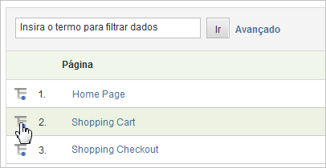

# Detalhamentos

Use detalhamentos quando você deseja saber mais sobre como um item ou segmento do relatório se relaciona a outros relatórios. Geralmente, isso é chamado de &quot;detalhamento&quot; de um relatório por outro relatório.

Um exemplo é o detalhamento de um relatório de tráfego personalizado chamado Grupo etário, no qual você coleta as idades dos visitantes do site de uma pesquisa. Esse relatório permite identificar qual faixa etária é responsável pela maior parte do tráfego do site. No entanto, se você tiver capturado algo como a idade de um visitante, poderá querer saber mais do que somente as exibições de páginas. Você pode gerar um relatório de detalhamento sobre o mecanismo de pesquisa utilizado pelos usuários, quais palavras-chave foram usadas ou onde eles estão localizados geograficamente. Você está relacionando a faixa etária e o mecanismo de pesquisa.

Se você fizer o detalhamento de um relatório por *`Referrer Type`*, você poderá ver um ponto de dados para *`Inside Your Site`*. Este valor indica uma página de referência que está na lista de Filtros de URL internos. Consulte [Filtros de URL internos](/help/admin/admin/internal-url-filter-admin.md) na Referência de administração.

É possível detalhar qualquer variável do Analytics (eVar ou prop) por qualquer outra variável. The **[!UICONTROL Breakdown By]** menu in the report table matches the standard Analytics reporting menu, keeping selections consistent

## Executar um relatório de detalhamento {#task_F685624830E64C829C8BE6435A107F69}

Etapas que descrevem como executar um relatório de análise.

<!-- 

t_reports_breakdown.xml

 -->

1. Abra o relatório, como **[!UICONTROL Analytics]** > **[!UICONTROL Reports]** > **[!UICONTROL Site Content]** > **[!UICONTROL Pages]**.
1. In the report table, click the **[!UICONTROL Breakdown By]** icon.

   If the **[!UICONTROL Breakdown By]** icon is not visible, the feature is either not available or not enabled.

   

   The **[!UICONTROL Breakdown By]** menu displays all available breakdown options available for the current report.
