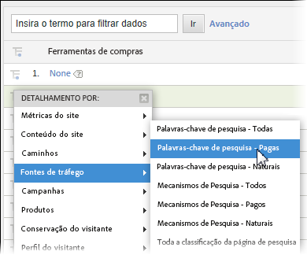
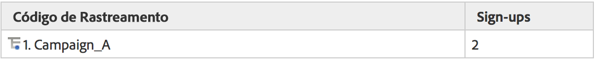
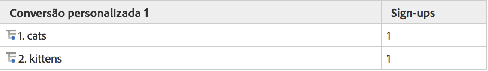
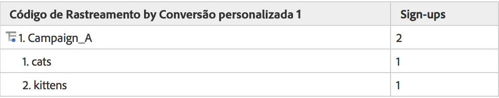
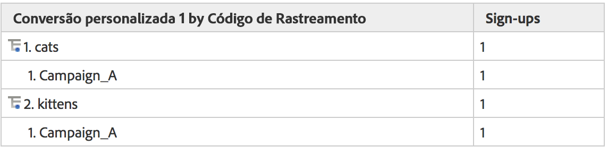

# Sub-relações

As sub-relações completas são ativadas em todos os relatórios de conversão, dessa forma, você pode dividir qualquer eVar por outra eVar. O menu Detalhar por na tabela de relatórios corresponde ao menu de relatório do Analytics, mantendo as seleções consistentes

## Como as sub-relações funcionam {#section_5BD862BB74FE411B96B59204520E4631}

Para ajudar a ilustrar como as sub-relações funcionam, considere este exemplo:

1. Um usuário visita seu site via Campaign_A e chega à página inicial.
1. O usuário pesquisa por "gatos" e recebe os resultados da pesquisa. eVar1 mantém um registro dos termos das pesquisas internas. 
1. O usuário se inscreve em uma lista de endereçamento, que é acompanhada usando event1.
1. Um usuário diferente visita seu site, também via Campaign_A, e chega à página inicial.
1. Esse usuário pesquisa por "gatinhos", recebe os resultados da pesquisa (eVar1) e também se inscreve em uma lista de endereçamento (event1). 

Se exibir um relatório de Código de rastreamento, você verá o seguinte:

Se exibir um relatório de eVar1, você verá o seguinte:

Se sub-relacionar um relatório de Campanha por eVar1, você verá o seguinte:

Se sub-relacionar um relatório de eVar1 por Campanha, você verá o seguinte:

Devido à natureza persistente das variáveis de conversão, duas colunas de dados são usadas para armazenar os valores de eVar, o valor acionado e o valor persistente. Se analisarmos uma exportação dos dados brutos desse exemplo, o resultado será (simplificado para o exemplo):

Nosso back-end funciona permitindo que post_campaign e post_evar1 persistam os valores definidos em campaign e evar1. Os relatórios de sub-relação analisam especificamente as ocorrências que contêm eventos bem-sucedidos (linhas destacadas em amarelo claro). Então, os relatórios de sub-relação são preenchidos com base nos valores persistentes (nesse caso, post_campaign e post_evar1, as células destacadas em amarelo brilhante).

Essencialmente, as sub-relações seguem estas etapas para preencher o relatório:

* Isolam as solicitações de imagens contendo os eventos bem-sucedidos exibidos no relatório.
* Retornam os valores persistentes de cada variável de conversão usada na sub-relação.
* Organizam os valores com base na ordem da sub-relação. Se uma variável não tiver um valor persistente (por exemplo, se uma eVar não tiver sido definido nem tiver expirado), ela será categorizada como "Nenhum".

