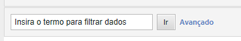
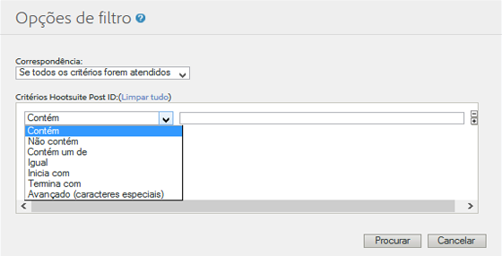

# Filter Report Data {#concept_09DC5B986A644738B12204DAC76A90E1}

Os filtros permitem restringir o relatório para incluir ou excluir itens de linha correspondentes a um filtro.

## Filtro simples {#section_5C4DE873F8D5484BB77F38A4AEB57B4A}



O filtro simples aparece na maioria dos relatórios para permitir que você encontre rapidamente itens de linha específicos. Simple filters do not use any special characters, so `-, ", ', +` and other special characters match the literal value in the report. Você pode encontrar itens de linha que contêm vários termos com um espaço.

Por exemplo:

```
help search
```

Corresponde às seguintes páginas:

```
help:Search
help:Paid Search Detection
help:Configure paid search detection
help:Search Keywords Report
help:Internal Search Term
```

## Filtros avançados {#section_E016626C084640E8A066B2FDA5B932BF}

Os filtros avançados permitem que você controle o escopo da pesquisa com uma coleção de filtros. Você pode selecionar para corresponder todos os filtros, ou qualquer filtro.



**Contém**

Corresponde se o termo é encontrado em qualquer ponto na item de linha. Isso opera a mesma ação que o filtro simples.

>[!NOTE]
>
>Espaços não podem ser usados em filtros, pois os espaços são delimitadores em pesquisas

**Não contém**

Corresponde se o termo não é encontrado em qualquer ponto no item de linha. You can filter "unspecified", "none", "keyword unavailable" and other [special values](https://marketing.adobe.com/resources/help/en_US/reference/none-unspecified-unknown-other.html) from reports using "does not contain".

Não contém: `none`

Para um filtro mais preciso, é possível usar um filtro Avançado (caracteres especiais):

* Avançado (Caractere especial): `-^none$`
* Avançado (Caractere especial): `-"keyword unavailable"`

Por exemplo, o seguinte item de linha é filtrado pelo critério "Não contém", mais não é filtrado pelo critério "Avançado (caractere especial)":

```
help:Rename the None classification key
```

**Contém um de**

Corresponde se qualquer termo, separado por espaços, são encontrados no item de linha. O seguinte filtro mostra todas as páginas que contêm "masculino" ou "oferta":

Contém um de: `mens sale`

Corresponde às seguintes páginas:

```
Womens
Mens
Mens:Desk & TravelJewelry & Accessories:Accessories:Hats:Mens
Sale & Values
```

**Igual**

Corresponde se o item de linha inteiro, incluindo espaços e outros caracteres, correspondem à frase especificada.

Igual: `mens:desk & travel`

`Mens:Desk & Travel`

**Começa com**

Corresponde se o item de linha, incluindo espaços e outros caracteres, inicia com a frase especificada

Começa com: `mens`

Corresponde às seguintes páginas:

```
Mens
Mens:Desk & Travel
Mens:Apparel
Mens Perfume Spray
Mens Hemp/Bamboo Flip Flops
```

**Termina com**

Corresponde se o item de linha, incluindo espaços e outros caracteres, termina com a frase especificada.

Termina com: `jean`

Corresponde às seguintes páginas:

```
Bell Bottom Jean
Velvet Dream Skinny Leg Jean
Dark Slimmer Jean
Bling Belt High Waist Jean
Ocean Blue Jean
```

## Avançado (Caractere especial) {#section_83DA3B6C23EB4C119DB6D74062DB501D}

Avançado permite que você execute um curinga e outras pesquisas complexas.

| Avançado (Caractere especial) | Descrição |
|--- |--- |
| `" "` | Corresponder à frase exata. |
| `*` | Curinga, correspondência voraz. <br>Por exemplo, `r*p` corresponde a "Inscrição de registro". |
| `^` | Começa com. <br>Não inclua um espaço entre o caractere especial e a frase de pesquisa. |
| `$` | Termina com. <br>Não inclua um espaço entre o caractere especial e a frase de pesquisa. |
| `-` | Não. <br>Não inclua um espaço entre o caractere especial e a frase de pesquisa. |
| `|` | Or<br>Note:  you must include a space on each side of the pipe character, `" | "`. |

## Criar filtros específicos de relatório {#task_DEBB0632411D4CA8AA0B3BA267A5B35F}

Etapas que descrevem como criar filtros para relatórios.

<!-- 

t_reports_filter_specific.xml

 -->

Alguns relatórios contém um filtro específicos para eles. Por exemplo, um [!UICONTROL Relatório de funil de conversão de compra] permite filtrar por páginas da Web. Um [!UICONTROL Relatório de segmentação geográfica] permite filtrar por região geográfica. Relatórios adicionais têm outros filtros específicos para eles.

Quando você acessa esses filtros, você pode visualizar as métricas de relatório para os itens especificados na lista.

**Para criar filtros específicos de relatório**

1. Generate a report, such as a [!UICONTROL Purchase Report] ( **[!UICONTROL Site Metrics]** &gt; **[!UICONTROL Purchases]** &gt; **[!UICONTROL Purchase Conversion Funnel]**).
1. No cabeçalho do relatório, clique no link **Filtro.**
1. Na página [!UICONTROL Seletor de filtro]**, clique em[!UICONTROL Aplicar um filtro]** e, em seguida, selecione um tipo de filtro.
1. Para procurar um item, digite uma sequência de caracteres no campo **Procurar**. 
1. Clique em **[!UICONTROL OK]**.

## Adicionar um filtro de correlação {#task_065042E384DA4BF3864C58AF2B88D6E2}

Etapas que descrevem como adicionar um filtro de correlação.

<!-- 

t_reports_correlation_filter.xml

 -->

Relatórios específicos permitem adicionar filtros de correlação personalizados. Por exemplo, se você estiver visualizando um [!UICONTROL Relatório de página] de um conjunto de relatórios que tem Seções de site correlacionadas com uma página da seção para Mulheres, você pode criar uma regra de filtro que gera relatórios que exibem as páginas mais populares quando Seções de site = Mulheres.

Você pode filtrar os dados mostrados em um relatório de correlação usando quaisquer correlações disponíveis. O exemplo mostra como adicionar um filtro de pesquisa de correlação de mecanismo de pesquisa.

**Para adicionar um filtro de correlação**

1. Execute um relatório com suporte a correlações. (See [Running a Breakdown Report](../../../analyze/reports-analytics/reports-customize/breakdowns.md#task_F685624830E64C829C8BE6435A107F69).)
1. In the report header, click the **[!UICONTROL Correlation Filter]** link.
1. Em [!UICONTROL Criador da regra do filtro], selecione uma categoria para correlacionar com um item.
1. Click **[!UICONTROL OK.]**
