# Alterar gráficos de relatórios

Etapas que descrevem como personalizar o gráfico a fim de que seja mais útil para o público-alvo desejado.

Os tipos de gráfico disponíveis dependem do tipo de relatório que você está executando. Por exemplo, gráficos de linha de tendência são úteis para relatórios de tendências, mas você pode também usar um gráfico de Barras verticais com linhas de tendência que ilustram claramente as tendências ao passar dos dias, semanas, meses e assim por diante. Opcionalmente, você poderia escolher um gráfico de pizza para ilustrar porcentagens das páginas visualizadas.

**Para alterar um gráfico de relatório**

1. Executar um relatório.
1. Click **[!UICONTROL Configure Graph]**.
1. Selecione um tipo gráfico.

   **[!UICONTROL Linha de Tendência]**: as linhas de tendência mostram as tendências diárias das métricas de relatório e são úteis para análise de tendência de uma métrica por linha ao longo do tempo.

   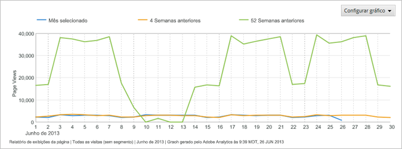

   **[!UICONTROL Linha suave]**: use esse tipo de gráfico com o [!UICONTROL Relatório detalhado de vídeo]. Ele mostra os números ou percentagens de pontos de exibições para segmentos específicos de um vídeo. Um aumento nas exibições de um segmento específico do vídeo indica que os telespectadores voltaram e visualizaram a seção do vídeo diversas vezes. Se usar porcentagens, a porcentagem mostrada no gráfico é uma porcentagem de todos os segmentos exibidos, e não uma porcentagem de telespectadores que viram o segmento. Por exemplo, no gráfico a soma de todos os segmentos do relatório é 39. O número de pontos de exibição para o segmento de 0 a 10 segundos é 10. Logo, o percentual de pontos de vista para este segmento é de aproximadamente 26%.

   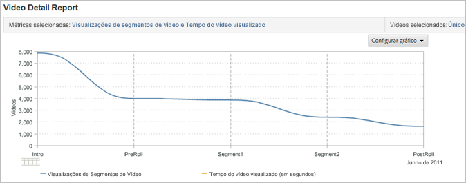

   **[!UICONTROL Área]**: o Gráfico de área é semelhante ao Gráfico de linhas de tendência, mas preenche a área abaixo das linhas. É necessário visualizar um relatório de tendências para que seja possível exibir o Gráfico de área.

   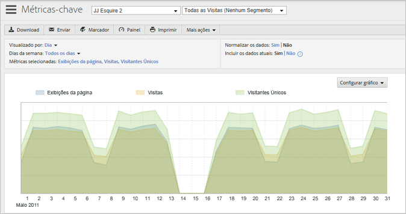

   **[!UICONTROL Área empilhada]**: gráficos de área empilhada são úteis ao analisar a tendência de produtos ou campanhas ao longo do tempo. Por exemplo, se você pesquisar a tendência dos cinco principais produtos mostrando a receita, você verá rapidamente quanto da receita total é trazido por esses produtos em um período de tempo. Você pode refinar a exibição usando um filtro de pesquisa para incluir ou excluir produtos específicos.

   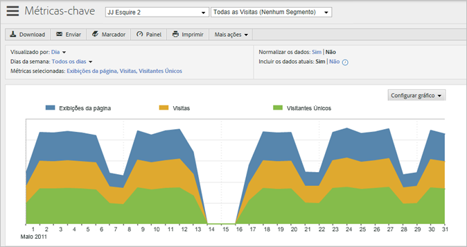

   **[!UICONTROL Barra vertical]**: o Gráfico de barra vertical mostra as porcentagens relativas das métricas de relatório.

   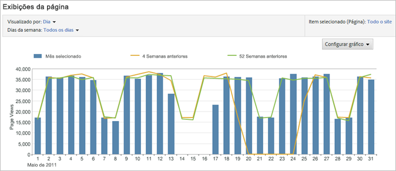

   **[!UICONTROL Barra vertical empilhada]**: empilhando itens similares, você obtém uma visualização rápida da influência total de um item. Por exemplo, em um [!UICONTROL Relatório de campanha], você pode empilhar métricas de sucesso similares e ver qual campanha está gerando o maior sucesso total. Isto facilita localizar campanhas que podem não ter o melhor desempenho em uma métrica, mas que tem alto desempenho na combinação de métricas.

   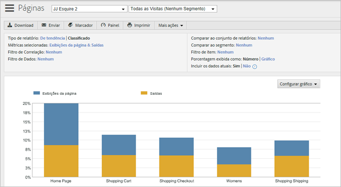

   **[!UICONTROL Barra horizontal]**: o Gráfico de barra horizontal é similar ao Gráfico de barra vertical, mas as colunas são horizontais.

   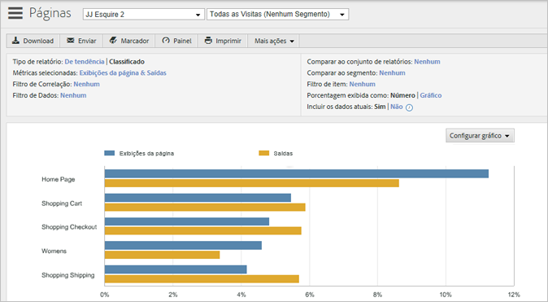

   **[!UICONTROL Barra horizontal empilhada]**: o Gráfico de barra horizontal é similar ao Gráfico de barra vertical, mas as colunas são horizontais.

   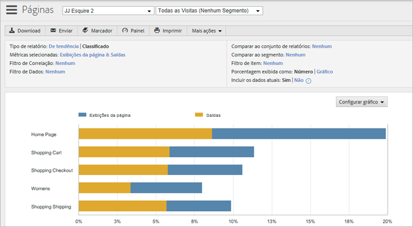

   **[!UICONTROL Pizza]**: o Gráfico de pizza mostra a relação porcentual entre os principais valores de métrica e mostra a porcentagem das métricas selecionadas em relação ao todo. É possível exibir o Gráfico de pizza para relatórios classificados.

   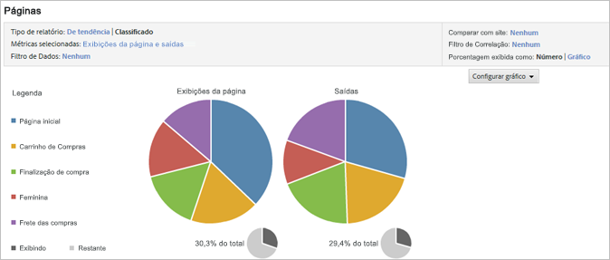

   **[!UICONTROL Dispersão]**: o Gráfico de dispersão mostra uma exibição dispersa das métricas que você selecionou em relação umas às outras. Esses gráficos permitem que você visualize dados em duas dimensões, de forma que você possa identificar quais itens são outliers.

   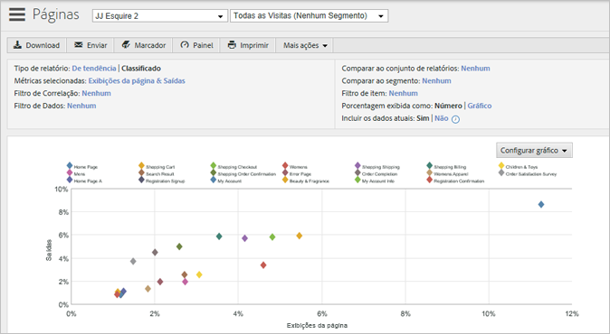

   **[!UICONTROL Bolha]**: o Gráfico de dispersão mostra uma exibição dispersa das métricas que você selecionou em relação umas às outras. A localização das bolhas mostra o relacionamento entre as métricas no eixo horizontal e vertical, enquanto o tamanho da bolha retrata a métrica do relatório principal. Esses gráficos permitem que você visualize dados em duas dimensões, de forma que você possa identificar quais itens são outliers.

   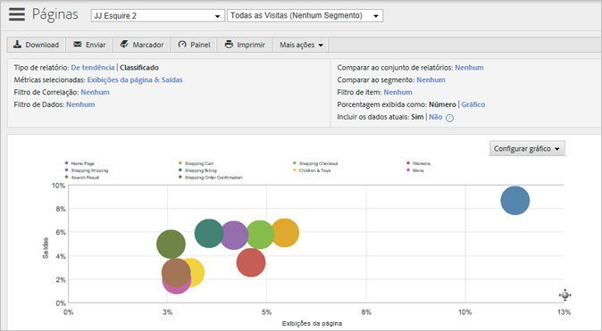

